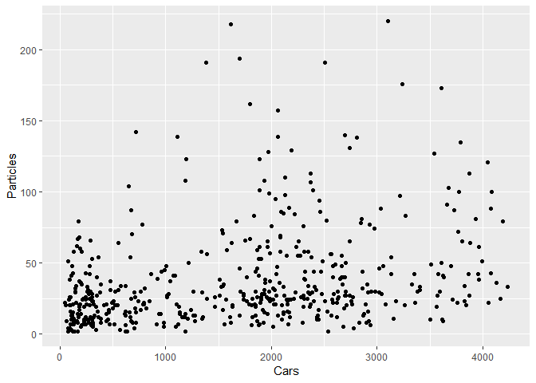
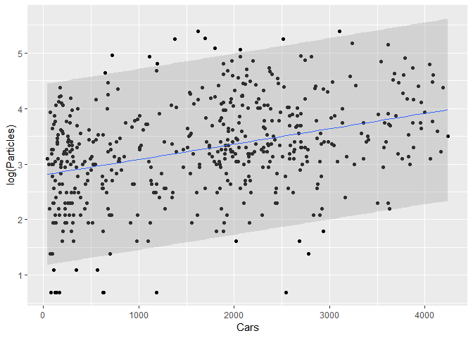
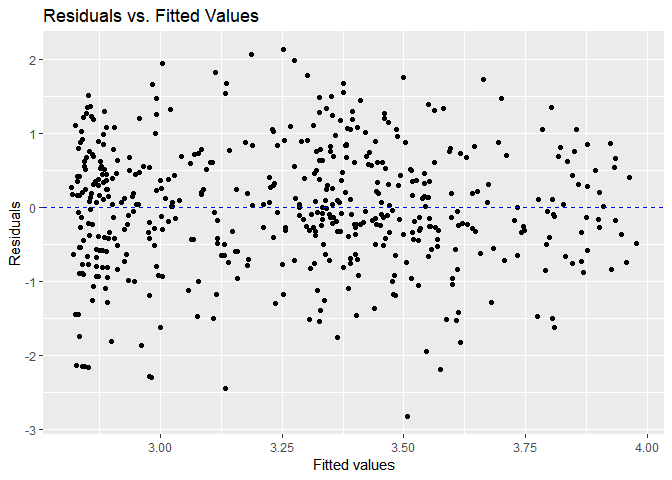
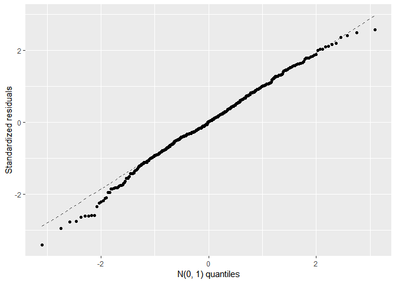

Stats Case Study \#1
================
Noam Benkler

scatterplot of cars vs. pm levels and residuals for log grapj
=============================================================

``` r
summary(pm)
```

    ##    Particles           Cars       
    ##  Min.   :  2.00   Min.   :  45.0  
    ##  1st Qu.: 15.00   1st Qu.: 523.5  
    ##  Median : 27.00   Median :1851.5  
    ##  Mean   : 37.88   Mean   :1683.2  
    ##  3rd Qu.: 48.00   3rd Qu.:2509.5  
    ##  Max.   :220.00   Max.   :4239.0

``` r
gf_point(Particles~Cars, data = pm)
```



``` r
#try to log the dep var. to make graph more linear
gf_point(log(Particles)~Cars, data = pm) %>% gf_lm(log(Particles)~Cars, data = pm, interval = "prediction")
```



``` r
logPm.lm <- lm(log(Particles)~Cars, data = pm)
resid.logPm <-augment(logPm.lm)
gf_point(.resid~.fitted, data=resid.logPm) %>% gf_hline(yintercept = 0, col = "blue", lty = 2) %>% gf_labs(x = "Fitted values", y = "Residuals", title = "Residuals vs. Fitted Values")
```



``` r
gf_qq(~.std.resid, data = resid.logPm) %>% gf_qqline() %>% gf_labs(x = "N(0, 1) quantiles", y = "Standardized residuals")
```



Tables
======

``` r
summary(logPm.lm)
```

    ## 
    ## Call:
    ## lm(formula = log(Particles) ~ Cars, data = pm)
    ## 
    ## Residuals:
    ##      Min       1Q   Median       3Q      Max 
    ## -2.81497 -0.49851  0.01011  0.55772  2.13160 
    ## 
    ## Coefficients:
    ##              Estimate Std. Error t value Pr(>|t|)    
    ## (Intercept) 2.805e+00  6.553e-02   42.81   <2e-16 ***
    ## Cars        2.765e-04  3.211e-05    8.61   <2e-16 ***
    ## ---
    ## Signif. codes:  0 '***' 0.001 '**' 0.01 '*' 0.05 '.' 0.1 ' ' 1
    ## 
    ## Residual standard error: 0.8282 on 498 degrees of freedom
    ## Multiple R-squared:  0.1296, Adjusted R-squared:  0.1278 
    ## F-statistic: 74.14 on 1 and 498 DF,  p-value: < 2.2e-16

``` r
pm <- pm %>% mutate(logPm = log(Particles))
stargazer(pm,type = "text", title = "Summary of PM dataset", digits = 1)
```

    ## 
    ## Summary of PM dataset
    ## ==========================================================
    ## Statistic  N   Mean   St. Dev. Min Pctl(25) Pctl(75)  Max 
    ## ----------------------------------------------------------
    ## Particles 500  37.9     35.0    2     15       48     220 
    ## Cars      500 1,683.2 1,154.5  45   523.5   2,509.5  4,239
    ## logPm     500   3.3     0.9    0.7   2.7      3.9     5.4 
    ## ----------------------------------------------------------

``` r
stargazer(logPm.lm, type = "text", title = "Linear Model Coefficients (standard error in parenthisis)", flip = TRUE)
```

    ## 
    ## Linear Model Coefficients (standard error in parenthisis)
    ## ===============================================
    ##                         Dependent variable:    
    ##                     ---------------------------
    ##                           log(Particles)       
    ## -----------------------------------------------
    ## Cars                         0.0003***         
    ##                              (0.00003)         
    ##                                                
    ## Constant                     2.805***          
    ##                               (0.066)          
    ##                                                
    ## -----------------------------------------------
    ## Observations                    500            
    ## R2                             0.130           
    ## Adjusted R2                    0.128           
    ## Residual Std. Error      0.828 (df = 498)      
    ## F Statistic           74.137*** (df = 1; 498)  
    ## ===============================================
    ## Note:               *p<0.1; **p<0.05; ***p<0.01

``` r
newdata = data.frame(Cars = 2000)
predict(logPm.lm, newdata, interval="predict") 
```

    ##        fit      lwr      upr
    ## 1 3.358522 1.729596 4.987448
