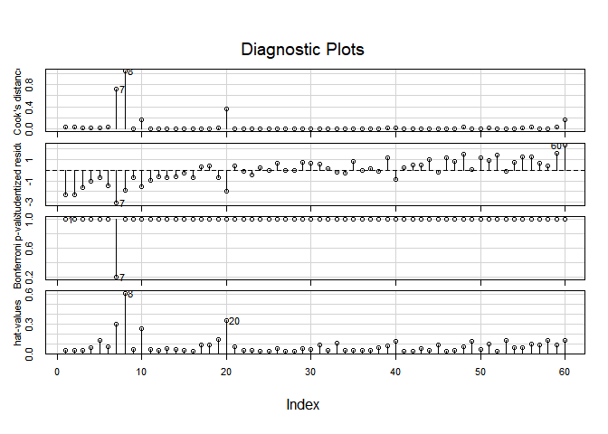
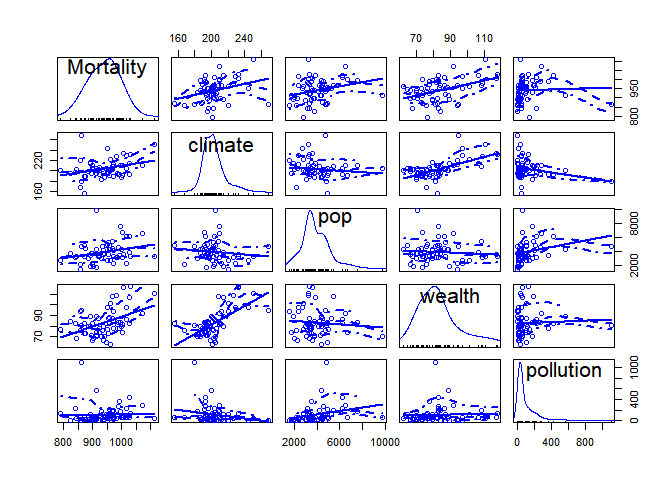
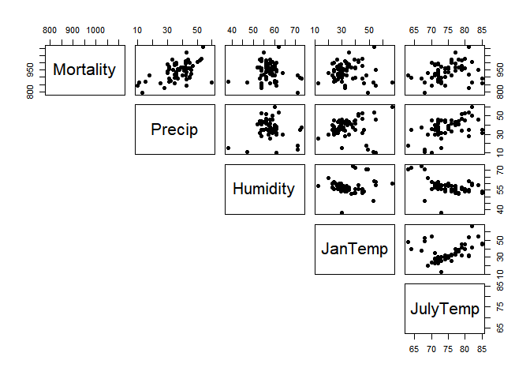
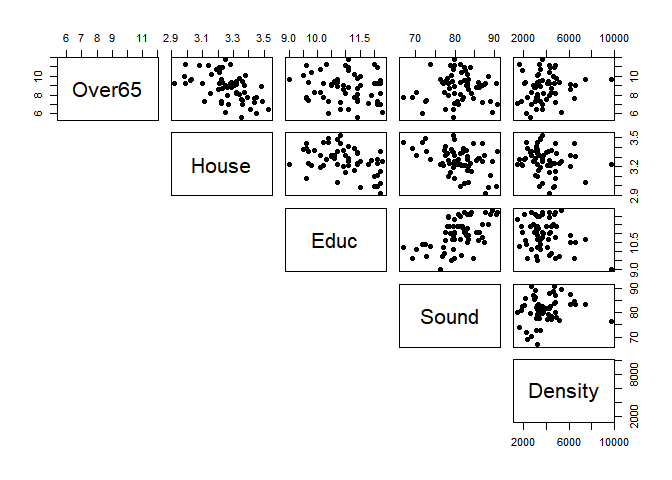
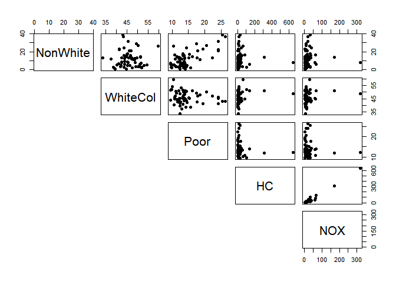
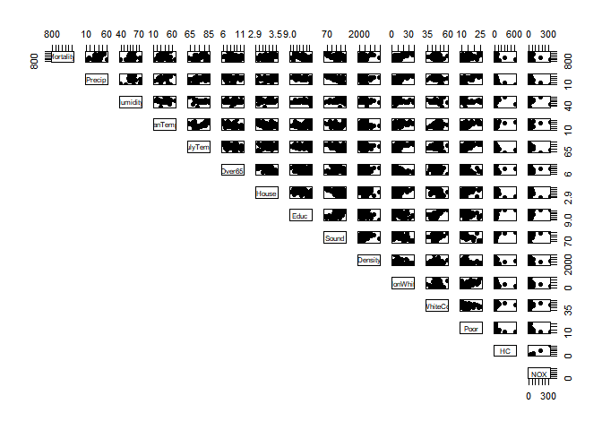
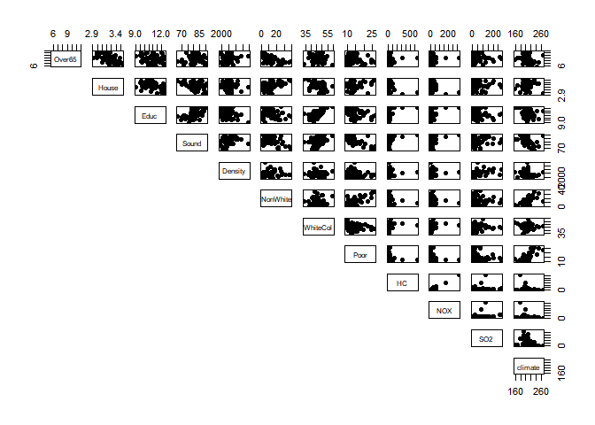
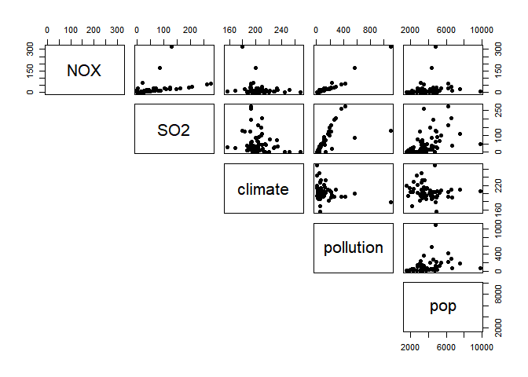
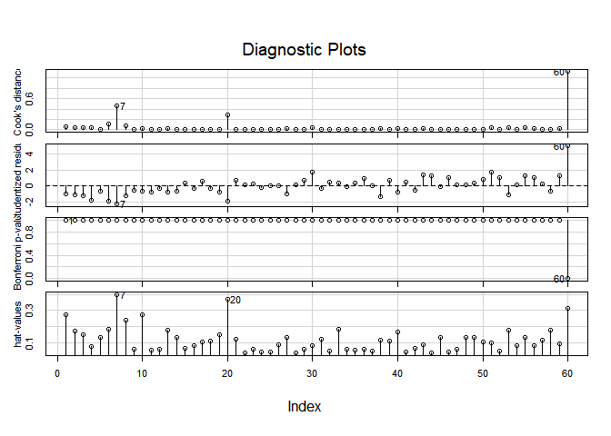

Case Study 2
================
Noam Benkler & Serafina Chen
May 6, 2018

A.
--

``` r
pollution <- Sleuth3::ex1217
tidy(pollution [, 2:17])
```

    ## Warning: 'tidy.data.frame' is deprecated.
    ## See help("Deprecated")

    ## # A tibble: 16 x 13
    ##    column     n   mean      sd median trimmed    mad     min    max   range
    ##    <chr>  <dbl>  <dbl>   <dbl>  <dbl>   <dbl>  <dbl>   <dbl>  <dbl>   <dbl>
    ##  1 Morta~    60 9.40e2 6.22e+1 9.44e2  940.    44.3   791.   1.11e3 3.22e+2
    ##  2 Precip    60 3.74e1 9.98e+0 3.80e1   38.2    5.5    10    6.00e1 5.00e+1
    ##  3 Humid~    60 5.77e1 5.37e+0 5.70e1   57.3    2.5    38    7.30e1 3.50e+1
    ##  4 JanTe~    60 3.40e1 1.02e+1 3.15e1   32.9    5.5    12    6.70e1 5.50e+1
    ##  5 JulyT~    60 7.46e1 4.76e+0 7.40e1   74.5    3      63    8.50e1 2.20e+1
    ##  6 Over65    60 8.80e0 1.46e+0 9.00e0    8.8    1.05    5.6  1.18e1 6.20e+0
    ##  7 House     60 3.26e0 1.35e-1 3.26e0    3.27   0.08    2.92 3.53e0 6.10e-1
    ##  8 Educ      60 1.10e1 8.45e-1 1.10e1   11.0    0.6     9    1.23e1 3.30e+0
    ##  9 Sound     60 8.09e1 5.14e+0 8.12e1   81.2    2.75   66.8  9.07e1 2.39e+1
    ## 10 Densi~    60 3.87e3 1.45e+3 3.57e3 3729.   704.   1441    9.70e3 8.26e+3
    ## 11 NonWh~    60 1.19e1 8.92e+0 1.04e1   10.7    5.4     0.8  3.85e1 3.77e+1
    ## 12 White~    60 4.61e1 4.61e+0 4.55e1   46.1    3.15   33.8  5.97e1 2.59e+1
    ## 13 Poor      60 1.44e1 4.16e+0 1.32e1   13.7    1.4     9.4  2.64e1 1.70e+1
    ## 14 HC        60 3.78e1 9.20e+1 1.45e1   18.6    8.5     1    6.48e2 6.47e+2
    ## 15 NOX       60 2.26e1 4.63e+1 9.00e0   13.2    6       1    3.19e2 3.18e+2
    ## 16 SO2       60 5.38e1 6.34e+1 3.00e1   41.1   22       1    2.78e2 2.77e+2
    ## # ... with 3 more variables: skew <dbl>, kurtosis <dbl>, se <dbl>

Creat merged variables
======================

``` r
pollution$climate <- pollution$Precip + pollution$Humidity + pollution$JanTemp + pollution$JulyTemp
pollution$pollution <- pollution$HC + pollution$NOX + pollution$SO2
pollution$pop <- pollution$House + pollution$Density + pollution$Over65 + pollution$Sound
pollution$wealth <- pollution$Poor + pollution$WhiteCol + pollution$NonWhite + pollution$Educ
```

creating linear models
======================

``` r
pol.lm <- lm(Mortality ~ Precip + Humidity + JanTemp + JulyTemp + Over65 + House + Educ + Sound + Density + NonWhite + WhiteCol + Poor + HC + NOX + SO2, data = pollution)
pol2.lm <- lm(Mortality ~ climate + pop + wealth + pollution, data = pollution)
pollog.lm<- lm(Mortality ~ Precip + Humidity + JanTemp + JulyTemp + Over65 + House + Educ + Sound + Density + NonWhite + WhiteCol + Poor + log(HC) + log(NOX) + SO2, data = pollution)
stargazer(pol.lm, pol2.lm, pollog.lm, type = "text")
```

    ## 
    ## ========================================================================================
    ##                                             Dependent variable:                         
    ##                     --------------------------------------------------------------------
    ##                                                  Mortality                              
    ##                              (1)                    (2)                    (3)          
    ## ----------------------------------------------------------------------------------------
    ## Precip                     1.905**                                      2.657***        
    ##                            (0.923)                                       (0.844)        
    ##                                                                                         
    ## Humidity                    0.106                                         0.193         
    ##                            (1.169)                                       (0.990)        
    ##                                                                                         
    ## JanTemp                    -1.935*                                      -2.467**        
    ##                            (1.108)                                       (0.947)        
    ##                                                                                         
    ## JulyTemp                    -3.102                                       -3.478*        
    ##                            (1.901)                                       (2.052)        
    ##                                                                                         
    ## Over65                      -9.045                                      -14.255*        
    ##                            (8.483)                                       (7.884)        
    ##                                                                                         
    ## House                      -106.502                                    -136.766**       
    ##                            (69.766)                                     (66.641)        
    ##                                                                                         
    ## Educ                       -17.068                                       -14.373        
    ##                            (11.861)                                     (10.540)        
    ##                                                                                         
    ## Sound                       -0.659                                       -0.791         
    ##                            (1.768)                                       (1.639)        
    ##                                                                                         
    ## Density                     0.004                                         0.003         
    ##                            (0.004)                                       (0.004)        
    ##                                                                                         
    ## NonWhite                   4.460***                                     3.778***        
    ##                            (1.326)                                       (1.280)        
    ##                                                                                         
    ## WhiteCol                    -0.192                                       -0.188         
    ##                            (1.661)                                       (1.488)        
    ##                                                                                         
    ## Poor                        -0.165                                        0.744         
    ##                            (3.225)                                       (2.975)        
    ##                                                                                         
    ## HC                          -0.672                                                      
    ##                            (0.491)                                                      
    ##                                                                                         
    ## NOX                         1.340                                                       
    ##                            (1.005)                                                      
    ##                                                                                         
    ## log(HC)                                                                 -33.657**       
    ##                                                                         (15.569)        
    ##                                                                                         
    ## log(NOX)                                                                42.239***       
    ##                                                                         (15.093)        
    ##                                                                                         
    ## SO2                         0.086                                         0.064         
    ##                            (0.147)                                       (0.116)        
    ##                                                                                         
    ## climate                                            0.193                                
    ##                                                   (0.525)                               
    ##                                                                                         
    ## pop                                              0.014***                               
    ##                                                   (0.005)                               
    ##                                                                                         
    ## wealth                                           2.154***                               
    ##                                                   (0.732)                               
    ##                                                                                         
    ## pollution                                         -0.020                                
    ##                                                   (0.046)                               
    ##                                                                                         
    ## Constant                 1,762.487***           669.318***            1,899.218***      
    ##                           (437.113)              (85.908)               (418.735)       
    ##                                                                                         
    ## ----------------------------------------------------------------------------------------
    ## Observations                  60                    60                     60           
    ## R2                          0.765                  0.297                  0.793         
    ## Adjusted R2                 0.685                  0.246                  0.722         
    ## Residual Std. Error    34.913 (df = 44)      54.008 (df = 55)       32.783 (df = 44)    
    ## F Statistic         9.552*** (df = 15; 44) 5.815*** (df = 4; 55) 11.227*** (df = 15; 44)
    ## ========================================================================================
    ## Note:                                                        *p<0.1; **p<0.05; ***p<0.01

``` r
vif(pol.lm)
```

    ##     Precip   Humidity    JanTemp   JulyTemp     Over65      House 
    ##   4.113808   1.906540   6.144998   3.967545   7.470930   4.309909 
    ##       Educ      Sound    Density   NonWhite   WhiteCol       Poor 
    ##   4.866145   3.998022   1.660457   6.773090   2.842303   8.714508 
    ##         HC        NOX        SO2 
    ##  98.637392 104.981032   4.229207

``` r
vif(pol2.lm)
```

    ##   climate       pop    wealth pollution 
    ##  1.844726  1.093076  1.770729  1.208244

``` r
vif(pollog.lm)
```

    ##    Precip  Humidity   JanTemp  JulyTemp    Over65     House      Educ 
    ##  3.903120  1.552752  5.093656  5.244655  7.318854  4.460011  4.357410 
    ##     Sound   Density  NonWhite  WhiteCol      Poor   log(HC)  log(NOX) 
    ##  3.899891  1.729636  7.161898  2.587694  8.408287 18.398052 17.543127 
    ##       SO2 
    ##  2.943944

``` r
influenceIndexPlot(pol2.lm)
```



work with the final model
=========================

``` r
final_model <- lm(Mortality ~ climate + pop + wealth + pollution, data = pollution)
stargazer(final_model, type = "text")
```

    ## 
    ## ===============================================
    ##                         Dependent variable:    
    ##                     ---------------------------
    ##                              Mortality         
    ## -----------------------------------------------
    ## climate                        0.193           
    ##                               (0.525)          
    ##                                                
    ## pop                          0.014***          
    ##                               (0.005)          
    ##                                                
    ## wealth                       2.154***          
    ##                               (0.732)          
    ##                                                
    ## pollution                     -0.020           
    ##                               (0.046)          
    ##                                                
    ## Constant                    669.318***         
    ##                              (85.908)          
    ##                                                
    ## -----------------------------------------------
    ## Observations                    60             
    ## R2                             0.297           
    ## Adjusted R2                    0.246           
    ## Residual Std. Error      54.008 (df = 55)      
    ## F Statistic            5.815*** (df = 4; 55)   
    ## ===============================================
    ## Note:               *p<0.1; **p<0.05; ***p<0.01

``` r
vif(final_model)
```

    ##   climate       pop    wealth pollution 
    ##  1.844726  1.093076  1.770729  1.208244

``` r
influenceIndexPlot(final_model)
```


``` r
scatterplotMatrix( ~ Mortality + climate + pop + wealth + pollution, data = pollution)
```



tests to look for multicollinearity
===================================

``` r
pairs(pollution[,2:6], pch = 19, lower.panel = NULL)
```



``` r
pairs(pollution[,7:11], pch = 19, lower.panel = NULL)
```



``` r
pairs(pollution[,12:16], pch = 19, lower.panel = NULL)
```



``` r
pairs(pollution[,2:16], pch = 19, lower.panel = NULL)
```



``` r
pairs(pollution[,7:18], pch = 19, lower.panel = NULL)
```



``` r
pairs(pollution[,16:20], pch = 19, lower.panel = NULL)
```



backwards elimination
=====================

``` r
full_mod <-lm(Mortality ~ climate + pop + wealth + pollution, data = pollution)
belim <- stepAIC(full_mod,
                 scope = list(lower = ~ 1),
                 direction = "backward" , trace = 0)

tidy(belim)
```

    ## # A tibble: 3 x 5
    ##   term        estimate std.error statistic  p.value
    ##   <chr>          <dbl>     <dbl>     <dbl>    <dbl>
    ## 1 (Intercept) 697.      51.2         13.6  1.50e-19
    ## 2 pop           0.0130   0.00478      2.72 8.70e- 3
    ## 3 wealth        2.31     0.545        4.23 8.56e- 5

Forward selection
=================

``` r
null_mod <- lm(Mortality ~ 1, data = pollution)
fselect <-
  stepAIC(null_mod, 
        scope = list(upper = ~ climate + pop + wealth + pollution, data = pollution),
        direction = "forward" , trace = 0)

tidy(fselect)
```

    ## # A tibble: 3 x 5
    ##   term        estimate std.error statistic  p.value
    ##   <chr>          <dbl>     <dbl>     <dbl>    <dbl>
    ## 1 (Intercept) 697.      51.2         13.6  1.50e-19
    ## 2 wealth        2.31     0.545        4.23 8.56e- 5
    ## 3 pop           0.0130   0.00478      2.72 8.70e- 3

Stepwise selection
==================

``` r
step_credit <-
  stepAIC(null_mod,
        scope = list(lower = ~ 1, 
                     upper = ~ climate + pop + wealth + pollution, data = pollution),
        direction = "both"
        , trace=0)

tidy(step_credit)
```

    ## # A tibble: 3 x 5
    ##   term        estimate std.error statistic  p.value
    ##   <chr>          <dbl>     <dbl>     <dbl>    <dbl>
    ## 1 (Intercept) 697.      51.2         13.6  1.50e-19
    ## 2 wealth        2.31     0.545        4.23 8.56e- 5
    ## 3 pop           0.0130   0.00478      2.72 8.70e- 3

Additional model to check if log may help
=========================================

``` r
pollution$climatalogical <- pollution$Precip + pollution$Humidity + pollution$JanTemp + pollution$JulyTemp
pollution$socioeconomic <- pollution$House + pollution$Density + pollution$Over65 + pollution$Sound + pollution$Poor + pollution$WhiteCol + pollution$NonWhite + pollution$Educ
```

``` r
final_model2 <- lm(Mortality ~ climate + pop + wealth + log(HC) + log(NOX) + log(SO2), data = pollution)
stargazer(final_model2, type = "text")
```

    ## 
    ## ===============================================
    ##                         Dependent variable:    
    ##                     ---------------------------
    ##                              Mortality         
    ## -----------------------------------------------
    ## climate                        0.768           
    ##                               (0.466)          
    ##                                                
    ## pop                            0.004           
    ##                               (0.005)          
    ##                                                
    ## wealth                       1.834***          
    ##                               (0.628)          
    ##                                                
    ## log(HC)                     -44.395***         
    ##                              (16.318)          
    ##                                                
    ## log(NOX)                      34.353*          
    ##                              (18.393)          
    ##                                                
    ## log(SO2)                     22.132***         
    ##                               (6.758)          
    ##                                                
    ## Constant                    587.391***         
    ##                              (82.036)          
    ##                                                
    ## -----------------------------------------------
    ## Observations                    60             
    ## R2                             0.541           
    ## Adjusted R2                    0.489           
    ## Residual Std. Error      44.465 (df = 53)      
    ## F Statistic           10.409*** (df = 6; 53)   
    ## ===============================================
    ## Note:               *p<0.1; **p<0.05; ***p<0.01

``` r
vif(final_model2)
```

    ##   climate       pop    wealth   log(HC)  log(NOX)  log(SO2) 
    ##  2.138998  1.330982  1.922185 10.986295 14.161401  3.056769

``` r
influenceIndexPlot(final_model2)
```


