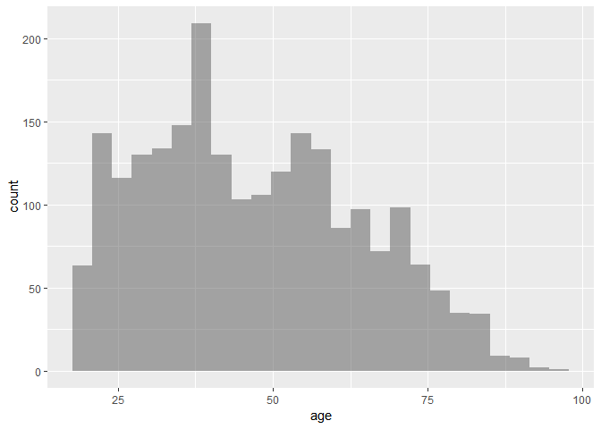
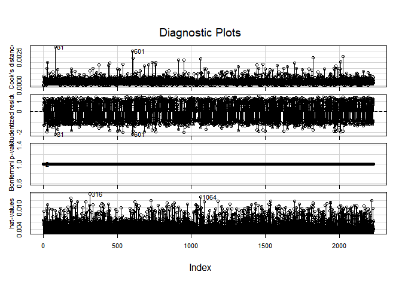
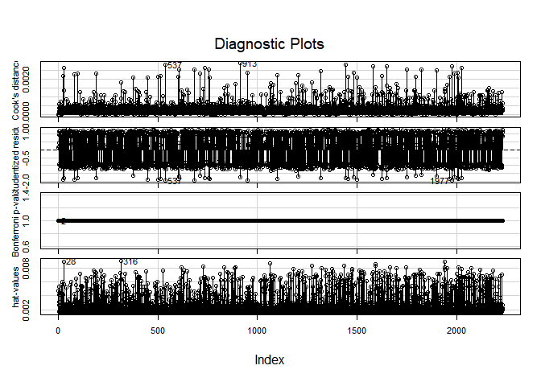
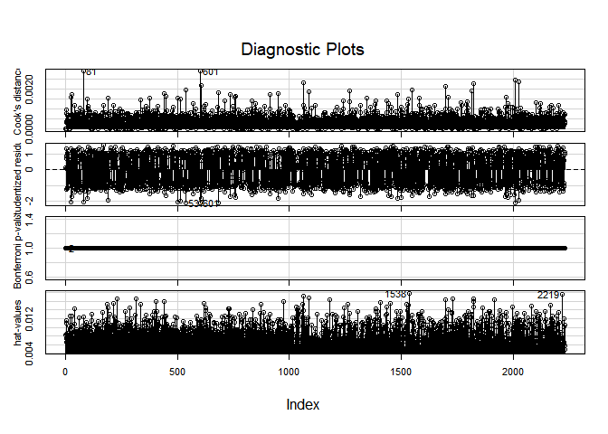

Case study \#3
================
Noam Benkler
May 20, 2018

``` r
nes <- read.csv("http://aloy.rbind.io/data/NES.csv")
View(nes)
```

``` r
nes.lm <- glm(dem ~ year + region + union + income + educ + gender + log(age) + race, data = nes)
summary(nes.lm)
```

    ## 
    ## Call:
    ## glm(formula = dem ~ year + region + union + income + educ + gender + 
    ##     log(age) + race, data = nes)
    ## 
    ## Deviance Residuals: 
    ##      Min        1Q    Median        3Q       Max  
    ## -1.02534  -0.46133   0.09819   0.47605   0.71292  
    ## 
    ## Coefficients:
    ##                    Estimate Std. Error t value Pr(>|t|)    
    ## (Intercept)      -0.1744491  2.1426366  -0.081  0.93512    
    ## year              0.0003878  0.0010773   0.360  0.71892    
    ## regionNE          0.0243839  0.0306758   0.795  0.42676    
    ## regionS           0.0021059  0.0270186   0.078  0.93788    
    ## regionW           0.0400576  0.0308199   1.300  0.19383    
    ## unionyes          0.1544088  0.0268189   5.757 9.72e-09 ***
    ## incomemiddle 1/3 -0.0632175  0.0261062  -2.422  0.01553 *  
    ## incomeupper 1/3  -0.1175198  0.0272253  -4.317 1.65e-05 ***
    ## educHS or less    0.0111786  0.0227301   0.492  0.62291    
    ## gendermale       -0.0584893  0.0205680  -2.844  0.00450 ** 
    ## log(age)          0.0749867  0.0272193   2.755  0.00592 ** 
    ## raceother        -0.3066394  0.0455119  -6.738 2.05e-11 ***
    ## racewhite        -0.3603014  0.0319023 -11.294  < 2e-16 ***
    ## ---
    ## Signif. codes:  0 '***' 0.001 '**' 0.01 '*' 0.05 '.' 0.1 ' ' 1
    ## 
    ## (Dispersion parameter for gaussian family taken to be 0.2271661)
    ## 
    ##     Null deviance: 555.27  on 2231  degrees of freedom
    ## Residual deviance: 504.08  on 2219  degrees of freedom
    ## AIC: 3041.1
    ## 
    ## Number of Fisher Scoring iterations: 2

``` r
gf_histogram( ~age, data = nes)
```



``` r
non.lm <- glm(dem ~ year + income + educ + log(age) + race, data = nes)
summary(non.lm)
```

    ## 
    ## Call:
    ## glm(formula = dem ~ year + income + educ + log(age) + race, data = nes)
    ## 
    ## Deviance Residuals: 
    ##     Min       1Q   Median       3Q      Max  
    ## -0.9438  -0.4697   0.1085   0.4927   0.6338  
    ## 
    ## Coefficients:
    ##                   Estimate Std. Error t value Pr(>|t|)    
    ## (Intercept)       1.009669   2.147372   0.470 0.638267    
    ## year             -0.000197   0.001080  -0.182 0.855304    
    ## incomemiddle 1/3 -0.042511   0.025801  -1.648 0.099571 .  
    ## incomeupper 1/3  -0.089264   0.026598  -3.356 0.000804 ***
    ## educHS or less    0.027072   0.022687   1.193 0.232869    
    ## log(age)          0.068621   0.027408   2.504 0.012364 *  
    ## raceother        -0.306288   0.045491  -6.733 2.11e-11 ***
    ## racewhite        -0.362175   0.031659 -11.440  < 2e-16 ***
    ## ---
    ## Signif. codes:  0 '***' 0.001 '**' 0.01 '*' 0.05 '.' 0.1 ' ' 1
    ## 
    ## (Dispersion parameter for gaussian family taken to be 0.2311738)
    ## 
    ##     Null deviance: 555.27  on 2231  degrees of freedom
    ## Residual deviance: 514.13  on 2224  degrees of freedom
    ## AIC: 3075.2
    ## 
    ## Number of Fisher Scoring iterations: 2

``` r
nes1980 <- nes %>% filter (year == "1980")
I980.lm <- glm(dem ~ region + union + income + educ + gender + age + race, data = nes1980)
summary(I980.lm)
```

    ## 
    ## Call:
    ## glm(formula = dem ~ region + union + income + educ + gender + 
    ##     age + race, data = nes1980)
    ## 
    ## Deviance Residuals: 
    ##     Min       1Q   Median       3Q      Max  
    ## -0.9932  -0.4589   0.0946   0.4662   0.7542  
    ## 
    ## Coefficients:
    ##                    Estimate Std. Error t value Pr(>|t|)    
    ## (Intercept)       0.7263328  0.0718612  10.107  < 2e-16 ***
    ## regionNE         -0.0159480  0.0434236  -0.367  0.71349    
    ## regionS           0.1012572  0.0394028   2.570  0.01031 *  
    ## regionW           0.0496671  0.0461329   1.077  0.28190    
    ## unionyes          0.1652878  0.0359022   4.604 4.66e-06 ***
    ## incomemiddle 1/3 -0.0662029  0.0388609  -1.704  0.08876 .  
    ## incomeupper 1/3  -0.1334350  0.0407131  -3.277  0.00108 ** 
    ## educHS or less    0.0059053  0.0328396   0.180  0.85733    
    ## gendermale       -0.0623314  0.0299991  -2.078  0.03797 *  
    ## age               0.0021010  0.0008871   2.368  0.01805 *  
    ## raceother        -0.2970232  0.0826375  -3.594  0.00034 ***
    ## racewhite        -0.3234661  0.0461633  -7.007 4.36e-12 ***
    ## ---
    ## Signif. codes:  0 '***' 0.001 '**' 0.01 '*' 0.05 '.' 0.1 ' ' 1
    ## 
    ## (Dispersion parameter for gaussian family taken to be 0.2260656)
    ## 
    ##     Null deviance: 262.20  on 1053  degrees of freedom
    ## Residual deviance: 235.56  on 1042  degrees of freedom
    ## AIC: 1437.8
    ## 
    ## Number of Fisher Scoring iterations: 2

``` r
nes2000 <- nes %>% filter (year == "2000")
oo0.lm <- glm(dem ~ region + union + income + educ + gender + age + race, data = nes2000)
summary(oo0.lm)
```

    ## 
    ## Call:
    ## glm(formula = dem ~ region + union + income + educ + gender + 
    ##     age + race, data = nes2000)
    ## 
    ## Deviance Residuals: 
    ##      Min        1Q    Median        3Q       Max  
    ## -1.02197  -0.45569   0.08823   0.46936   0.72416  
    ## 
    ## Coefficients:
    ##                   Estimate Std. Error t value Pr(>|t|)    
    ## (Intercept)       0.869331   0.066785  13.017  < 2e-16 ***
    ## regionNE          0.074124   0.043262   1.713  0.08691 .  
    ## regionS          -0.089122   0.036986  -2.410  0.01612 *  
    ## regionW           0.030174   0.041306   0.730  0.46523    
    ## unionyes          0.151931   0.040578   3.744  0.00019 ***
    ## incomemiddle 1/3 -0.047621   0.035663  -1.335  0.18203    
    ## incomeupper 1/3  -0.091382   0.037047  -2.467  0.01378 *  
    ## educHS or less    0.023285   0.031584   0.737  0.46112    
    ## gendermale       -0.058508   0.028134  -2.080  0.03778 *  
    ## age               0.001453   0.000869   1.672  0.09470 .  
    ## raceother        -0.345900   0.056522  -6.120 1.28e-09 ***
    ## racewhite        -0.411153   0.044223  -9.297  < 2e-16 ***
    ## ---
    ## Signif. codes:  0 '***' 0.001 '**' 0.01 '*' 0.05 '.' 0.1 ' ' 1
    ## 
    ## (Dispersion parameter for gaussian family taken to be 0.2247039)
    ## 
    ##     Null deviance: 293.07  on 1177  degrees of freedom
    ## Residual deviance: 262.00  on 1166  degrees of freedom
    ## AIC: 1598.2
    ## 
    ## Number of Fisher Scoring iterations: 2

``` r
nes_glm <- glm(dem ~ year*gender, data = nes, family = binomial)
summary(nes_glm)
```

    ## 
    ## Call:
    ## glm(formula = dem ~ year * gender, family = binomial, data = nes)
    ## 
    ## Deviance Residuals: 
    ##    Min      1Q  Median      3Q     Max  
    ## -1.295  -1.174   1.064   1.068   1.187  
    ## 
    ## Coefficients:
    ##                   Estimate Std. Error z value Pr(>|z|)
    ## (Intercept)     -0.8802013 11.4588706  -0.077    0.939
    ## year             0.0005767  0.0057567   0.100    0.920
    ## gendermale       2.2707375 17.0409194   0.133    0.894
    ## year:gendermale -0.0012833  0.0085608  -0.150    0.881
    ## 
    ## (Dispersion parameter for binomial family taken to be 1)
    ## 
    ##     Null deviance: 3083.3  on 2231  degrees of freedom
    ## Residual deviance: 3072.2  on 2228  degrees of freedom
    ## AIC: 3080.2
    ## 
    ## Number of Fisher Scoring iterations: 3

``` r
nes$genderFactor <- "0"
nes$genderFactor[nes$gender == "male"] = "1"

nes$genderFactor <- factor(nes$genderFactor)
View(nes)
```

``` r
prop.table(table(nes$dem, nes$gender))
```

    ##    
    ##        female      male
    ##   0 0.2392473 0.2258065
    ##   1 0.3127240 0.2222222

``` r
prop.table(table(nes1980$dem, nes1980$gender))
```

    ##    
    ##        female      male
    ##   0 0.2409867 0.2239089
    ##   1 0.3130930 0.2220114

``` r
prop.table(table(nes2000$dem, nes2000$gender))
```

    ##    
    ##        female      male
    ##   0 0.2376910 0.2275042
    ##   1 0.3123939 0.2224109

``` r
prop.table(table(nes$dem, nes$region))
```

    ##    
    ##             NC         NE          S          W
    ##   0 0.12231183 0.08646953 0.16487455 0.09139785
    ##   1 0.12992832 0.10483871 0.19623656 0.10394265

``` r
prop.table(table(nes1980$dem, nes1980$region))
```

    ##    
    ##             NC         NE          S          W
    ##   0 0.12713472 0.10815939 0.14421252 0.08538899
    ##   1 0.12144213 0.10626186 0.21631879 0.09108159

``` r
prop.table(table(nes2000$dem, nes2000$region))
```

    ##    
    ##             NC         NE          S          W
    ##   0 0.11799660 0.06706282 0.18336163 0.09677419
    ##   1 0.13752122 0.10356537 0.17826825 0.11544992

``` r
prop.table(table(nes$dem, nes$union))
```

    ##    
    ##             no        yes
    ##   0 0.39202509 0.07302867
    ##   1 0.40905018 0.12589606

``` r
prop.table(table(nes1980$dem, nes1980$union))
```

    ##    
    ##             no        yes
    ##   0 0.36622391 0.09867173
    ##   1 0.37666034 0.15844402

``` r
prop.table(table(nes2000$dem, nes2000$union))
```

    ##    
    ##             no        yes
    ##   0 0.41511036 0.05008489
    ##   1 0.43803056 0.09677419

``` r
base.lm <- glm(dem ~ income + educ + log(age) + race, data = nes)
summary(base.lm)
```

    ## 
    ## Call:
    ## glm(formula = dem ~ income + educ + log(age) + race, data = nes)
    ## 
    ## Deviance Residuals: 
    ##     Min       1Q   Median       3Q      Max  
    ## -0.9416  -0.4706   0.1090   0.4923   0.6318  
    ## 
    ## Coefficients:
    ##                  Estimate Std. Error t value Pr(>|t|)    
    ## (Intercept)       0.61852    0.10620   5.824 6.57e-09 ***
    ## incomemiddle 1/3 -0.04202    0.02566  -1.638 0.101585    
    ## incomeupper 1/3  -0.08878    0.02646  -3.355 0.000806 ***
    ## educHS or less    0.02825    0.02174   1.300 0.193818    
    ## log(age)          0.06807    0.02724   2.499 0.012519 *  
    ## raceother        -0.30712    0.04525  -6.787 1.46e-11 ***
    ## racewhite        -0.36194    0.03163 -11.444  < 2e-16 ***
    ## ---
    ## Signif. codes:  0 '***' 0.001 '**' 0.01 '*' 0.05 '.' 0.1 ' ' 1
    ## 
    ## (Dispersion parameter for gaussian family taken to be 0.2310733)
    ## 
    ##     Null deviance: 555.27  on 2231  degrees of freedom
    ## Residual deviance: 514.14  on 2225  degrees of freedom
    ## AIC: 3073.2
    ## 
    ## Number of Fisher Scoring iterations: 2

``` r
gender.lm <-glm(dem ~ gender + income + educ + log(age) + race, data = nes)
summary(gender.lm)
```

    ## 
    ## Call:
    ## glm(formula = dem ~ gender + income + educ + log(age) + race, 
    ##     data = nes)
    ## 
    ## Deviance Residuals: 
    ##     Min       1Q   Median       3Q      Max  
    ## -0.9598  -0.4709   0.1087   0.4911   0.6497  
    ## 
    ## Coefficients:
    ##                  Estimate Std. Error t value Pr(>|t|)    
    ## (Intercept)       0.63690    0.10632   5.990 2.44e-09 ***
    ## gendermale       -0.05216    0.02066  -2.524   0.0117 *  
    ## incomemiddle 1/3 -0.03571    0.02575  -1.387   0.1656    
    ## incomeupper 1/3  -0.08088    0.02661  -3.039   0.0024 ** 
    ## educHS or less    0.02653    0.02172   1.222   0.2220    
    ## log(age)          0.06843    0.02721   2.515   0.0120 *  
    ## raceother        -0.30854    0.04520  -6.826 1.12e-11 ***
    ## racewhite        -0.36195    0.03159 -11.458  < 2e-16 ***
    ## ---
    ## Signif. codes:  0 '***' 0.001 '**' 0.01 '*' 0.05 '.' 0.1 ' ' 1
    ## 
    ## (Dispersion parameter for gaussian family taken to be 0.2305169)
    ## 
    ##     Null deviance: 555.27  on 2231  degrees of freedom
    ## Residual deviance: 512.67  on 2224  degrees of freedom
    ## AIC: 3068.8
    ## 
    ## Number of Fisher Scoring iterations: 2

``` r
region.lm <- glm(dem ~ region + income + educ + log(age) + race, data = nes)
summary(region.lm)
```

    ## 
    ## Call:
    ## glm(formula = dem ~ region + income + educ + log(age) + race, 
    ##     data = nes)
    ## 
    ## Deviance Residuals: 
    ##     Min       1Q   Median       3Q      Max  
    ## -0.9550  -0.4705   0.1072   0.4901   0.6481  
    ## 
    ## Coefficients:
    ##                  Estimate Std. Error t value Pr(>|t|)    
    ## (Intercept)       0.62575    0.10819   5.784 8.34e-09 ***
    ## regionNE          0.02071    0.03087   0.671 0.502273    
    ## regionS          -0.02500    0.02683  -0.932 0.351640    
    ## regionW           0.03002    0.03102   0.968 0.333385    
    ## incomemiddle 1/3 -0.04359    0.02567  -1.698 0.089679 .  
    ## incomeupper 1/3  -0.09172    0.02650  -3.461 0.000548 ***
    ## educHS or less    0.02948    0.02180   1.352 0.176438    
    ## log(age)          0.06843    0.02726   2.511 0.012118 *  
    ## raceother        -0.31632    0.04562  -6.933 5.37e-12 ***
    ## racewhite        -0.37173    0.03207 -11.591  < 2e-16 ***
    ## ---
    ## Signif. codes:  0 '***' 0.001 '**' 0.01 '*' 0.05 '.' 0.1 ' ' 1
    ## 
    ## (Dispersion parameter for gaussian family taken to be 0.2309146)
    ## 
    ##     Null deviance: 555.27  on 2231  degrees of freedom
    ## Residual deviance: 513.09  on 2222  degrees of freedom
    ## AIC: 3074.7
    ## 
    ## Number of Fisher Scoring iterations: 2

``` r
union.lm <- glm(dem ~ union + income + educ + log(age) + race, data = nes)
summary(union.lm)
```

    ## 
    ## Call:
    ## glm(formula = dem ~ union + income + educ + log(age) + race, 
    ##     data = nes)
    ## 
    ## Deviance Residuals: 
    ##     Min       1Q   Median       3Q      Max  
    ## -1.0491  -0.4615   0.1028   0.4665   0.6746  
    ## 
    ## Coefficients:
    ##                   Estimate Std. Error t value Pr(>|t|)    
    ## (Intercept)       0.586402   0.105574   5.554 3.12e-08 ***
    ## unionyes          0.152419   0.026268   5.802 7.47e-09 ***
    ## incomemiddle 1/3 -0.070423   0.025935  -2.715  0.00667 ** 
    ## incomeupper 1/3  -0.125547   0.027020  -4.646 3.57e-06 ***
    ## educHS or less    0.009113   0.021830   0.417  0.67638    
    ## log(age)          0.075145   0.027068   2.776  0.00555 ** 
    ## raceother        -0.295991   0.044964  -6.583 5.74e-11 ***
    ## racewhite        -0.356684   0.031410 -11.356  < 2e-16 ***
    ## ---
    ## Signif. codes:  0 '***' 0.001 '**' 0.01 '*' 0.05 '.' 0.1 ' ' 1
    ## 
    ## (Dispersion parameter for gaussian family taken to be 0.2277298)
    ## 
    ##     Null deviance: 555.27  on 2231  degrees of freedom
    ## Residual deviance: 506.47  on 2224  degrees of freedom
    ## AIC: 3041.7
    ## 
    ## Number of Fisher Scoring iterations: 2

``` r
gendery.lm <-glm(dem ~ gender*year + income + educ + log(age) + race, data = nes)
summary(gender.lm)
```

    ## 
    ## Call:
    ## glm(formula = dem ~ gender + income + educ + log(age) + race, 
    ##     data = nes)
    ## 
    ## Deviance Residuals: 
    ##     Min       1Q   Median       3Q      Max  
    ## -0.9598  -0.4709   0.1087   0.4911   0.6497  
    ## 
    ## Coefficients:
    ##                  Estimate Std. Error t value Pr(>|t|)    
    ## (Intercept)       0.63690    0.10632   5.990 2.44e-09 ***
    ## gendermale       -0.05216    0.02066  -2.524   0.0117 *  
    ## incomemiddle 1/3 -0.03571    0.02575  -1.387   0.1656    
    ## incomeupper 1/3  -0.08088    0.02661  -3.039   0.0024 ** 
    ## educHS or less    0.02653    0.02172   1.222   0.2220    
    ## log(age)          0.06843    0.02721   2.515   0.0120 *  
    ## raceother        -0.30854    0.04520  -6.826 1.12e-11 ***
    ## racewhite        -0.36195    0.03159 -11.458  < 2e-16 ***
    ## ---
    ## Signif. codes:  0 '***' 0.001 '**' 0.01 '*' 0.05 '.' 0.1 ' ' 1
    ## 
    ## (Dispersion parameter for gaussian family taken to be 0.2305169)
    ## 
    ##     Null deviance: 555.27  on 2231  degrees of freedom
    ## Residual deviance: 512.67  on 2224  degrees of freedom
    ## AIC: 3068.8
    ## 
    ## Number of Fisher Scoring iterations: 2

``` r
regiony.lm <- glm(dem ~ region*year + income + educ + log(age) + race, data = nes)
summary(region.lm)
```

    ## 
    ## Call:
    ## glm(formula = dem ~ region + income + educ + log(age) + race, 
    ##     data = nes)
    ## 
    ## Deviance Residuals: 
    ##     Min       1Q   Median       3Q      Max  
    ## -0.9550  -0.4705   0.1072   0.4901   0.6481  
    ## 
    ## Coefficients:
    ##                  Estimate Std. Error t value Pr(>|t|)    
    ## (Intercept)       0.62575    0.10819   5.784 8.34e-09 ***
    ## regionNE          0.02071    0.03087   0.671 0.502273    
    ## regionS          -0.02500    0.02683  -0.932 0.351640    
    ## regionW           0.03002    0.03102   0.968 0.333385    
    ## incomemiddle 1/3 -0.04359    0.02567  -1.698 0.089679 .  
    ## incomeupper 1/3  -0.09172    0.02650  -3.461 0.000548 ***
    ## educHS or less    0.02948    0.02180   1.352 0.176438    
    ## log(age)          0.06843    0.02726   2.511 0.012118 *  
    ## raceother        -0.31632    0.04562  -6.933 5.37e-12 ***
    ## racewhite        -0.37173    0.03207 -11.591  < 2e-16 ***
    ## ---
    ## Signif. codes:  0 '***' 0.001 '**' 0.01 '*' 0.05 '.' 0.1 ' ' 1
    ## 
    ## (Dispersion parameter for gaussian family taken to be 0.2309146)
    ## 
    ##     Null deviance: 555.27  on 2231  degrees of freedom
    ## Residual deviance: 513.09  on 2222  degrees of freedom
    ## AIC: 3074.7
    ## 
    ## Number of Fisher Scoring iterations: 2

``` r
uniony.lm <- glm(dem ~ union*year + income + educ + log(age) + race, data = nes)
summary(union.lm)
```

    ## 
    ## Call:
    ## glm(formula = dem ~ union + income + educ + log(age) + race, 
    ##     data = nes)
    ## 
    ## Deviance Residuals: 
    ##     Min       1Q   Median       3Q      Max  
    ## -1.0491  -0.4615   0.1028   0.4665   0.6746  
    ## 
    ## Coefficients:
    ##                   Estimate Std. Error t value Pr(>|t|)    
    ## (Intercept)       0.586402   0.105574   5.554 3.12e-08 ***
    ## unionyes          0.152419   0.026268   5.802 7.47e-09 ***
    ## incomemiddle 1/3 -0.070423   0.025935  -2.715  0.00667 ** 
    ## incomeupper 1/3  -0.125547   0.027020  -4.646 3.57e-06 ***
    ## educHS or less    0.009113   0.021830   0.417  0.67638    
    ## log(age)          0.075145   0.027068   2.776  0.00555 ** 
    ## raceother        -0.295991   0.044964  -6.583 5.74e-11 ***
    ## racewhite        -0.356684   0.031410 -11.356  < 2e-16 ***
    ## ---
    ## Signif. codes:  0 '***' 0.001 '**' 0.01 '*' 0.05 '.' 0.1 ' ' 1
    ## 
    ## (Dispersion parameter for gaussian family taken to be 0.2277298)
    ## 
    ##     Null deviance: 555.27  on 2231  degrees of freedom
    ## Residual deviance: 506.47  on 2224  degrees of freedom
    ## AIC: 3041.7
    ## 
    ## Number of Fisher Scoring iterations: 2

``` r
anova(base.lm, gender.lm, test="F")
```

    ## Analysis of Deviance Table
    ## 
    ## Model 1: dem ~ income + educ + log(age) + race
    ## Model 2: dem ~ gender + income + educ + log(age) + race
    ##   Resid. Df Resid. Dev Df Deviance     F  Pr(>F)  
    ## 1      2225     514.14                            
    ## 2      2224     512.67  1   1.4686 6.371 0.01167 *
    ## ---
    ## Signif. codes:  0 '***' 0.001 '**' 0.01 '*' 0.05 '.' 0.1 ' ' 1

``` r
anova(base.lm, region.lm, test="F")
```

    ## Analysis of Deviance Table
    ## 
    ## Model 1: dem ~ income + educ + log(age) + race
    ## Model 2: dem ~ region + income + educ + log(age) + race
    ##   Resid. Df Resid. Dev Df Deviance      F Pr(>F)
    ## 1      2225     514.14                          
    ## 2      2222     513.09  3   1.0459 1.5098   0.21

``` r
anova(base.lm, union.lm, test="F")
```

    ## Analysis of Deviance Table
    ## 
    ## Model 1: dem ~ income + educ + log(age) + race
    ## Model 2: dem ~ union + income + educ + log(age) + race
    ##   Resid. Df Resid. Dev Df Deviance      F    Pr(>F)    
    ## 1      2225     514.14                                 
    ## 2      2224     506.47  1   7.6671 33.668 7.472e-09 ***
    ## ---
    ## Signif. codes:  0 '***' 0.001 '**' 0.01 '*' 0.05 '.' 0.1 ' ' 1

``` r
anova(gender.lm, gendery.lm, test="F")
```

    ## Analysis of Deviance Table
    ## 
    ## Model 1: dem ~ gender + income + educ + log(age) + race
    ## Model 2: dem ~ gender * year + income + educ + log(age) + race
    ##   Resid. Df Resid. Dev Df Deviance     F Pr(>F)
    ## 1      2224     512.67                         
    ## 2      2222     512.65  2 0.017995 0.039 0.9618

``` r
anova(region.lm, regiony.lm, test="F")
```

    ## Analysis of Deviance Table
    ## 
    ## Model 1: dem ~ region + income + educ + log(age) + race
    ## Model 2: dem ~ region * year + income + educ + log(age) + race
    ##   Resid. Df Resid. Dev Df Deviance      F    Pr(>F)    
    ## 1      2222     513.09                                 
    ## 2      2218     507.54  4    5.548 6.0613 7.542e-05 ***
    ## ---
    ## Signif. codes:  0 '***' 0.001 '**' 0.01 '*' 0.05 '.' 0.1 ' ' 1

``` r
anova(union.lm, uniony.lm, test="F")
```

    ## Analysis of Deviance Table
    ## 
    ## Model 1: dem ~ union + income + educ + log(age) + race
    ## Model 2: dem ~ union * year + income + educ + log(age) + race
    ##   Resid. Df Resid. Dev Df Deviance      F Pr(>F)
    ## 1      2224     506.47                          
    ## 2      2222     506.24  2  0.23383 0.5132 0.5987

``` r
new.lm <- glm(dem ~ income + educ + log(age) + race+ union*year + region*year + gender*year, data = nes)
stargazer(new.lm, type = "text")
```

    ## 
    ## =============================================
    ##                       Dependent variable:    
    ##                   ---------------------------
    ##                               dem            
    ## ---------------------------------------------
    ## incomemiddle 1/3           -0.058**          
    ##                             (0.026)          
    ##                                              
    ## incomeupper 1/3            -0.115***         
    ##                             (0.027)          
    ##                                              
    ## educHS or less               0.016           
    ##                             (0.023)          
    ##                                              
    ## log(age)                   0.077***          
    ##                             (0.027)          
    ##                                              
    ## raceother                  -0.315***         
    ##                             (0.045)          
    ##                                              
    ## racewhite                  -0.369***         
    ##                             (0.032)          
    ##                                              
    ## unionyes                     0.064           
    ##                             (5.233)          
    ##                                              
    ## year                         0.003           
    ##                             (0.002)          
    ##                                              
    ## regionNE                    -8.944           
    ##                             (6.087)          
    ##                                              
    ## regionS                    17.779***         
    ##                             (5.292)          
    ##                                              
    ## regionW                      1.678           
    ##                             (6.110)          
    ##                                              
    ## gendermale                  -0.478           
    ##                             (4.054)          
    ##                                              
    ## unionyes:year               0.00005          
    ##                             (0.003)          
    ##                                              
    ## year:regionNE                0.005           
    ##                             (0.003)          
    ##                                              
    ## year:regionS               -0.009***         
    ##                             (0.003)          
    ##                                              
    ## year:regionW                -0.001           
    ##                             (0.003)          
    ##                                              
    ## year:gendermale             0.0002           
    ##                             (0.002)          
    ##                                              
    ## Constant                    -5.167           
    ##                             (4.641)          
    ##                                              
    ## ---------------------------------------------
    ## Observations                 2,232           
    ## Log Likelihood            -1,494.531         
    ## Akaike Inf. Crit.          3,025.063         
    ## =============================================
    ## Note:             *p<0.1; **p<0.05; ***p<0.01

``` r
anova(base.lm, new.lm, test="F")
```

    ## Analysis of Deviance Table
    ## 
    ## Model 1: dem ~ income + educ + log(age) + race
    ## Model 2: dem ~ income + educ + log(age) + race + union * year + region * 
    ##     year + gender * year
    ##   Resid. Df Resid. Dev Df Deviance      F    Pr(>F)    
    ## 1      2225     514.14                                 
    ## 2      2214     498.23 11   15.906 6.4256 1.382e-10 ***
    ## ---
    ## Signif. codes:  0 '***' 0.001 '**' 0.01 '*' 0.05 '.' 0.1 ' ' 1

``` r
anova(gender.lm, new.lm, test="F")
```

    ## Analysis of Deviance Table
    ## 
    ## Model 1: dem ~ gender + income + educ + log(age) + race
    ## Model 2: dem ~ income + educ + log(age) + race + union * year + region * 
    ##     year + gender * year
    ##   Resid. Df Resid. Dev Df Deviance      F    Pr(>F)    
    ## 1      2224     512.67                                 
    ## 2      2214     498.23 10   14.437 6.4156 8.345e-10 ***
    ## ---
    ## Signif. codes:  0 '***' 0.001 '**' 0.01 '*' 0.05 '.' 0.1 ' ' 1

``` r
anova(region.lm, new.lm, test="F")
```

    ## Analysis of Deviance Table
    ## 
    ## Model 1: dem ~ region + income + educ + log(age) + race
    ## Model 2: dem ~ income + educ + log(age) + race + union * year + region * 
    ##     year + gender * year
    ##   Resid. Df Resid. Dev Df Deviance      F    Pr(>F)    
    ## 1      2222     513.09                                 
    ## 2      2214     498.23  8    14.86 8.2543 4.494e-11 ***
    ## ---
    ## Signif. codes:  0 '***' 0.001 '**' 0.01 '*' 0.05 '.' 0.1 ' ' 1

``` r
anova(union.lm, new.lm, test="F")
```

    ## Analysis of Deviance Table
    ## 
    ## Model 1: dem ~ union + income + educ + log(age) + race
    ## Model 2: dem ~ income + educ + log(age) + race + union * year + region * 
    ##     year + gender * year
    ##   Resid. Df Resid. Dev Df Deviance      F    Pr(>F)    
    ## 1      2224     506.47                                 
    ## 2      2214     498.23 10   8.2389 3.6611 7.248e-05 ***
    ## ---
    ## Signif. codes:  0 '***' 0.001 '**' 0.01 '*' 0.05 '.' 0.1 ' ' 1

``` r
influenceIndexPlot(nes.lm)
```



``` r
influenceIndexPlot(base.lm)
```



``` r
influenceIndexPlot(new.lm)
```



``` r
nounion.lm <- glm(dem ~ income + educ + log(age) + race + region*year , data = nes)
anova(nounion.lm, new.lm, test = "F")
```

    ## Analysis of Deviance Table
    ## 
    ## Model 1: dem ~ income + educ + log(age) + race + region * year
    ## Model 2: dem ~ income + educ + log(age) + race + union * year + region * 
    ##     year + gender * year
    ##   Resid. Df Resid. Dev Df Deviance      F    Pr(>F)    
    ## 1      2218     507.54                                 
    ## 2      2214     498.23  4   9.3121 10.345 2.666e-08 ***
    ## ---
    ## Signif. codes:  0 '***' 0.001 '**' 0.01 '*' 0.05 '.' 0.1 ' ' 1

``` r
summary(new.lm)
```

    ## 
    ## Call:
    ## glm(formula = dem ~ income + educ + log(age) + race + union * 
    ##     year + region * year + gender * year, data = nes)
    ## 
    ## Deviance Residuals: 
    ##      Min        1Q    Median        3Q       Max  
    ## -1.00725  -0.45758   0.08584   0.47301   0.74811  
    ## 
    ## Coefficients:
    ##                    Estimate Std. Error t value Pr(>|t|)    
    ## (Intercept)      -5.167e+00  4.641e+00  -1.113 0.265698    
    ## incomemiddle 1/3 -5.762e-02  2.603e-02  -2.213 0.026974 *  
    ## incomeupper 1/3  -1.149e-01  2.712e-02  -4.235 2.38e-05 ***
    ## educHS or less    1.559e-02  2.269e-02   0.687 0.492138    
    ## log(age)          7.700e-02  2.711e-02   2.840 0.004551 ** 
    ## raceother        -3.147e-01  4.548e-02  -6.919 5.94e-12 ***
    ## racewhite        -3.685e-01  3.180e-02 -11.588  < 2e-16 ***
    ## unionyes          6.396e-02  5.233e+00   0.012 0.990248    
    ## year              2.893e-03  2.332e-03   1.241 0.214859    
    ## regionNE         -8.944e+00  6.087e+00  -1.469 0.141843    
    ## regionS           1.778e+01  5.292e+00   3.360 0.000794 ***
    ## regionW           1.678e+00  6.110e+00   0.275 0.783628    
    ## gendermale       -4.780e-01  4.054e+00  -0.118 0.906143    
    ## unionyes:year     4.671e-05  2.631e-03   0.018 0.985838    
    ## year:regionNE     4.510e-03  3.059e-03   1.474 0.140498    
    ## year:regionS     -8.930e-03  2.658e-03  -3.359 0.000795 ***
    ## year:regionW     -8.230e-04  3.068e-03  -0.268 0.788573    
    ## year:gendermale   2.100e-04  2.036e-03   0.103 0.917891    
    ## ---
    ## Signif. codes:  0 '***' 0.001 '**' 0.01 '*' 0.05 '.' 0.1 ' ' 1
    ## 
    ## (Dispersion parameter for gaussian family taken to be 0.2250371)
    ## 
    ##     Null deviance: 555.27  on 2231  degrees of freedom
    ## Residual deviance: 498.23  on 2214  degrees of freedom
    ## AIC: 3025.1
    ## 
    ## Number of Fisher Scoring iterations: 2

``` r
yearnodummy.lm <-glm(dem ~ income + educ + log(age) + race+ union + region + gender + year , data = nes)
anova(yearnodummy.lm, new.lm, test = "F")
```

    ## Analysis of Deviance Table
    ## 
    ## Model 1: dem ~ income + educ + log(age) + race + union + region + gender + 
    ##     year
    ## Model 2: dem ~ income + educ + log(age) + race + union * year + region * 
    ##     year + gender * year
    ##   Resid. Df Resid. Dev Df Deviance      F    Pr(>F)    
    ## 1      2219     504.08                                 
    ## 2      2214     498.23  5   5.8495 5.1987 9.501e-05 ***
    ## ---
    ## Signif. codes:  0 '***' 0.001 '**' 0.01 '*' 0.05 '.' 0.1 ' ' 1

``` r
stargazer(yearnodummy.lm, type = "text")
```

    ## 
    ## =============================================
    ##                       Dependent variable:    
    ##                   ---------------------------
    ##                               dem            
    ## ---------------------------------------------
    ## incomemiddle 1/3           -0.063**          
    ##                             (0.026)          
    ##                                              
    ## incomeupper 1/3            -0.118***         
    ##                             (0.027)          
    ##                                              
    ## educHS or less               0.011           
    ##                             (0.023)          
    ##                                              
    ## log(age)                   0.075***          
    ##                             (0.027)          
    ##                                              
    ## raceother                  -0.307***         
    ##                             (0.046)          
    ##                                              
    ## racewhite                  -0.360***         
    ##                             (0.032)          
    ##                                              
    ## unionyes                   0.154***          
    ##                             (0.027)          
    ##                                              
    ## regionNE                     0.024           
    ##                             (0.031)          
    ##                                              
    ## regionS                      0.002           
    ##                             (0.027)          
    ##                                              
    ## regionW                      0.040           
    ##                             (0.031)          
    ##                                              
    ## gendermale                 -0.058***         
    ##                             (0.021)          
    ##                                              
    ## year                        0.0004           
    ##                             (0.001)          
    ##                                              
    ## Constant                    -0.174           
    ##                             (2.143)          
    ##                                              
    ## ---------------------------------------------
    ## Observations                 2,232           
    ## Log Likelihood            -1,507.558         
    ## Akaike Inf. Crit.          3,041.115         
    ## =============================================
    ## Note:             *p<0.1; **p<0.05; ***p<0.01

``` r
nesNull_mod <- lm(dem ~ 1, data = nes)
fselect <- stepAIC(nesNull_mod, 
                   scope = list(upper = ~ year + region + union + income + educ + 
                                  gender + log(age) + race),
                   direction = "forward"
                   , trace = 0)

tidy(fselect)
```

    ## # A tibble: 8 x 5
    ##   term             estimate std.error statistic  p.value
    ##   <chr>               <dbl>     <dbl>     <dbl>    <dbl>
    ## 1 (Intercept)        0.607     0.106       5.75 1.03e- 8
    ## 2 raceother         -0.298     0.0448     -6.64 3.86e-11
    ## 3 racewhite         -0.357     0.0313    -11.4  2.45e-29
    ## 4 unionyes           0.157     0.0259      6.06 1.60e- 9
    ## 5 incomemiddle 1/3  -0.0655    0.0256     -2.56 1.05e- 2
    ## 6 incomeupper 1/3   -0.120     0.0258     -4.67 3.24e- 6
    ## 7 log(age)           0.0768    0.0268      2.87 4.20e- 3
    ## 8 gendermale        -0.0582    0.0205     -2.84 4.58e- 3

``` r
nesNull_mod <- lm(dem ~ 1, data = nes)
fselect <- stepAIC(nesNull_mod, 
                   scope = list(upper = ~ year + region + union + income + educ + 
                                  gender + log(age) + race),
                   direction = "forward"
                   , trace = 0)

tidy(fselect)
```

    ## # A tibble: 8 x 5
    ##   term             estimate std.error statistic  p.value
    ##   <chr>               <dbl>     <dbl>     <dbl>    <dbl>
    ## 1 (Intercept)        0.607     0.106       5.75 1.03e- 8
    ## 2 raceother         -0.298     0.0448     -6.64 3.86e-11
    ## 3 racewhite         -0.357     0.0313    -11.4  2.45e-29
    ## 4 unionyes           0.157     0.0259      6.06 1.60e- 9
    ## 5 incomemiddle 1/3  -0.0655    0.0256     -2.56 1.05e- 2
    ## 6 incomeupper 1/3   -0.120     0.0258     -4.67 3.24e- 6
    ## 7 log(age)           0.0768    0.0268      2.87 4.20e- 3
    ## 8 gendermale        -0.0582    0.0205     -2.84 4.58e- 3
