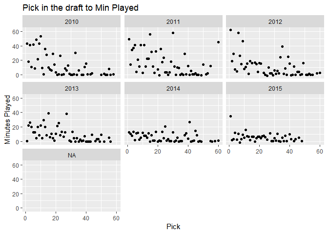
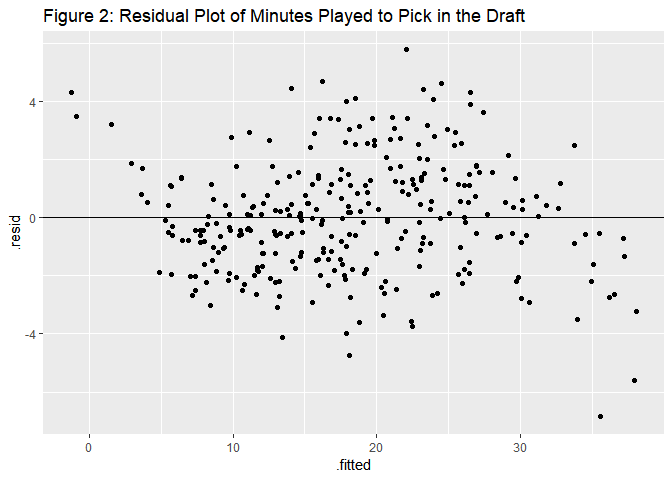

Final Proj Code 2
================
Noam Benkler
May 30, 2018

``` r
NBAdata <- read.csv("finalNBAdraftdata.csv", colClasses=c("NULL", NA, "NULL", NA, NA, NA, NA, NA, NA, "NULL", "NULL", NA, NA, NA, NA, NA, NA, NA, NA, NA, NA, "NULL", "NULL", "NULL", NA, NA))

stargazer(NBAdata, type = "text", title = "Table 1: Summary Statistics of NBA Data for Players Drafted between 2010 and 2015")
```

    ## 
    ## Table 1: Summary Statistics of NBA Data for Players Drafted between 2010 and 2015
    ## ========================================================================
    ## Statistic  N    Mean    St. Dev.    Min    Pctl(25)  Pctl(75)     Max   
    ## ------------------------------------------------------------------------
    ## Year      309 2,012.430  1.671   2,010.000 2,011.000 2,014.000 2,015.000
    ## Rd        309   1.424    0.495     1.000     1.000     2.000     2.000  
    ## Pk        309  27.061    16.023    1.000    13.000    40.000    60.000  
    ## Age       309  20.976    1.410    18.208    20.093    22.119    27.148  
    ## From      309 2,013.686  1.804   2,011.000 2,012.000 2,015.000 2,018.000
    ## To        309 2,016.793  1.897   2,011.000 2,016.000 2,018.000 2,018.000
    ## G         309  214.987  158.930    1.000    69.000    339.000   613.000 
    ## MP        309  17.763    8.433     2.000    10.700    24.400    36.400  
    ## PTS       309   7.106    4.959     0.000     3.300     9.900    23.400  
    ## TRB       309   3.223    2.271     0.000     1.600     4.100    13.400  
    ## AST       309   1.432    1.303     0.000     0.600     1.900     9.200  
    ## STL       309   0.565    0.356     0.000     0.300     0.800     1.800  
    ## BLK       309   0.389    0.412     0.000     0.100     0.500     2.400  
    ## FG.       308   0.434    0.089     0.000     0.398     0.478     0.800  
    ## WS        309   9.665    12.796   -2.000     0.500    12.700    62.500  
    ## WS.48     309   0.062    0.082    -0.597     0.027     0.107     0.291  
    ## ------------------------------------------------------------------------

``` r
NBAdata <- NBAdata[-c( 252, 260, 266, 267, 268, 272, 273), ]
```

``` r
NBAdata %>%
  ggplot(aes(x = Pk, y = MP)) +
  geom_point() +
  facet_wrap(~ Year) +
  xlab("Pick") + 
  ylab("Minutes Played") +
  labs(title = "Pick in the draft to Min Played")
```

    ## Warning: Removed 2 rows containing missing values (geom_point).


``` r
NBAdata %>%
  ggplot(aes(x = Pk, y = WS)) +
  geom_point() +
  facet_wrap(~ Year) +
  xlab("Pick") + 
  ylab("Minutes Played") +
  labs(title = "Pick in the draft to Min Played")
```

    ## Warning: Removed 2 rows containing missing values (geom_point).



``` r
NBAdata %>%
  ggplot(aes(x = Pk, y = WS.48)) +
  geom_point() +
  facet_wrap(~ Year) +
  xlab("Pick") + 
  ylab("Minutes Played") +
  labs(title = "Pick in the draft to Min Played")
```

    ## Warning: Removed 2 rows containing missing values (geom_point).


``` r
gf_point(MP ~ Pk, data = NBAdata)
```

    ## Warning: Removed 2 rows containing missing values (geom_point).


``` r
gf_histogram( ~ MP, data = NBAdata, title = "Histogram of Minutes Played", xlab = "Minutes Played")
```

    ## Warning: Removed 2 rows containing non-finite values (stat_bin).


``` r
gf_histogram( ~ Pk, data = NBAdata, title = "Histogram of Pick in the Draft", xlab = "Pick (1-60)")
```

    ## Warning: Removed 2 rows containing non-finite values (stat_bin).


``` r
gf_histogram( ~ Age, data = NBAdata, title = "Histogram of Player Age", xlab = "Age (years)")
```

    ## Warning: Removed 2 rows containing non-finite values (stat_bin).


``` r
gf_histogram( ~ Year, data = NBAdata)
```

    ## Warning: Removed 2 rows containing non-finite values (stat_bin).


``` r
gf_histogram( ~ G, data = NBAdata)
```

    ## Warning: Removed 2 rows containing non-finite values (stat_bin).


``` r
gf_histogram( ~ PTS, data = NBAdata,title =  "Histogram of Points Per Game", xlab = "Points Scored")
```

    ## Warning: Removed 2 rows containing non-finite values (stat_bin).


``` r
gf_histogram( ~ TRB, data = NBAdata, title = "Histogram of Total Rebounds per Game", xlab = "Total Rebounds/game")
```

    ## Warning: Removed 2 rows containing non-finite values (stat_bin).


``` r
gf_histogram( ~ log(TRB), data = NBAdata,title =  "Histogram of Log(Total Rebounds per Game)", xlab = "log(Total Rebounds/game)")
```

    ## Warning: Removed 2 rows containing non-finite values (stat_bin).


``` r
gf_histogram( ~ AST, data = NBAdata, title = "Histogram of Total Assists per Game", xlab = "Total Assists/game)")
```

    ## Warning: Removed 2 rows containing non-finite values (stat_bin).


``` r
gf_histogram( ~ log(AST), data = NBAdata, title = "Histogram of Log(Total Assists per Game)", xlab = "log(Total Assists/game)")
```

    ## Warning: Removed 2 rows containing non-finite values (stat_bin).


``` r
gf_histogram( ~ STL, data = NBAdata, title = "Histogram of Total Steals per Game", xlab = "Total Steals/game")
```

    ## Warning: Removed 2 rows containing non-finite values (stat_bin).


``` r
gf_histogram( ~ log(BLK), data = NBAdata,title =  "Histogram of Total Blocks per Game", xlab = "Total Blocks/game")
```

    ## Warning: Removed 30 rows containing non-finite values (stat_bin).


``` r
gf_histogram( ~ FG., data = NBAdata)
```

    ## Warning: Removed 2 rows containing non-finite values (stat_bin).


``` r
gf_histogram( ~ WS, data = NBAdata)
```

    ## Warning: Removed 2 rows containing non-finite values (stat_bin).


``` r
gf_histogram( ~ WS.48, data = NBAdata)
```

    ## Warning: Removed 2 rows containing non-finite values (stat_bin).


``` r
lm1 <- lm(MP ~ Pk + Age + Pos + Year + G + PTS + TRB + AST + STL + BLK + FG. + WS + WS.48, data = NBAdata)
stargazer(lm1, type = "text")
```

    ## 
    ## ===============================================
    ##                         Dependent variable:    
    ##                     ---------------------------
    ##                                 MP             
    ## -----------------------------------------------
    ## Pk                            -0.002           
    ##                               (0.011)          
    ##                                                
    ## Age                            0.091           
    ##                               (0.103)          
    ##                                                
    ## PosC-F                         0.055           
    ##                               (0.637)          
    ##                                                
    ## PosF                         1.468***          
    ##                               (0.530)          
    ##                                                
    ## PosF-C                         0.261           
    ##                               (0.601)          
    ##                                                
    ## PosF-G                        2.028**          
    ##                               (0.842)          
    ##                                                
    ## PosG                          1.232*           
    ##                               (0.647)          
    ##                                                
    ## PosG-F                       2.555***          
    ##                               (0.705)          
    ##                                                
    ## Year                          0.221**          
    ##                               (0.088)          
    ##                                                
    ## G                            0.016***          
    ##                               (0.002)          
    ##                                                
    ## PTS                          0.911***          
    ##                               (0.055)          
    ##                                                
    ## TRB                          0.667***          
    ##                               (0.131)          
    ##                                                
    ## AST                           0.436**          
    ##                               (0.173)          
    ##                                                
    ## STL                          4.994***          
    ##                               (0.630)          
    ##                                                
    ## BLK                            0.581           
    ##                               (0.525)          
    ##                                                
    ## FG.                           -1.530           
    ##                               (3.028)          
    ##                                                
    ## WS                           -0.134***         
    ##                               (0.021)          
    ##                                                
    ## WS.48                          1.781           
    ##                               (2.936)          
    ##                                                
    ## Constant                    -443.380**         
    ##                              (177.912)         
    ##                                                
    ## -----------------------------------------------
    ## Observations                    302            
    ## R2                             0.940           
    ## Adjusted R2                    0.936           
    ## Residual Std. Error      2.079 (df = 283)      
    ## F Statistic          247.090*** (df = 18; 283) 
    ## ===============================================
    ## Note:               *p<0.1; **p<0.05; ***p<0.01

``` r
vif(lm1)
```

    ##           GVIF Df GVIF^(1/(2*Df))
    ## Pk    2.127531  1        1.458606
    ## Age   1.468736  1        1.211914
    ## Pos   4.716455  6        1.137980
    ## Year  1.508303  1        1.228130
    ## G     3.975352  1        1.993829
    ## PTS   5.092666  1        2.256694
    ## TRB   6.061744  1        2.462061
    ## AST   3.522791  1        1.876910
    ## STL   3.397553  1        1.843245
    ## BLK   3.285170  1        1.812504
    ## FG.   3.794108  1        1.947847
    ## WS    5.116962  1        2.262070
    ## WS.48 3.892205  1        1.972867

``` r
null_mod <- lm(MP ~ 1, data = NBAdata)
lm.step <- stepAIC(null_mod, scope = list(lower = ~ 1, upper = ~ Pk + Age + Pos + Year + PTS + log(TRB) + log(AST) + STL + BLK + FG. + WS + WS.48), direction = "both" , trace=0)
tidy(lm.step)
```

    ## # A tibble: 14 x 5
    ##    term        estimate std.error statistic  p.value
    ##    <chr>          <dbl>     <dbl>     <dbl>    <dbl>
    ##  1 (Intercept)   2.75      2.12       1.30  1.95e- 1
    ##  2 PTS           0.791     0.0447    17.7   7.22e-48
    ##  3 STL           3.51      0.587      5.97  6.84e- 9
    ##  4 log(TRB)      3.78      0.371     10.2   4.62e-21
    ##  5 log(AST)      1.55      0.270      5.75  2.33e- 8
    ##  6 PosC-F       -0.111     0.620     -0.180 8.57e- 1
    ##  7 PosF          1.39      0.460      3.03  2.71e- 3
    ##  8 PosF-C       -0.106     0.567     -0.187 8.52e- 1
    ##  9 PosF-G        2.48      0.762      3.25  1.29e- 3
    ## 10 PosG          1.63      0.653      2.50  1.32e- 2
    ## 11 PosG-F        2.63      0.631      4.16  4.18e- 5
    ## 12 Pk           -0.0277    0.0101    -2.74  6.62e- 3
    ## 13 WS.48        -4.02      2.00      -2.01  4.50e- 2
    ## 14 Age           0.174     0.0967     1.80  7.27e- 2

``` r
new.mod <- lm(MP ~ Pk + Pos + PTS + log(TRB) + log(AST) + STL + Age, data = NBAdata)
stargazer(new.mod, type = "text")
```

    ## 
    ## ===============================================
    ##                         Dependent variable:    
    ##                     ---------------------------
    ##                                 MP             
    ## -----------------------------------------------
    ## Pk                           -0.030***         
    ##                               (0.010)          
    ##                                                
    ## PosC-F                        -0.026           
    ##                               (0.621)          
    ##                                                
    ## PosF                         1.517***          
    ##                               (0.459)          
    ##                                                
    ## PosF-C                        -0.079           
    ##                               (0.570)          
    ##                                                
    ## PosF-G                       2.600***          
    ##                               (0.764)          
    ##                                                
    ## PosG                         1.772***          
    ##                               (0.652)          
    ##                                                
    ## PosG-F                       2.711***          
    ##                               (0.633)          
    ##                                                
    ## PTS                          0.783***          
    ##                               (0.045)          
    ##                                                
    ## log(TRB)                     3.522***          
    ##                               (0.349)          
    ##                                                
    ## log(AST)                     1.561***          
    ##                               (0.271)          
    ##                                                
    ## STL                          3.423***          
    ##                               (0.589)          
    ##                                                
    ## Age                           0.170*           
    ##                               (0.097)          
    ##                                                
    ## Constant                       2.893           
    ##                               (2.130)          
    ##                                                
    ## -----------------------------------------------
    ## Observations                    302            
    ## R2                             0.943           
    ## Adjusted R2                    0.940           
    ## Residual Std. Error      2.012 (df = 289)      
    ## F Statistic          396.969*** (df = 12; 289) 
    ## ===============================================
    ## Note:               *p<0.1; **p<0.05; ***p<0.01

``` r
summary(new.mod)
```

    ## 
    ## Call:
    ## lm(formula = MP ~ Pk + Pos + PTS + log(TRB) + log(AST) + STL + 
    ##     Age, data = NBAdata)
    ## 
    ## Residuals:
    ##     Min      1Q  Median      3Q     Max 
    ## -6.8312 -1.4099 -0.0731  1.2406  5.7779 
    ## 
    ## Coefficients:
    ##             Estimate Std. Error t value Pr(>|t|)    
    ## (Intercept)  2.89346    2.13041   1.358 0.175468    
    ## Pk          -0.03009    0.01009  -2.983 0.003099 ** 
    ## PosC-F      -0.02645    0.62139  -0.043 0.966079    
    ## PosF         1.51689    0.45861   3.308 0.001060 ** 
    ## PosF-C      -0.07883    0.56969  -0.138 0.890047    
    ## PosF-G       2.60044    0.76363   3.405 0.000754 ***
    ## PosG         1.77198    0.65236   2.716 0.007000 ** 
    ## PosG-F       2.71066    0.63279   4.284 2.51e-05 ***
    ## PTS          0.78315    0.04480  17.480  < 2e-16 ***
    ## log(TRB)     3.52156    0.34945  10.077  < 2e-16 ***
    ## log(AST)     1.56147    0.27084   5.765 2.09e-08 ***
    ## STL          3.42253    0.58860   5.815 1.61e-08 ***
    ## Age          0.17019    0.09716   1.752 0.080883 .  
    ## ---
    ## Signif. codes:  0 '***' 0.001 '**' 0.01 '*' 0.05 '.' 0.1 ' ' 1
    ## 
    ## Residual standard error: 2.012 on 289 degrees of freedom
    ##   (2 observations deleted due to missingness)
    ## Multiple R-squared:  0.9428, Adjusted R-squared:  0.9404 
    ## F-statistic:   397 on 12 and 289 DF,  p-value: < 2.2e-16

``` r
vif(new.mod)
```

    ##              GVIF Df GVIF^(1/(2*Df))
    ## Pk       1.905485  1        1.380393
    ## Pos      4.137472  6        1.125627
    ## PTS      3.617451  1        1.901960
    ## log(TRB) 4.723488  1        2.173359
    ## log(AST) 4.313453  1        2.076885
    ## STL      3.172002  1        1.781012
    ## Age      1.405577  1        1.185570

``` r
influenceIndexPlot(new.mod)
```


``` r
tCritical = print(qt(0.005, df = 267))
```

    ## [1] -2.594368

``` r
#conf-int for Pk
cat("conf-int for Pk", -0.03084 -  0.01037*tCritical, "to", -0.03084 +  0.01037*tCritical )
```

    ## conf-int for Pk -0.003936405 to -0.0577436

``` r
#conf-int for PosC-F
cat("                                                              ")
```

``` r
cat("conf-int for PosC-F", -0.22614 - 0.67946*tCritical, "to", -0.22614 + 0.67946*tCritical*tCritical)
```

    ## conf-int for PosC-F 1.536629 to 4.347132

``` r
#conf-int for PosF
cat("                                                              ")
```

``` r
cat("conf-int for PosF", 1.55744 - 0.54430*tCritical, "to", 1.55744 + 0.54430*tCritical)
```

    ## conf-int for PosF 2.969554 to 0.1453255

``` r
#conf-int for PosF-C
cat("                                                              ")
```

``` r
cat("conf-int for PosF-C", -0.07720 - 0.62976*tCritical, "to", -0.07720 + 0.62976*tCritical)
```

    ## conf-int for PosF-C 1.556629 to -1.711029

``` r
#conf-int for PosF-G
cat("                                                              ")
```

``` r
cat("conf-int for PosF-G", 2.70736 - 0.81816*tCritical, "to", 2.70736 + 0.81816*tCritical )
```

    ## conf-int for PosF-G 4.829968 to 0.584752

``` r
#conf-int for PosG
cat("                                                              ")
```

``` r
cat("conf-int for PosG", 1.93656-0.74471*tCritical,"to", 1.93656+0.74471*tCritical)
```

    ## conf-int for PosG 3.868612 to 0.004508275

``` r
#conf-int for PosG-F
cat("                                                              ")
```

``` r
cat("conf-int for PosG-F", 2.81323-0.70411*tCritical, "to", 2.81323+0.70411*tCritical)
```

    ## conf-int for PosG-F 4.63995 to 0.9865096

``` r
#conf-int for PTS
cat("                                                              ")
```

``` r
cat("conf-int for PTS", 0.75053-0.04658*tCritical, "to", 0.75053+0.04658*tCritical)
```

    ## conf-int for PTS 0.8713757 to 0.6296843

``` r
#conf-int for log(TRB)
cat("                                                              ")
```

``` r
cat("conf-int for log(TRB)", 3.88799-0.38557*tCritical, "to", 3.88799+0.38557*tCritical )
```

    ## conf-int for log(TRB) 4.8883 to 2.88768

``` r
#conf-int for log(AST)
cat("                                                              ")
```

``` r
cat("conf-int for log(AST)", 1.66010-0.29504*tCritical, "to", 1.66010+0.29504*tCritical)
```

    ## conf-int for log(AST) 2.425542 to 0.8946577

``` r
#conf-int for STL
cat("                                                              ")
```

``` r
cat("conf-int for STL", 3.19391-0.60322*tCritical, "to", 3.19391+0.60322*tCritical)
```

    ## conf-int for STL 4.758885 to 1.628935

``` r
#conf-int for Age
cat("                                                              ")
```

``` r
cat("conf-int for Age", 0.16777-0.10114*tCritical, "to", 0.16777+0.10114*tCritical)
```

    ## conf-int for Age 0.4301644 to -0.09462437

``` r
gf_point(MP ~ Pk, data = NBAdata, title = "Figure 1: Average Minutes Played vs. Draft Pick", xlab = "Draft Pick (1-60)", ylab = "Minutes Played per Game") + geom_smooth(method = "lm")
```

    ## Warning: Removed 2 rows containing non-finite values (stat_smooth).

    ## Warning: Removed 2 rows containing missing values (geom_point).


``` r
gf_point(.resid ~ .fitted, data = new.mod, title = "Figure 2: Residual Plot of Minutes Played to Pick in the Draft") %>% gf_hline(yintercept = 0)
```



``` r
NBAdata.residplot <- augment(new.mod, NBAdata)
NBAdata.residplot %>% ggplot(aes(.fitted, .resid, color = Pos)) +
  geom_point() +
  labs(x = "Fitted Values",
       y = "Residuals",
       title = "Residual Plot of Minutes Played to Pick in the Draft, Visualizing Position") + geom_hline(yintercept = 0)
```


``` r
new.modqq <- augment(new.mod)
gf_qq(~.std.resid, data = new.modqq) %>% gf_qqline() %>% gf_labs(x = "N(0, 1) quantiles", y = "Standardized residuals", title = "Figure 3: Q-Q plot for Restricted Model")
```


``` r
gf_point(MP ~ Pk, data = NBAdata, title = "Figure 4: Plot of Minutes Played to Pick in the Draft Prediction Interval", xlab = "Pick", ylab = "Minutes Played") %>% gf_lm(MP ~ Pk, interval = "prediction")
```

    ## Warning: Removed 2 rows containing non-finite values (stat_lm).

    ## Warning: Removed 2 rows containing missing values (geom_point).


``` r
#Heteroskedastisity tests for pooled model

#Breusch-Pagan test
bptest(new.mod)
```

    ## 
    ##  studentized Breusch-Pagan test
    ## 
    ## data:  new.mod
    ## BP = 13.464, df = 12, p-value = 0.3363

``` r
#tests for autocorrelation

#dwtest
dwtest(new.mod)
```

    ## 
    ##  Durbin-Watson test
    ## 
    ## data:  new.mod
    ## DW = 1.9844, p-value = 0.427
    ## alternative hypothesis: true autocorrelation is greater than 0

``` r
#Breusch-Godfrey Test
bgtest(new.mod)
```

    ## 
    ##  Breusch-Godfrey test for serial correlation of order up to 1
    ## 
    ## data:  new.mod
    ## LM test = 0.0035756, df = 1, p-value = 0.9523

``` r
#Runs test
runs.test(as.factor(sign(resid(new.mod))))
```

    ## 
    ##  Runs Test
    ## 
    ## data:  as.factor(sign(resid(new.mod)))
    ## Standard Normal = -0.67994, p-value = 0.4965
    ## alternative hypothesis: two.sided

``` r
#correct for autocorellation
sqrt(diag(NeweyWest(new.mod)))
```

    ## (Intercept)          Pk      PosC-F        PosF      PosF-C      PosF-G 
    ## 1.784573092 0.009450965 0.661109496 0.441726984 0.473180986 0.713054068 
    ##        PosG      PosG-F         PTS    log(TRB)    log(AST)         STL 
    ## 0.609059281 0.686984259 0.052483032 0.376000503 0.249854542 0.674049607 
    ##         Age 
    ## 0.083727158
