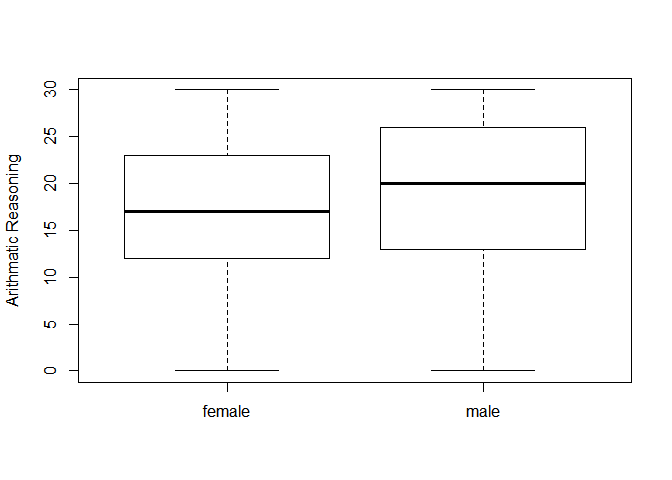
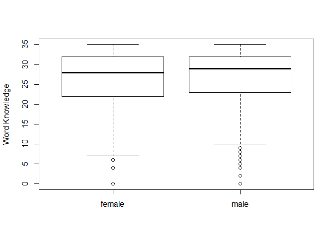
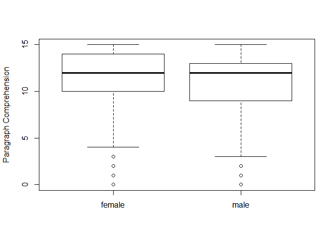
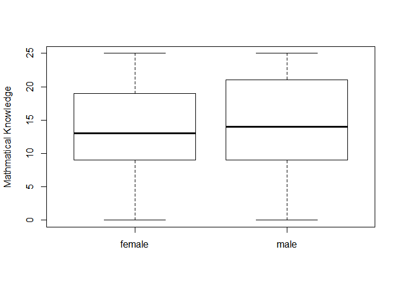
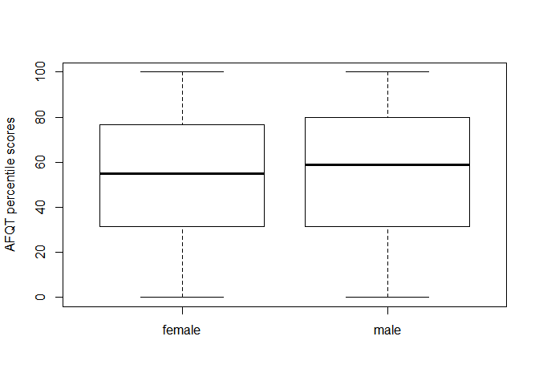

Math 245 HW 1
================
Name: Noam Benkler
3/27/18 I worked with: Christian Zaytoun

Problem 1
---------

#### (a) Create side-by-side boxplots comparing the two distributions and give a qualitative comparison of these distributions (comment on the centers, shapes, and spreads).

*Answer:* Arithmatic Reasoning: Males and Females appeared to have a similar spread of Arithmetic Reasoning scores. However, Males showed a larger IQR with a higher upper bound, and a higher median score than Females. Both seem to be normally distributed.

Word by Gender: Males seem to have higher median Word Knowledge scores than females, but the maximum scores seem to be the same for both genders. While both gender's IQR's seem to be very similar the spread seems to be greater for Females than Males while Males seem to be more skewed towards the lower bound. Both distributions showed outliers.

Paragraph by Gender: Similar to Word Knowlege, Male and Female maximum scores for Paragraph Comprehension are very close. However, Females have a higher IQR than their Male counterpartes, and males have a more extreme lower bound than females. Both distributions were skewed towards the upper bounds.

Math by Gender: Male and Female's upper and lower bounds on mathmatical knowledge were very similar to one another. Male's IQR was larger and reached higher than that of the Females, however both started at about the same level. Though the medians appear to be close, Male's seem to have a slightly higher median score on the math knowledge portion of the test than Females. Both spreads appear to be fairly normaly distributed.

AFQT by Gender: Like Mathamatical Knowledge, Male and Female's AFQT scores appeared to be very similar. Male's still showed a larger IQR with a slightly higher bound, along with a slightly higher median AFQT score. Both spreads appeared to be normaly distributd.

``` r
boxplot(Arith ~ Gender, data=ex0222, ylab = "Arithmatic Reasoning")
```



``` r
boxplot(Word ~ Gender, data=ex0222, ylab = "Word Knowledge") 
```



``` r
boxplot(Parag ~ Gender, data=ex0222, ylab = "Paragraph Comprehension")
```



``` r
boxplot(Math ~ Gender, data=ex0222, ylab = "Mathmatical Knowledge")
```



``` r
boxplot(AFQT ~ Gender, data=ex0222, ylab = "AFQT percentile scores")
```



#### (b) Give a 95% confidence interval to estimate the differences in male and female AFQT scores. Interpret this interval without using the word "difference" (use words like "higher" or "lower" instead).

With 95% confidence female AFQT scores are between 4.1799 points lower and 0.0990 points higher than male AFQT scores.

``` r
t.test(AFQT ~ Gender, data = ex0222)

    Welch Two Sample t-test

data:  AFQT by Gender
t = -1.8701, df = 2578.1, p-value = 0.06158
alternative hypothesis: true difference in means is not equal to 0
95 percent confidence interval:
 -4.179916  0.099000
sample estimates:
mean in group female   mean in group male 
            53.40579             55.44625 
```

#### (c) State null and alternative hypotheses comparing the means of the distributions of AFQT scores by gender.

*Answer:* Ha: Mean Male AFQT Score - Mean Female AFQT Score = 0 H0: Mean Male AFQT Score - Mean Female AFQT Score != 0

#### (d) Compute the test statistic and p-value associated with the hypothesis test you specified in the previous part and interpret the strength of evidence.

*Answer:* At 95% confidence, we cannot conclude that the true difference in mean AFQT score between Females and Males is not equal to zero.

p-value: tells us that in a test where the means were equal to 0 we would get the same results as we see here 6.158% of the time

``` r
t.test(AFQT ~ Gender, data = ex0222)

    Welch Two Sample t-test

data:  AFQT by Gender
t = -1.8701, df = 2578.1, p-value = 0.06158
alternative hypothesis: true difference in means is not equal to 0
95 percent confidence interval:
 -4.179916  0.099000
sample estimates:
mean in group female   mean in group male 
            53.40579             55.44625 
```

#### (e) What assumptions were involved in your answers to (b) and (d)? Are these assumptions reasonable for these data?

*Answer:* Assumptions: 1. AFQT scores correspond to a normal distribution - This assumption seemed reasonable for or data, as the AFQT scores looked like they followed a normal distribution

1.  Random sampling -The experiment detailed in the book, from which this data was take, claims the scores were selected from random samples.

2.  Large enough sample size -Sample size in this experiment was 1,306 men and 1,278 women which seems like a large enough sample size to qualify.

``` r
# (e) code
```
