Math 245 HW 2
================
Name: Noam Benkler
I worked with: Christian Zaytoun

Problem 1: Using the results shown in D. 7.9 find a 95% conf. int. for the intercept in the regression of measured distance on recession velosity
-------------------------------------------------------------------------------------------------------------------------------------------------

We can say with 95% confidence that the true intercept lies between 0.3506713 and 0.4475287

``` r
sd = 0.1185
coefficient = 0.3991
n = 23
error <- qnorm(0.975)*sd/sqrt(n)
left <- coefficient-error
right <- coefficient+error

left
[1] 0.3506713
right
[1] 0.4475287
```

Problem 2
---------

### (a) Create a scatterplot of stream runoff against snowfall. Comment on the apparent relationship (strength, shape, direction).

We can se a medium streangth positive linear correlation between Snowfall and Stream runoff.

``` r

gf_point(Runoff~Precip, data = water, xlab = "Snowfall (in)", ylab = "Stream Runoff (acre-feet)")
```

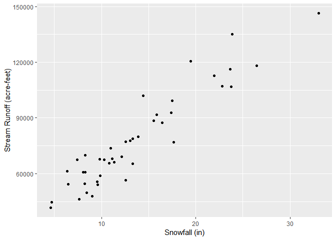

### (b)Find (and write out) the equation of the estimated linear model of the expected runoff given snowfall. (Do not just print the R output; you need to write down the estimated model.) Add the least squares line to the data plot from part (a).

The estimated linear model of the expected runoff given snowfall is Runoff = 27014.6(acre-feet) + 3752.5\*Snowfall

``` r

snowscatter.lm <- lm(Runoff~Precip, data = water)
summary(snowscatter.lm)

Call:
lm(formula = Runoff ~ Precip, data = water)

Residuals:
     Min       1Q   Median       3Q      Max 
-17603.8  -5338.0    332.1   3410.6  20875.6 

Coefficients:
            Estimate Std. Error t value Pr(>|t|)    
(Intercept)  27014.6     3218.9   8.393 1.93e-10 ***
Precip        3752.5      215.7  17.394  < 2e-16 ***
---
Signif. codes:  0 '***' 0.001 '**' 0.01 '*' 0.05 '.' 0.1 ' ' 1

Residual standard error: 8922 on 41 degrees of freedom
Multiple R-squared:  0.8807,    Adjusted R-squared:  0.8778 
F-statistic: 302.6 on 1 and 41 DF,  p-value: < 2.2e-16
gf_point(Runoff~Precip, data = water, xlab = "Snowfall (in)", ylab = "Stream Runoff (acre-feet)") %>% gf_lm(Runoff~Precip, data=water)
```


### (c)Interpret the slope coefficient in the context of the problem. (Don’t forget to specify units.)

For every additional inch of snowfall we expect a 3752.5 (acre-feet) increase in stream runoff

### (d) Interpret the intercept in the context of the problem. (Don’t forget to specify units.)

If there is no snowfall we expect to see 27,014.6 (acre-feet) of stream runoff

### (e) Give a 95% confidence interval for the slope coefficient.

``` r
sd = 215.7
slope = 3752.5
error <- qnorm(0.975)*sd/sqrt(n)
left <- slope-error
right <- slope+error

cat("With 95% confidence, we can say that the true slope coefficient relating snowfall to stream runoff lies between", (left), "and", (right), ".")
With 95% confidence, we can say that the true slope coefficient relating snowfall to stream runoff lies between 3664.348 and 3840.652 .
```

### (f) Are the four assumptions for the simple linear regression model reasonable? Be sure to show and explain any graphs you used to assess these assumptions.

Linearity: Our scatterplot, shown below, shows the data follows a linear trend.

Independence: Our residual plot shows the data is fairly evenly distributed around the center with no discernable trends, meaning it is reasonable to assume independence.

Constant Error Variance: Our residual plot appeard to have a random distribution of data points with no apparent trends, that suggests there are no wierd trends in standard error variance.

Normality: Our Q-Q plot below shows our data corresponds to a normal distribution, the data fits well along the residual line, with most of the data points towards the center of the plot -1 and 1.

``` r
gf_point(Runoff~Precip, data = water, xlab = "Snowfall (in)", ylab = "Stream Runoff (acre-feet)", main= "Scatterplot Demonstrating Linearity") %>% gf_lm(Runoff~Precip, data=water)
```

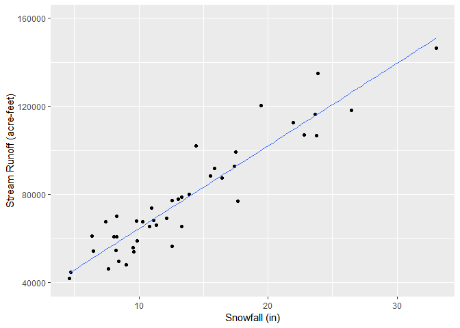

``` r
library(broom)
resid_sn <- augment(snowscatter.lm)

gf_point(.resid~.fitted, data=resid_sn) %>% gf_hline(yintercept = 0, col = "blue", lty = 2) %>% gf_labs(x = "Fitted values", y = "Residuals", title = "Residuals vs. Fitted Values")
```

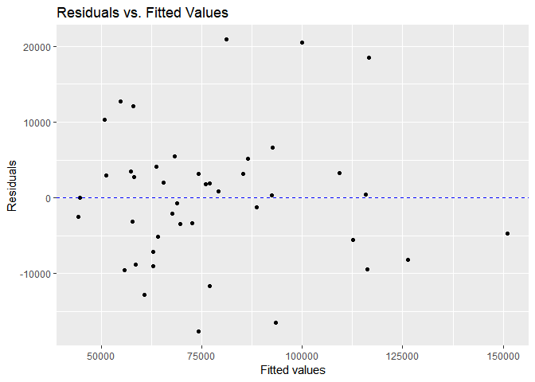

``` r
gf_qq(~.std.resid, data = resid_sn) %>% gf_qqline() %>% gf_labs(x = "N(0, 1) quantiles", y = "Standardized residuals")
```

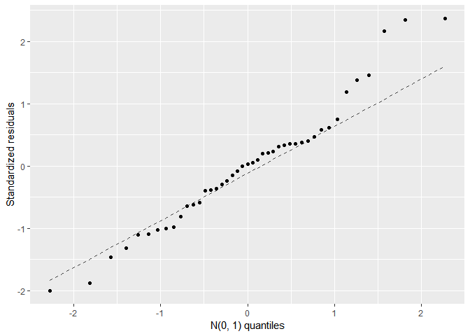

### (g) In the winter of 2013-2014, the site only received 4.5 inches of snowfall. What do you predict will be the associated runoff? Provide a 95% prediction interval and interpret the interval in the context of the problem.

We predict the associated runoff with snowfall level of 4.5 inches will be 43900.77 (acre-feet), and we are 95% confident that the true associated runoff will be between 25254.2 (acre-feet) and 62547.34 (acre-feet).

``` r
new.df <- data.frame(Precip = 4.5)
predict(snowscatter.lm, newdata = new.df, interval = "predict")
       fit     lwr      upr
1 43900.77 25254.2 62547.34
```

### (h)Do you have any hesitations about the prediction you made in part (g)? Describe these hesitations and their potential impact on your prediction.

Because 4.5 inches is on the lower end of measured snowfall records we hesitate at the accuracy of the prediction becasue the lack of sufficeint evidence at the end of the bottom means we can't confirm linearity at 4.5 inches of snowfall, this could pontentially mean our prediction is too low (if the corrolation becomes more shallow) or too high (if the corrolation becomes much steeper)

Problem 3
---------

``` r
queens <- filter(ex0327, BeeType == "Queen")
```

### (a)Fit the simple linear regression model of removal on duration. Report the fitted least-squares (model) equation and create a scatterplot of the data along with the least-squares line added.

Proportion of Pollen Removed = 0.295204 + 0.008106\*Duration of Visit

``` r
gf_point(PollenRemoved~DurationOfVisit, data = queens, ylab = "Proportion of Pollen Removed", xlab = "Duration of Visit (seconds)") %>% gf_lm(PollenRemoved~DurationOfVisit, data=queens)
```

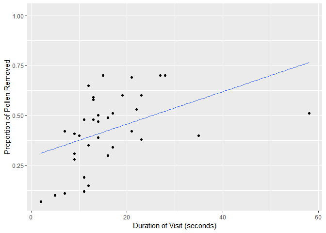

``` r

queens.lm <- lm(PollenRemoved~DurationOfVisit, data = queens)
summary(queens.lm)

Call:
lm(formula = PollenRemoved ~ DurationOfVisit, data = queens)

Residuals:
     Min       1Q   Median       3Q      Max 
-0.26437 -0.11327  0.04184  0.10700  0.28321 

Coefficients:
                Estimate Std. Error t value Pr(>|t|)    
(Intercept)     0.295204   0.053640   5.503 4.17e-06 ***
DurationOfVisit 0.008106   0.002831   2.863  0.00724 ** 
---
Signif. codes:  0 '***' 0.001 '**' 0.01 '*' 0.05 '.' 0.1 ' ' 1

Residual standard error: 0.1653 on 33 degrees of freedom
Multiple R-squared:  0.1989,    Adjusted R-squared:  0.1747 
F-statistic: 8.196 on 1 and 33 DF,  p-value: 0.00724
```

### (b)Plot the residuals against duration. What problems are evident in the residual plot?

The two outliers shown in the residuals plot would mess with the trend of the data and force it towards the outliers and away from a more accurate result.

``` r
library(broom)
resid_qu <- augment(queens.lm)

gf_point(.resid~.fitted, data=resid_qu) %>% gf_hline(yintercept = 0, col = "blue", lty = 2) %>% gf_labs(x = "Fitted values", y = "Residuals", title = "Residuals vs. Fitted Values")
```

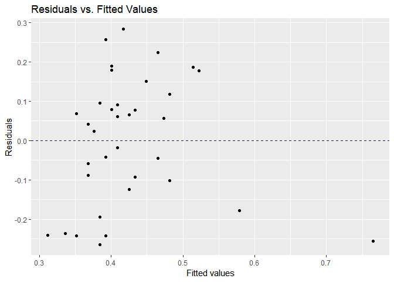

### (c)Create a histogram and normal Q-Q plot of duration, and describe the distribution.

Our histogram shows a fairly normal distribution with one or two outliers, making it skew to the right. Our Q-Q also corresponds to a fairly normal distribution.

``` r
gf_histogram(~ DurationOfVisit, color = NA, data = queens)
```

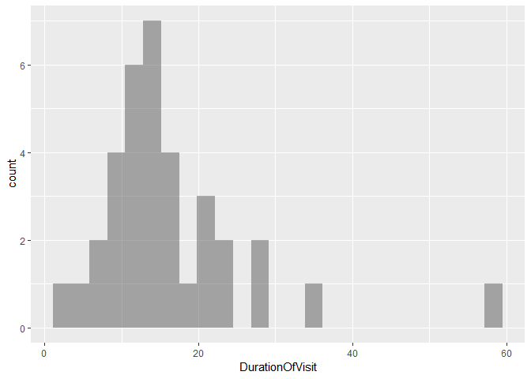

``` r

gf_qq(~.std.resid, data = resid_qu) %>% gf_qqline() %>% gf_labs(x = "N(0, 1) quantiles", y = "Standardized residuals")
```

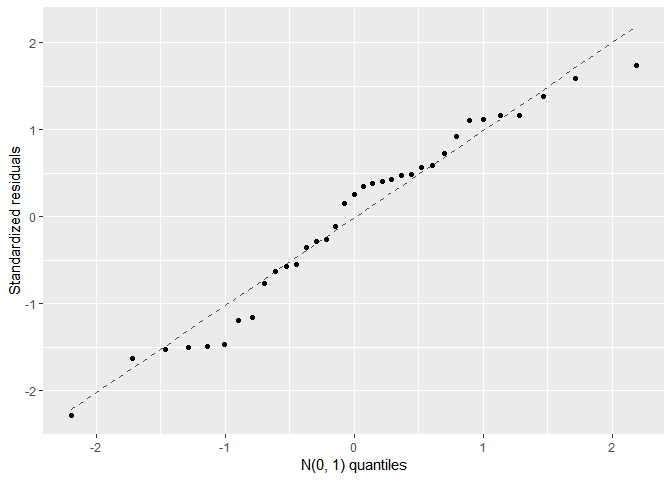

### (d)Fit the simple linear regression model of removal on log of duration and report the fitted model equation.

Proportion of Pollen Removed = -0.07285 + 0.19008\*log(Duration of Visit)

``` r
logDuration <- log(queens$DurationOfVisit)
logD.lm <- lm(PollenRemoved~logDuration, data = queens)
gf_point(PollenRemoved~logDuration, data = queens, ylab = "Proportion of Pollen Removed", xlab = "log of the Duration of Visit") %>% gf_lm(PollenRemoved~logDuration, data=queens)
```

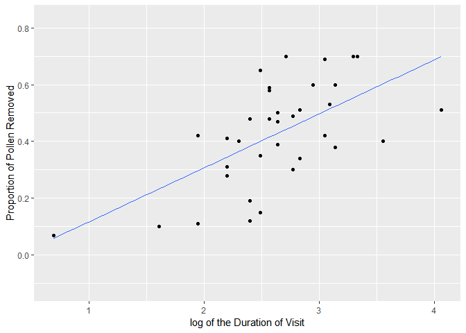

``` r

summary(logD.lm)

Call:
lm(formula = PollenRemoved ~ logDuration, data = queens)

Residuals:
     Min       1Q   Median       3Q      Max 
-0.26294 -0.12938  0.03518  0.10512  0.25811 

Coefficients:
            Estimate Std. Error t value Pr(>|t|)    
(Intercept) -0.07285    0.11421  -0.638    0.528    
logDuration  0.19008    0.04247   4.476 8.57e-05 ***
---
Signif. codes:  0 '***' 0.001 '**' 0.01 '*' 0.05 '.' 0.1 ' ' 1

Residual standard error: 0.1457 on 33 degrees of freedom
Multiple R-squared:  0.3777,    Adjusted R-squared:  0.3589 
F-statistic: 20.03 on 1 and 33 DF,  p-value: 8.573e-05
```

### (e)Create the residual plot for the above model (residuals against log of duration). Did the transformation help address the problems you observed in the original model?

The transformation somewhat helped address the problems of outliers we observed before, the data is much more randomly distributed about the center, though there is some problem with clustering in the center of the graph.

``` r
resid_lgQ <- augment(logD.lm)

gf_point(.resid~.fitted, data=resid_lgQ) %>% gf_hline(yintercept = 0, col = "blue", lty = 2) %>% gf_labs(x = "Fitted values", y = "Residuals", title = "Residuals vs. Fitted Values")
```

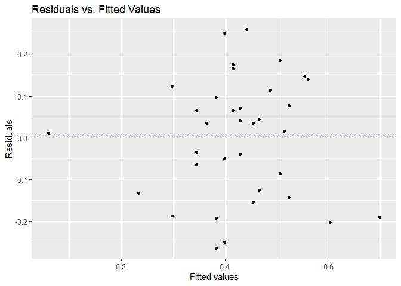

### (f)Now, fit the simple linear regression model of removal on duration to the data set only including bees with duration less than 31 seconds (take a look at the original scatterplot again to see why). Report the fitted model equation.

Pollen Removed = 0.130031 + 0.020547(Duration of Visit)

``` r
potential_outliers <- which(resid_qu$DurationOfVisit > 31)
potential_outliers
[1] 14 34

refit.lm <- lm(PollenRemoved~DurationOfVisit, data = queens, subset = -potential_outliers)
summary(refit.lm)

Call:
lm(formula = PollenRemoved ~ DurationOfVisit, data = queens, 
    subset = -potential_outliers)

Residuals:
      Min        1Q    Median        3Q       Max 
-0.236054 -0.132769 -0.002624  0.082851  0.273399 

Coefficients:
                Estimate Std. Error t value Pr(>|t|)    
(Intercept)     0.130031   0.063335   2.053   0.0486 *  
DurationOfVisit 0.020547   0.004075   5.043  1.9e-05 ***
---
Signif. codes:  0 '***' 0.001 '**' 0.01 '*' 0.05 '.' 0.1 ' ' 1

Residual standard error: 0.1408 on 31 degrees of freedom
Multiple R-squared:  0.4506,    Adjusted R-squared:  0.4329 
F-statistic: 25.43 on 1 and 31 DF,  p-value: 1.9e-05

#,  ylab = "Proportion of Pollen Removed", xlab = "Duration of Visit", main = "Linear Regression Excluding Outliers") %>% gf_lm(PollenRemoved~logDuration, data=queens)
```

### (g)Plot the residuals against duration. Does this look like an acceptable fit?

This plot shows a much more acceptable fit.

``` r
gf_point(.resid~.fitted, data=refit.lm) %>% gf_hline(yintercept = 0, col = "blue", lty = 2) %>% gf_labs(x = "Fitted values", y = "Residuals", title = "Residuals vs. Fitted Values")
```


Problem 4
---------

### (a) Draw a scatterplot of Democratic percentage of absentee ballots versus Democratic percentage of machine-counted baollots, use a separate plotting symbol to highlight the disputed election.

``` r
elections <- subset(ex0820)
gf_point(DemPctOfAbsenteeVotes~DemPctOfMachineVotes, data = elections, shape = ~Disputed, ylab = "Democratic Party Absentee Votes", xlab = "Democratic Party Machine Votes" )
```

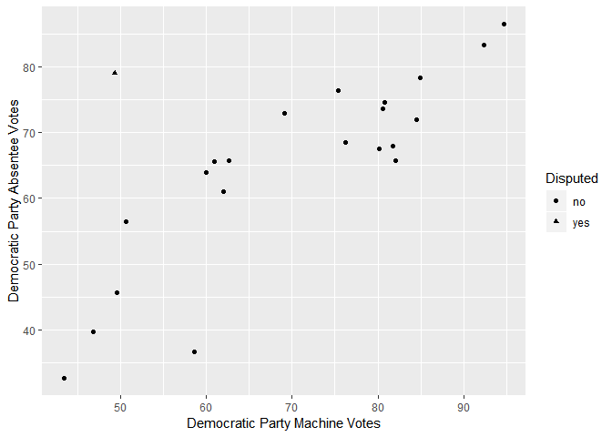

### (b) Fit the simple linear regression of the absentee percentage on machine-count percentage, excluding the disputed election. Draw this line on the scatterplot. Also includ a 95% prediction band. What does this plot reveal about the unusualness of the absentee percentage in the disputed election?

``` r
elections.lm <- lm(DemPctOfAbsenteeVotes~DemPctOfMachineVotes, data = elections, subset = -which(ex0820$Disputed == "yes"))
summary(elections.lm)

Call:
lm(formula = DemPctOfAbsenteeVotes ~ DemPctOfMachineVotes, data = elections, 
    subset = -which(ex0820$Disputed == "yes"))

Residuals:
    Min      1Q  Median      3Q     Max 
-17.988  -5.090   0.459   7.621   9.405 

Coefficients:
                     Estimate Std. Error t value Pr(>|t|)    
(Intercept)            5.5339     7.7678   0.712    0.485    
DemPctOfMachineVotes   0.8388     0.1080   7.765  2.6e-07 ***
---
Signif. codes:  0 '***' 0.001 '**' 0.01 '*' 0.05 '.' 0.1 ' ' 1

Residual standard error: 7.407 on 19 degrees of freedom
Multiple R-squared:  0.7604,    Adjusted R-squared:  0.7478 
F-statistic:  60.3 on 1 and 19 DF,  p-value: 2.6e-07
gf_point(DemPctOfAbsenteeVotes~DemPctOfMachineVotes, shape = ~Disputed, data = elections) %>%
gf_lm(interval = "prediction") %>%
gf_labs(x = "Percentage of Democratic Party Absentee Voters", y = "Percentege of Democratic Party Machine Votes", main = "Scaterplot with 95% Prediction Band")
```

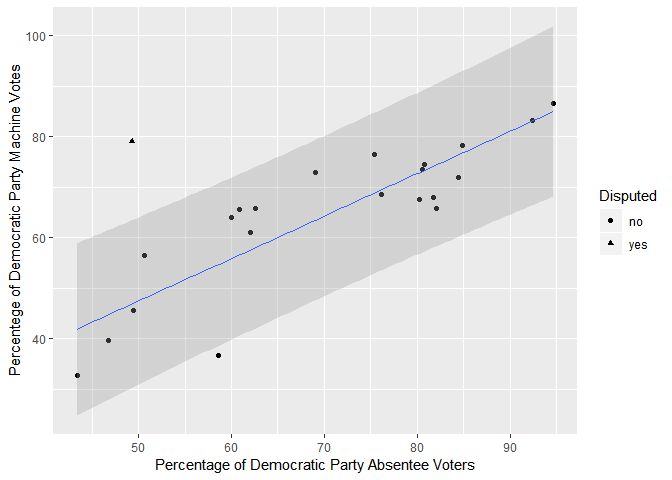 The graph shows that the disputed election had a much higher than percentege of Democratic Absentee Voters than all other in this dataset elections. Moreover, though one other election sits slightly outside the predicted interval, the disputed election is the only election that falls far outside the 95% prediction interval.

### (c) Find the prediction and standard error of the pridiction from this fit if the machine-count percentage is 49.3. How many estimated standard deviations is the observed absentee percentage, 79.0, from this predicted value? compare this answer to a t-distribution to obtain a p-value.

At 43: prediction = 46.88664 /// standard error of prediction = 2.788739 The observed absentee percentege is 11.51537 standard deviations away from this predicted value. p-value is 7.126815\*10^-22

``` r
machCount.df <- data.frame(DemPctOfMachineVotes = 49.3)
predict(elections.lm,
newdata = machCount.df,
se.fit = TRUE)
$fit
       1 
46.88664 

$se.fit
[1] 2.788739

$df
[1] 19

$residual.scale
[1] 7.407472

sd = 2.788739
abs((46.88664-79.0)/sd)
[1] 11.51537

average=46.88664
mean =  79.0
df = 19

t <- (mean-average)/(sd/sqrt(df+1))
pctMach.p <-2*pt(-abs(t),df= df)
cat("p-value is ", pctMach.p)
p-value is  7.126815e-22
```

### (d) Adjust the p-value with a Bonferroni correction to account for all 22 residuals that could be similarly considered.

``` r
newpval <- pctMach.p *22
cat("adjusted p-value is ", newpval)
adjusted p-value is  1.567899e-20
```
