Math 245 HW 3
================
Name: Noam Benkler
I worked with: Christian Zaytoun

Problem 1: Interpret the slope in context and in the original units of x and Y .
================================================================================

(a) Where Y = weight and x = hours spent on the elliptical machine 
$$\\hat{\\mu} \\{Y | log(x)\\} = 3 − 3.7log(x)$$
------------------------------------------------------------------

An increase of 1 hour spent on the elliptical is associated with a multiplicative change of exp(-3.7), or 0.025 (weight), in Median {Y|x}

(b) Where Y is salary in dollars and x is age in years. 
$$\\hat{\\mu} \\{log(Y) | x\\} = 3 + 0.85x$$
-------------------------------------------------------

A doubling of age(years) is associated with a log(2)(0.85), or -0.234, dollar change in salary.

Problem 2: Study of the effectiveness of biological control of the exotic weed tansy ragwort.
=============================================================================================

(a) Use scatterplots of the raw data, along with trial and error, to determine transformations of Y=Ragwort dry mass and of X = Flea beetle load that will produce an approximate linear relationship.
------------------------------------------------------------------------------------------------------------------------------------------------------------------------------------------------------

right skewed histograms of both Y and X suggest log transformations will yield the best results

``` r
hist(ex0817$Load, xlab = "Load", main= "Histogram of Frequency of Variable Load")
```

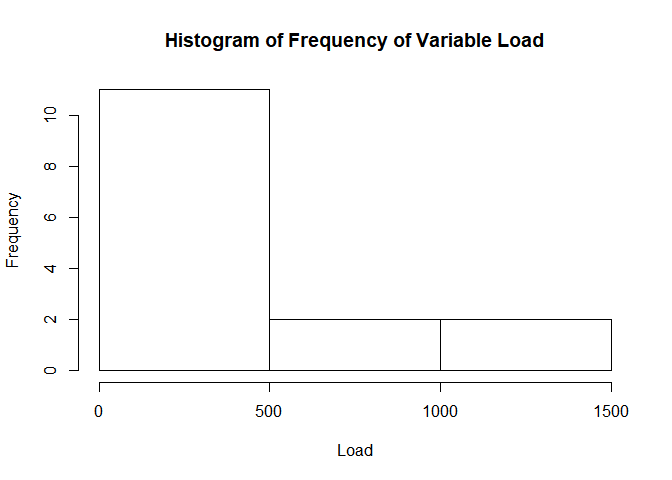

``` r
hist(ex0817$Mass, xlab = "Mass", main= "Histogram of Frequency of Variable Mass")
```

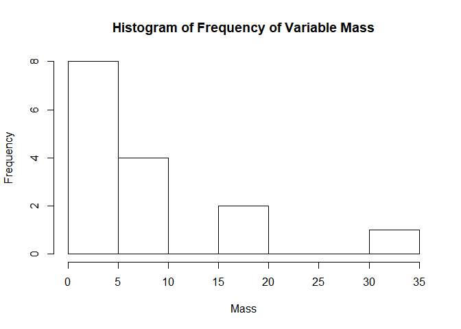

``` r
gf_point(Mass~Load, data=ex0817) %>% gf_labs(title= "Scatterplot of Mass by Load")
```

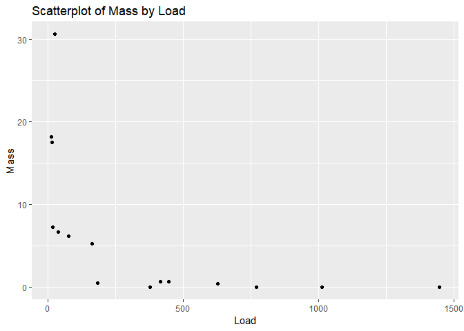

``` r
gf_point(1/Mass~Load, data=ex0817) %>% gf_labs(title= "Scatterplot of 1/Mass by Load")
```

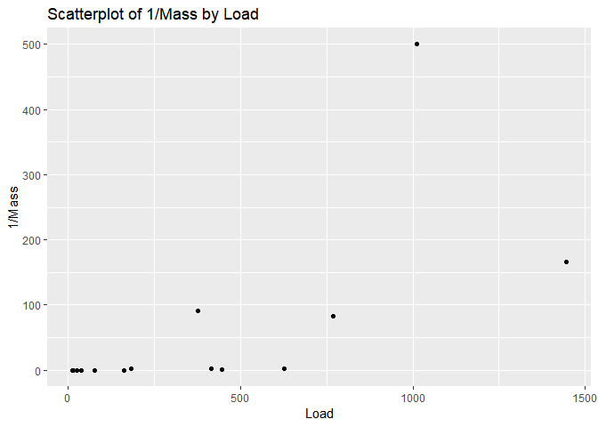

``` r
gf_point(Mass~1/Load, data=ex0817) %>% gf_labs(title= "Scatterplot of Mass by 1/Load")
```

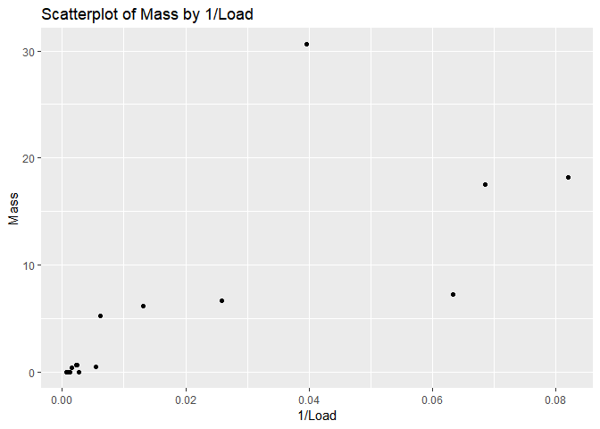

``` r
gf_point(1/Mass~1/Load, data=ex0817) %>% gf_labs(title= "Scatterplot of 1/Mass by 1/Load")
```

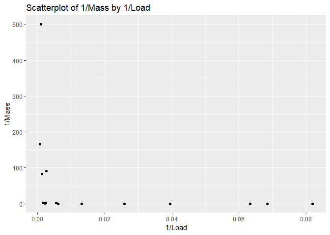

``` r
gf_point(log(Mass)~Load, data=ex0817) %>% gf_labs(title= "Scatterplot of log(Mass) by Load")
```

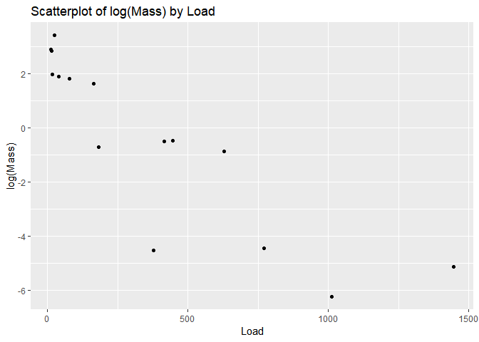

``` r
gf_point(Mass~log(Load), data=ex0817) %>% gf_labs(title= "Scatterplot of Mass by log(Load)")
```

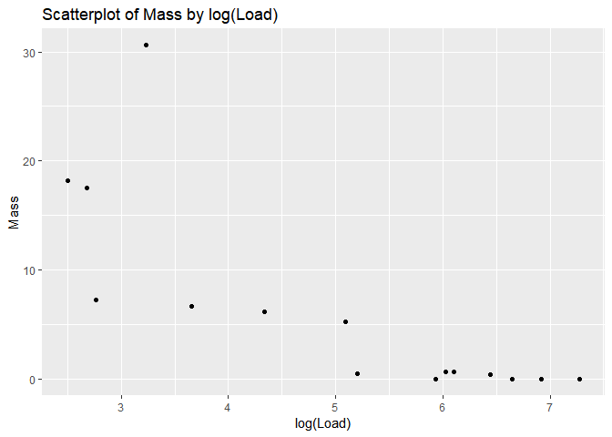

``` r
gf_point(log(Mass)~log(Load), data=ex0817) %>% gf_labs(title= "Scatterplot of log(Mass) by log(Load)")
```


``` r
gf_point(1/Mass~log(Load), data=ex0817) %>% gf_labs(title= "Scatterplot of 1/Mass by log(Load)")
```

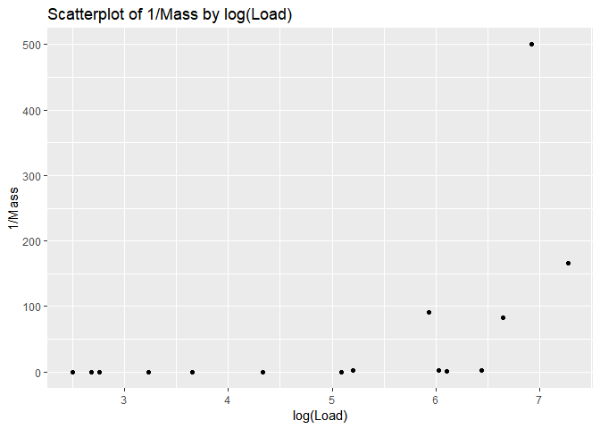

``` r
gf_point(log(Mass)~1/Load, data=ex0817) %>% gf_labs(title="Scatterplot of log(Mass) by 1/Load")
```

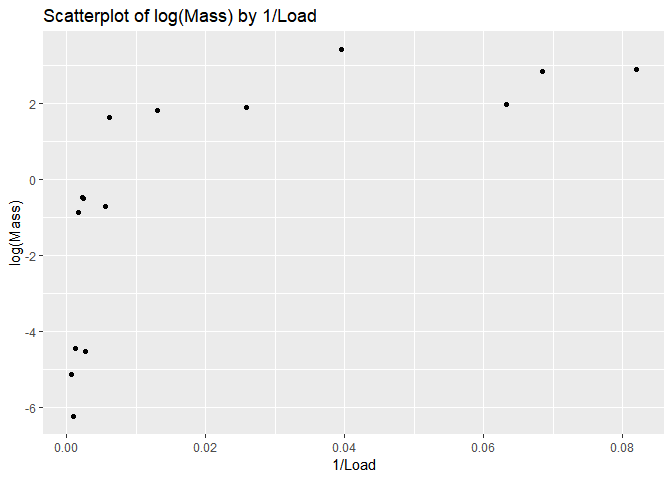

(b) Fit a linear regression model on the transformed scale; calculate residuals and fitted balues.
--------------------------------------------------------------------------------------------------

``` r
gf_point(log(Mass)~Load, data=ex0817) %>% gf_lm(log(Mass)~Load, data=ex0817, interval = "confidence")
```

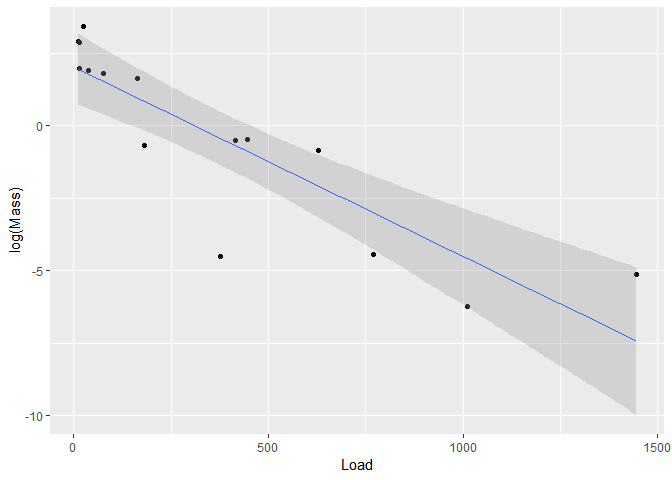

``` r
logy_mod <- lm(log(Mass)~Load, data=ex0817)
resid_logy <- augment(logy_mod)
gf_point(.resid ~ .fitted, data = resid_logy) %>%
  gf_hline(yintercept = 0, col = "blue", lty = 2) %>%
  gf_labs(x = "Fitted values", y = "Residuals",
  title = "Residuals vs. Fitted Values of log(y)")
```

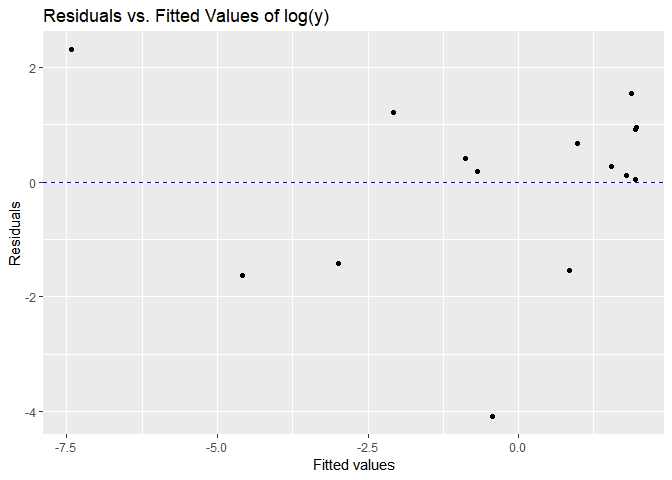

``` r
gf_point(log(Mass)~log(Load), data=ex0817) %>% gf_lm(log(Mass)~log(Load), data=ex0817, interval = "confidence")
```

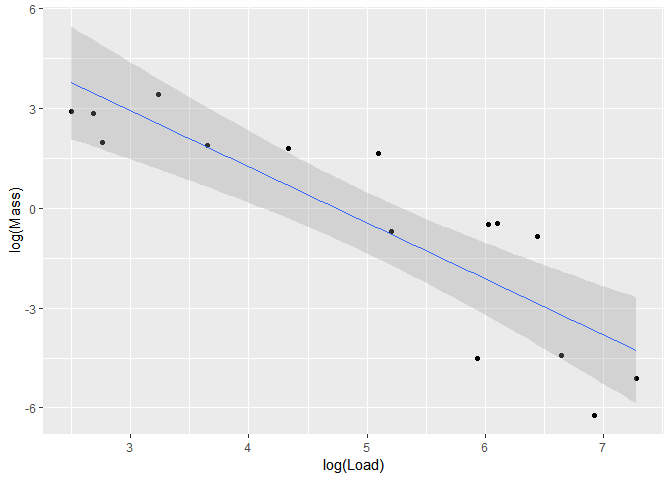

``` r
logxy_mod <- lm(log(Mass)~log(Load), data=ex0817)
resid_logxy <- augment(logxy_mod)
gf_point(.resid ~ .fitted, data = resid_logxy) %>%
  gf_hline(yintercept = 0, col = "blue", lty = 2) %>%
  gf_labs(x = "Fitted values", y = "Residuals",
  title = "Residuals vs. Fitted Values of log(x) and log(y)")
```

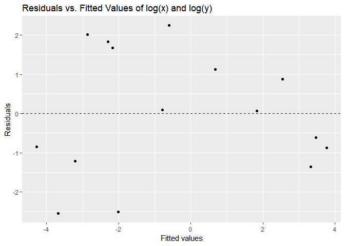

``` r
gf_point(Mass~1/Load, data=ex0817)%>% gf_lm(Mass ~ 1/Load, data=ex0817, interval = "confidence")
```

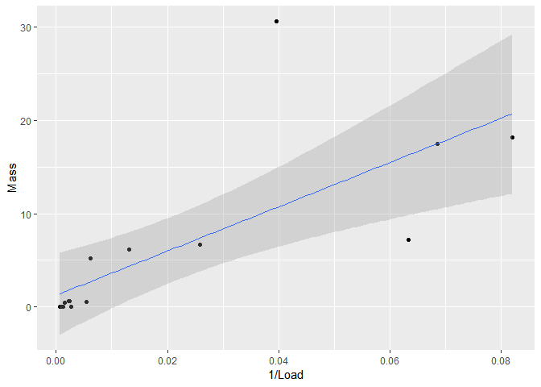

``` r
quox_mod <- lm(Mass~1/Load, data=ex0817)
resid_quox <- augment(quox_mod)
gf_point(.resid ~ .fitted, data = resid_quox) %>%
  gf_hline(yintercept = 0, col = "blue", lty = 2) %>%
  gf_labs(x = "Fitted values", y = "Residuals",
  title = "Residuals vs. Fitted Values of 1/x")
```

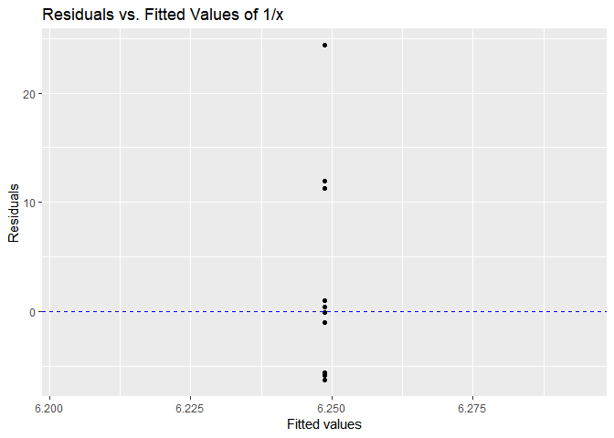

(c)Look at the residuals plot, do you want to try other transformations? What do you suggest?
---------------------------------------------------------------------------------------------

The best residuals plot for the transformation where both x and y were log'd seems to have the most random distribution. However, the points tend to extend over the 0 residual in the middle and under and under the 0 risidual towards the outward bounds. I would be fine without trying other transformations. Given the scatter plots of other transformations calculated above, I am fairly certain this is the cleanest transformation we are likely to get.

Problem 3: Kleiber's Law
========================

(a) Make a plot of average metabolic rate against mass for the 95 animals in this data set. Make sure the axes are appropriately labeled. Comment on the relationship (shape, strength, direction of association).
------------------------------------------------------------------------------------------------------------------------------------------------------------------------------------------------------------------

The data is be very right skewed, with most of the points concentrated towards the lower bounds and only a few pointsthat extend out past 500kg Body Mass. There appears to be a strong positive correlation between Average Body Mass and Average Metabolic Rate

``` r
gf_point(Metab~Mass, data=ex0826, ylab = "Average Metabolic Rate (kJ/day)", xlab = "Average Body Mass(kg)")
```

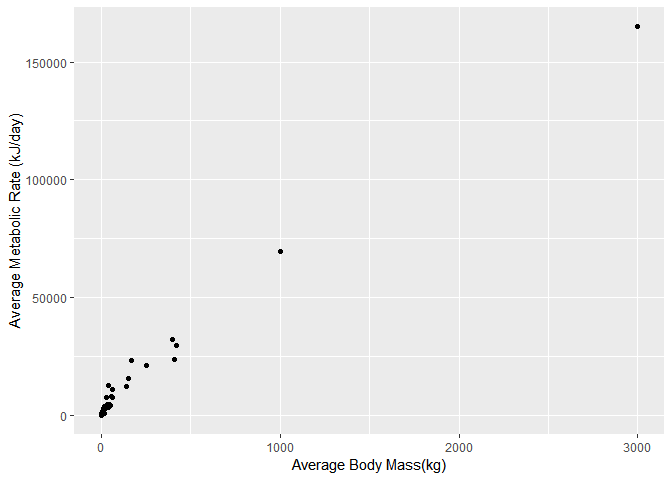

(b) Fit the simple linear regression model of metabolic rate on mass. Write down the theoretical model using appropriate notation. Give the estimated coefficient values and their standard errors in a table (see the handout on formatting numeric output in R for help with nice formatting in R Markdown).
--------------------------------------------------------------------------------------------------------------------------------------------------------------------------------------------------------------------------------------------------------------------------------------------------------------

Average Metabolic Rate(kJ/day) = 1203.20(kJ/day) + 57.03(kJ/day(kg))\*Average Body Mass(kg)

``` r
metamass.lm <- lm(Metab~Mass, data=ex0826)

knitr::kable(tidy(metamass.lm, conf.int= TRUE))
```

| term        |    estimate|   std.error|  statistic|   p.value|   conf.low|   conf.high|
|:------------|-----------:|-----------:|----------:|---------:|----------:|-----------:|
| (Intercept) |  1203.20188|  291.269942|   4.130882|  7.89e-05|  624.79750|  1781.60626|
| Mass        |    57.02678|    0.869497|  65.585941|  0.00e+00|   55.30013|    58.75343|

(c) Interpret the estimated slope coefficient from part (b) in the context of the problem.
------------------------------------------------------------------------------------------

On average, every extra kg of mass a mammal possesses corresponds to a 57.027 kJ/day increase in that mammal's average metabolic rate

(d) Are the four assumptions for the simple linear regression model reasonable? Be sure to show and explain any graphs you used to assess these assumptions.
------------------------------------------------------------------------------------------------------------------------------------------------------------

*Linearity: unreasonable* Our scatterplot, shown below, shows the data does not fit an entirely linear trend. *Independence: unreasonable* Our residual plot shows the data is very concentrated towards the the left side of our plot and extends into the upper leftmost quadrant, meaning it is not reasonable to assume independence. *Constant Error Variance: unreasonable* Our residual plot did not appeard to have a random distribution of data points, and showed observable trends. This suggests there are problems in assuming standard error variance. *Normality: unreasonable* Our Q-Q plot below shows our data does not correspond to a normal distribution, and skews off above the line of normality after the first quantile.

``` r
gf_point(Metab~Mass, data=ex0826, ylab = "Average Metabolic Rate (kJ/day)", xlab = "Average Body Mass(kg)", main= "Scatterplot Demonstrating Linearity") %>% gf_lm(Metab~Mass, data=ex0826)
```

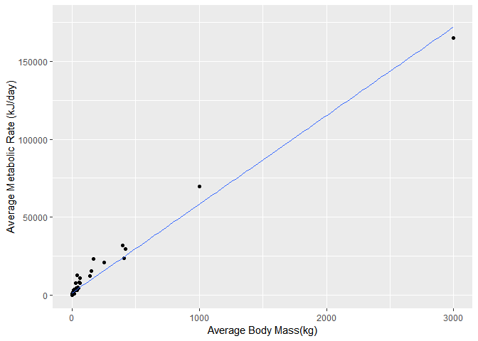

``` r
resid_metm <- augment(metamass.lm)

gf_point(.resid~.fitted, data=resid_metm) %>% gf_hline(yintercept = 0, col = "blue", lty = 2) %>% gf_labs(x = "Fitted values", y = "Residuals", title = "Residuals vs. Fitted Values")
```

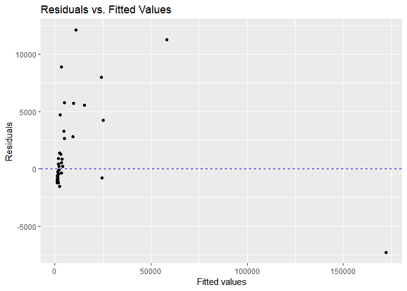

``` r
gf_qq(~.std.resid, data = resid_metm) %>% gf_qqline() %>% gf_labs(x = "N(0, 1) quantiles", y = "Standardized residuals")
```

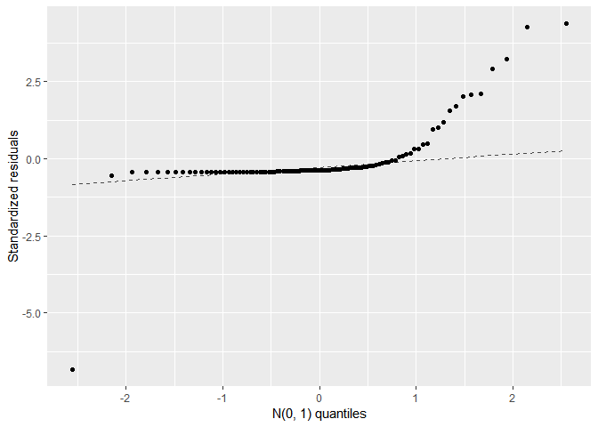

(e) Give the R2 value for the model in part (b) and interpret it in context. On the basis of the R2 value and/or the residual plot, is the simple linear regression model in part (b) a good description of these data?
-----------------------------------------------------------------------------------------------------------------------------------------------------------------------------------------------------------------------

R^2 = 0.98 this means the line of best fit accounts for around 98% of the variation in y. Based on the R^2 value the simple linear regression model in part (b) is a good description of this data, however, based on the residual plot, the simple linear regression model in part (b) is not a good discription of these data.

``` r
summary(metamass.lm)
```

    ## 
    ## Call:
    ## lm(formula = Metab ~ Mass, data = ex0826)
    ## 
    ## Residuals:
    ##     Min      1Q  Median      3Q     Max 
    ## -7283.5 -1179.0 -1034.3  -370.2 12102.2 
    ## 
    ## Coefficients:
    ##              Estimate Std. Error t value Pr(>|t|)    
    ## (Intercept) 1203.2019   291.2699   4.131 7.89e-05 ***
    ## Mass          57.0268     0.8695  65.586  < 2e-16 ***
    ## ---
    ## Signif. codes:  0 '***' 0.001 '**' 0.01 '*' 0.05 '.' 0.1 ' ' 1
    ## 
    ## Residual standard error: 2777 on 93 degrees of freedom
    ## Multiple R-squared:  0.9788, Adjusted R-squared:  0.9786 
    ## F-statistic:  4302 on 1 and 93 DF,  p-value: < 2.2e-16

(f) Make a plot of the the logarithm of the metablic rate vs. the logarithm of the mass. Compare with the plot in (a).
----------------------------------------------------------------------------------------------------------------------

this plot shows a much stronger positive linear relationship between metabolic rate and average body mass than the plot in part (a)

``` r
gf_point(log(Metab)~log(Mass), data=ex0826, ylab = "Log(Average Metabolic Rate (kJ/day))", xlab = "log(Average Body Mass(kg))")
```

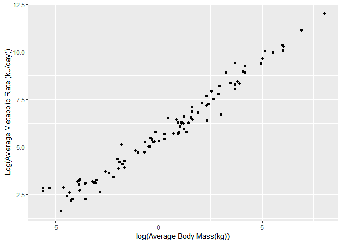

(g) Fit the simple linear model of log(Metablic rate) against log(Mass). Write down the theoretical model, and give the coefficient estimates and their standard errors in tabular form.
----------------------------------------------------------------------------------------------------------------------------------------------------------------------------------------

log(Average Metabolic Rate (kJ/day)) = 5.64 + 0.739\*log(Average Body Mass)

``` r
metamass.log <- lm(log(Metab)~log(Mass), data=ex0826)

knitr::kable(tidy(metamass.log, conf.int= TRUE))
```

| term        |   estimate|  std.error|  statistic|  p.value|   conf.low|  conf.high|
|:------------|----------:|----------:|----------:|--------:|----------:|----------:|
| (Intercept) |  5.6383307|  0.0470933|  119.72693|        0|  5.5448128|  5.7318485|
| log(Mass)   |  0.7387436|  0.0146196|   50.53116|        0|  0.7097121|  0.7677752|

(h) Interpret the estimated slope coefficient from part (g) in the context of the problem.
------------------------------------------------------------------------------------------

A doubling of the average mass of a mammal(kg), is associated with a multiplicative change of 2^(0.739), or 1.669, in the median of mammal's average metabolic rate (kJ/day)

(i) Are the four assumptions for the simple linear regression model reasonable for your transformed model in part (g)? Be sure to show and explain any graphs you used to assess these assumptions.
---------------------------------------------------------------------------------------------------------------------------------------------------------------------------------------------------

*Linearity: reasonable * Our scatterplot, shown below, shows the data nicely follows a linear trend. *Independence: reasonable* Our residual plot shows the data is fairly evenly distributed around the center with no discernable trends, meaning it is reasonable to assume independence. *Constant Error Variance: reasonable* Our residual plot appeard to have a random distribution of data points with no apparent trends, that suggests there are no wierd trends in standard error variance. *Normality: reasonable* Our Q-Q plot below shows our data corresponds to a normal distribution, the data fits well along the residual line, with most of the data points towards the center of the plot -1 and 1.

``` r
gf_point(log(Metab)~log(Mass), data=ex0826, ylab = "log(Average Metabolic Rate (kJ/day))", xlab = "log(Average Body Mass(kg))", main= "Scatterplot Demonstrating Linearity") %>% gf_lm(log(Metab)~log(Mass), data=ex0826)
```

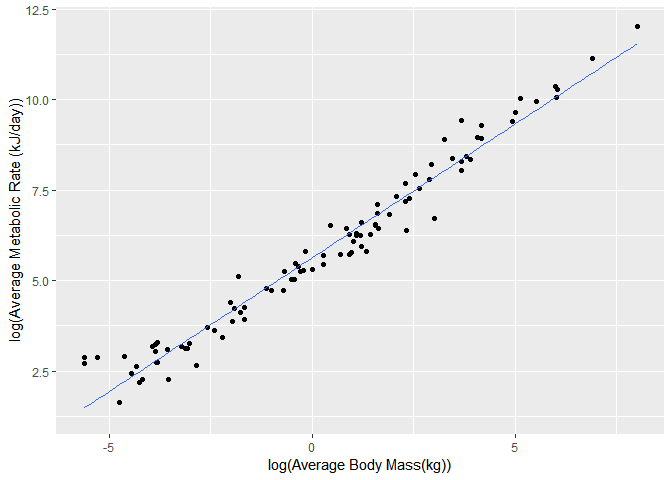

``` r
resid_logm <- augment(metamass.log)

gf_point(.resid~.fitted, data=resid_logm) %>% gf_hline(yintercept = 0, col = "blue", lty = 2) %>% gf_labs(x = "Fitted values", y = "Residuals", title = "Residuals vs. Fitted Values")
```

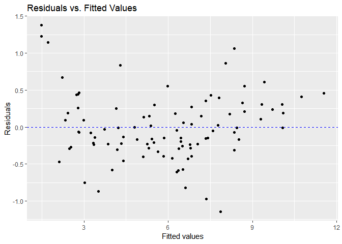

``` r
gf_qq(~.std.resid, data = resid_logm) %>% gf_qqline() %>% gf_labs(x = "N(0, 1) quantiles", y = "Standardized residuals")
```

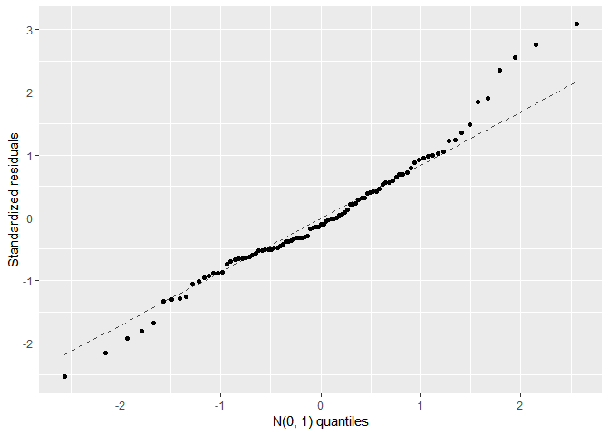

(j) Give the R2 value for the model in part (f) and interpret it in context.
----------------------------------------------------------------------------

R^2 = 0.98 this means the line of best fit accounts for around 98% of the variation in y. Based on the R^2 value and our residuals plot, the simple linear regression model in part (f) is a good description of this data.

``` r
summary(metamass.lm)
```

    ## 
    ## Call:
    ## lm(formula = Metab ~ Mass, data = ex0826)
    ## 
    ## Residuals:
    ##     Min      1Q  Median      3Q     Max 
    ## -7283.5 -1179.0 -1034.3  -370.2 12102.2 
    ## 
    ## Coefficients:
    ##              Estimate Std. Error t value Pr(>|t|)    
    ## (Intercept) 1203.2019   291.2699   4.131 7.89e-05 ***
    ## Mass          57.0268     0.8695  65.586  < 2e-16 ***
    ## ---
    ## Signif. codes:  0 '***' 0.001 '**' 0.01 '*' 0.05 '.' 0.1 ' ' 1
    ## 
    ## Residual standard error: 2777 on 93 degrees of freedom
    ## Multiple R-squared:  0.9788, Adjusted R-squared:  0.9786 
    ## F-statistic:  4302 on 1 and 93 DF,  p-value: < 2.2e-16

(k) Which model is better: the original model or the log-log model? Justify your answer.
----------------------------------------------------------------------------------------

The log-log model is a better model than the original model becasue the log-log model accounts for the serious right skew of the origional model, showing a much nicer, more evenly distributed model, that is easier to analyze and interpret.

(l) Kleiber’s law states that the metabolic rate of an animal species, on average, is proportional to its mass raised to the 3/4 power. Are these data consistent with Kleiber’s law? Conduct an appropriate hypothesis test to answer this question. Be sure to report the value of the test statistic and p-value when you state your conclusion in context.
--------------------------------------------------------------------------------------------------------------------------------------------------------------------------------------------------------------------------------------------------------------------------------------------------------------------------------------------------------------

*H*<sub>0</sub> : Slope on *M**a**s**s*<sup>0.75</sup> = 0
*H*<sub>*A*</sub> : Slope on *M**a**s**s*<sup>0.75</sup> ≠ 0
*p* − *v**a**l**u**e* : 3.313 \* 10<sup>−23</sup>
*t**e**s**t**s**t**a**t**i**s**t**i**c* : 13.331
 Our p-value suggests that if the *H*<sub>0</sub> was correct we would only percieve results as extreme as those we did 3.313 \* 10<sup>−23</sup>% of the time. Moreover our test statistic shows that our result falls 13.33 standard deviations away from the mean, were the *H*<sub>0</sub> true. Given these results we can safely reject the null Hypothesis.

``` r
metmass_mod <- lm(Metab ~ Mass + I(Mass^0.75), data = ex0826)
tidy(metmass_mod)
```

    ## # A tibble: 3 x 5
    ##   term         estimate std.error statistic  p.value
    ##   <chr>           <dbl>     <dbl>     <dbl>    <dbl>
    ## 1 (Intercept)      55.1    191.       0.287 7.74e- 1
    ## 2 Mass             19.6      2.86     6.84  8.46e-10
    ## 3 I(Mass^0.75)    262.      19.7     13.3   3.31e-23
