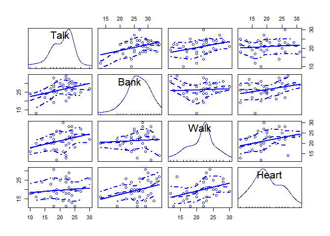

Math 245 HW 4
================
Name: Noam Benkler
I worked with: Christian Zaytoun

Problem 1
---------

### (a)

``` r
    scatterplotMatrix(~  Talk + Bank + Walk + Heart, data = ex0914)
```



### (b)

``` r
hearts_lm <- lm(Heart ~ Bank + Walk + Talk, data = ex0914)
tidy(hearts_lm)
# A tibble: 4 x 5
  term        estimate std.error statistic p.value
  <chr>          <dbl>     <dbl>     <dbl>   <dbl>
1 (Intercept)    3.18      6.34      0.502  0.619 
2 Bank           0.405     0.197     2.06   0.0480
3 Walk           0.452     0.201     2.25   0.0316
4 Talk          -0.180     0.222    -0.808  0.425 
```

### (c)

it does not appear that that variance of the residuals increases as the fitted values increase

``` r
hearts.re <- augment(hearts_lm)
gf_point(.resid ~ .fitted, data = hearts.re) %>% gf_hline(yintercept = 0)
```


### (d)

$\\widehat{\\mu}(Heart | Bank) = \\underset{(6.34)}{3.18} + \\underset{(0.20)}{0.41 (Bank)}$ All else held constant, for every point increase in mean time it takes bank clerks to make change for $20 average age adjusted death rates increase by 0.41 points. $\\widehat{\\mu}(Heart | Walk) = \\underset{(6.34)}{3.18} + \\underset{(0.20)}{0.45 Walk}$ All else held constant, for every point increase in mean pedestrian walking speed average age adjusted death rates increase by 0.45 points. $\\widehat{\\mu}(Heart | Talk) = \\underset{(6.34)}{3.18} - \\underset{(0.22)}{0.18 (Talk)}$ All else held constant, for every point increase in mean postal clerk talking speed average age adjusted death rates decrease by 0.18 points.

Problem 2
---------

### (a)

$\\widehat{\\mu}(Depression | Age, Education ) = {\\widehat{\\beta}\_0} + {\\widehat{\\beta}\_1 Age} + {\\widehat{\\beta}\_2 Education,i} + {\\widehat{\\beta}\_3 Education,ii} +{\\widehat{\\beta}\_4 Education,iii}$ $ parameter = \_3-\_2$

### (b)

$\\widehat{\\mu}(Depression | Age, Education ) = {\\widehat{\\beta}\_0} + {\\widehat{\\beta}\_1 Age} + {\\widehat{\\beta}\_2 Education,i} + {\\widehat{\\beta}\_2 Education,ii} +{\\widehat{\\beta}\_3 Education,iii}$ $ parameter = \_3-\_2$

### (c)

$\\widehat{\\mu}(Depression | Age, Education ) = {\\widehat{\\beta}\_0} + {\\widehat{\\beta}\_1 (Age-k)^2} + {\\widehat{\\beta}\_2 Education,i} + {\\widehat{\\beta}\_3 Education,ii} +{\\widehat{\\beta}\_4 Education,iii}$ where k = some constant that stands for the mean age at which the lowest point in mean depression is reached

Problem 3
---------

### (a)

d.f. for *σ* estimation = 32

### (b)

*H*<sub>*o*</sub> : *β*<sub>4</sub> = *β*<sub>5</sub> *H*<sub>*a*</sub> : *β*<sub>4</sub> ≠ *β*<sub>5</sub> According to diagram 10.18 the p-value for *β*<sub>4</sub> = *β*<sub>5</sub> is 0.0083 which is enough for us to reject the null hypothysis that species two has the same regression as species 1

### (c)

With 95% confidence the slope for species 3 exceeds the slope for species 1 by between 0.693 and -6.481 points.

``` r
SE = 1.761
slope = -2.486 - 0.4083 #slope 3 - slope 1
t.critical <- qt(.025, df = 32)
slope + t.critical*SE
[1] -6.48134
slope - t.critical*SE
[1] 0.6927396
```

Problem 4
---------

$ F = = =6.362$ p-value = 0.8596

``` r
pf(6.362, 4,2)
[1] 0.8595792
```

Problem 5
---------

### (a)

``` r
case.lm <- lm(log(Energy) ~ log(Mass) + Type, data = case1002)
stargazer(case.lm, type = "text")

======================================================
                               Dependent variable:    
                           ---------------------------
                                   log(Energy)        
------------------------------------------------------
log(Mass)                           0.815***          
                                     (0.045)          
                                                      
Typenon-echolocating bats            -0.079           
                                     (0.203)          
                                                      
Typenon-echolocating birds            0.024           
                                     (0.158)          
                                                      
Constant                            -1.498***         
                                     (0.150)          
                                                      
------------------------------------------------------
Observations                           20             
R2                                    0.982           
Adjusted R2                           0.978           
Residual Std. Error              0.186 (df = 16)      
F Statistic                  283.589*** (df = 3; 16)  
======================================================
Note:                      *p<0.1; **p<0.05; ***p<0.01
```

$\\widehat{\\mu}(log(Energy) | log(Mass), Species) = \\underset{(0.150)}{-1.498} + \\underset{(0.045)}{0.815(bats:e)}$

$\\widehat{\\mu}(log(Energy) | log(Mass), Species) = \\underset{(0.150)}{-1.498} - \\underset{(0.203)}{0.079(bats:non-e)}$

$\\widehat{\\mu}(log(Energy) | log(Mass), Species) = \\underset{(0.150)}{-1.498} + \\underset{(0.158)}{0.024(birds:non-e)}$

### (b)

$\\widehat{\\mu}(log(Energy) | log(Mass), Species ) = {\\widehat{\\beta}\_0} + {\\widehat{\\beta}\_1 log(Mass)} + {\\widehat{\\beta}\_2 (Bats:non-e)} + {\\widehat{\\beta}\_3 (Birds:non-e)} +{\\widehat{\\beta}\_4 (Bats:e)}$ $H\_0: \_3 = \_4 $ $H\_a: \_3 \_4 $ There is sufficient evidence to reject the *H*<sub>0</sub> that *β*<sub>3</sub> = *β*<sub>4</sub>.

``` r
estimable(case.lm, c(0, 1, -1, 0))
            Estimate Std. Error  t value DF    Pr(>|t|)
(0 1 -1 0) 0.8936212  0.2383323 3.749475 16 0.001749699
```

### (c)

$\\widehat{\\mu}(log(Energy) | log(Mass), Species ) = {\\widehat{\\beta}\_0} + {\\widehat{\\beta}\_1 log(Mass)} + {\\widehat{\\beta}\_2 (Bats:non-e)} + {\\widehat{\\beta}\_3 (Birds:non-e)} +{\\widehat{\\beta}\_4 (Bats:e)}$ $H\_0: \_2 = \_3 $ $H\_a: \_2 \_3 $

``` r
estimable(case.lm, c(0, 0, -1, 1))
            Estimate Std. Error   t value DF Pr(>|t|)
(0 0 -1 1) 0.1022619  0.1141826 0.8955995 16 0.383743
```

Comparing parameters, we observe a p-value of 0.384. Therefore we can not reject the null hypothesis that non-echolocating bats have different log energy outputs than non- echolocating birds.

### (d)

``` r

case_lm <- augment(case.lm)
gf_point(log(Energy) ~ log(Mass), data = case1002, color = ~Type, shape ~Type) %>%
gf_lm(.fitted ~ log.Mass., data= case_lm) %>% gf_refine(scale_color_discrete()) %>%
  gf_labs(x="Mass(g)", y = "Energy(kJ)")
```


