Stats 245 HW\_5
================
Noam Benkler
I worked with: Christian Zaytoun

Problem 1: a) df SS MS F Pr(&gt;F) x 3 2309 1 2 0.01
resid 12 1650 137.5

SS/df=764.67 MS(x)/MS(resid)=5.598

1.  $=^2 $ $\\sigma^2 = \\frac{1659}{12}=137.5$ $ = =11.73$

2.  The reason having 3 df indicates a catigorical variable is a variable with only 4 observations would be far to small to indicate anything significant if the variable is quantitative, therefor it must be a catigorical variable with multiple corresponding observations.

3.  $R^2 = \\frac{mean sq - resid mean sq}{total mean sq} = \\frac{769.67-137.5}{769.67} = 0.821$ about 82.1% of the variation in y is explained by our model

4.  $H\_o: X=Y $ $H\_a: X Y $ given our p-value of 0.01 there is sufficient evidence to reject the null hypothesis that X=Y

Problem 2:

``` r
tRex<- ex1120
```

1.  Slope: 1.07 SE: 0.116 *R*<sup>2</sup>: 0.843 *blue line*

``` r
tRex.lm <- lm(Calcite ~ Carbonate, data = tRex)
summary(tRex.lm)

Call:
lm(formula = Calcite ~ Carbonate, data = tRex)

Residuals:
     Min       1Q   Median       3Q      Max 
-1.46796 -0.64104 -0.04927  0.67301  1.55856 

Coefficients:
            Estimate Std. Error t value Pr(>|t|)    
(Intercept)  -1.4984     3.1766  -0.472    0.644    
Carbonate     1.0703     0.1156   9.259 7.93e-08 ***
---
Signif. codes:  0 '***' 0.001 '**' 0.01 '*' 0.05 '.' 0.1 ' ' 1

Residual standard error: 0.9959 on 16 degrees of freedom
Multiple R-squared:  0.8427,    Adjusted R-squared:  0.8329 
F-statistic: 85.73 on 1 and 16 DF,  p-value: 7.929e-08
```

1.  Observation 1 appears to be an influential point according to this plot.

``` r
influenceIndexPlot(tRex.lm)
```

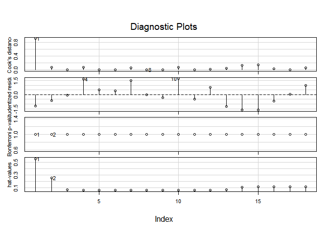

1.  

Slope: 0.922 SE: 0.1663 *R*<sup>2</sup>: 0.65 *red line*

``` r
tRex2 <- tRex[-c(1),]
tRex2.lm <- lm(Calcite ~ Carbonate, data = tRex2)
summary(tRex2.lm)

Call:
lm(formula = Calcite ~ Carbonate, data = tRex2)

Residuals:
    Min      1Q  Median      3Q     Max 
-1.2799 -0.4816 -0.1364  0.7184  1.4871 

Coefficients:
            Estimate Std. Error t value Pr(>|t|)    
(Intercept)   2.6727     4.6247   0.578    0.572    
Carbonate     0.9217     0.1663   5.541 5.65e-05 ***
---
Signif. codes:  0 '***' 0.001 '**' 0.01 '*' 0.05 '.' 0.1 ' ' 1

Residual standard error: 0.9807 on 15 degrees of freedom
Multiple R-squared:  0.6718,    Adjusted R-squared:  0.6499 
F-statistic:  30.7 on 1 and 15 DF,  p-value: 5.653e-05
```

1.  After considering both index plots, it is udoubtably clear that the first observation is influential. Frustratingly, however, once the first point is removed the second becomes influential. This process feels very self propogating.

``` r
influenceIndexPlot(tRex.lm)
```


``` r
influenceIndexPlot(tRex2.lm)
```

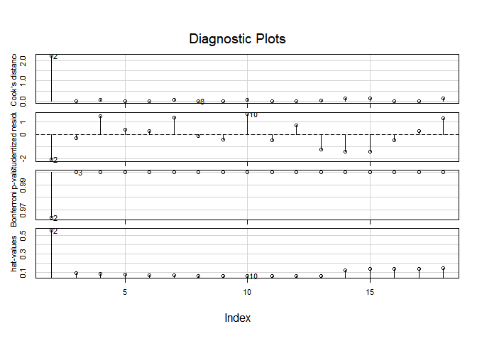

1.  

Slope: 0.590 SE: 0.220 *R*<sup>2</sup>: 0.293 *green line*

``` r
tRex3 <- tRex[-c(1,2),]
tRex3.lm <- lm(Calcite ~ Carbonate, data = tRex3)
summary(tRex3.lm)

Call:
lm(formula = Calcite ~ Carbonate, data = tRex3)

Residuals:
    Min      1Q  Median      3Q     Max 
-1.1844 -0.7038 -0.1139  0.6854  1.5492 

Coefficients:
            Estimate Std. Error t value Pr(>|t|)  
(Intercept)  12.0589     6.1592   1.958   0.0705 .
Carbonate     0.5896     0.2196   2.684   0.0178 *
---
Signif. codes:  0 '***' 0.001 '**' 0.01 '*' 0.05 '.' 0.1 ' ' 1

Residual standard error: 0.8875 on 14 degrees of freedom
Multiple R-squared:  0.3398,    Adjusted R-squared:  0.2926 
F-statistic: 7.205 on 1 and 14 DF,  p-value: 0.0178
```

1.  This last diagnastic plot now calls several points in to question: 18, 10 and 15.

``` r
influenceIndexPlot(tRex3.lm)
```

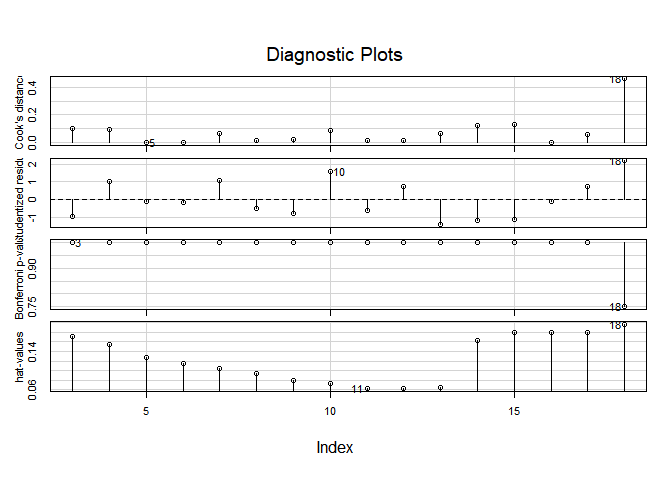

1.  The *R*<sup>2</sup> values decrease as we remove observations which means as we remove observations from our model the model accounts for less and less of the variance in Y. Moreover, the slope decreases when the first two observations were removed, but the slope's SE increased. This corroborates the idea that the first two observations were very inflential to our model.

2.  Hiding influential points within groups of observations is easy because influence is measured on an individual basis. Because of this, a group of observations considered to be influencial will help hide an individual point's influence over a model.

3.  There is a weak and possitive linear relationship between Calcite and Carbonate isotopic compositions in cements and bones respectivly. We can see the inflduential points between 23 and 20 far away from the large cluster of data points around 26-30.

``` r
gf_point(Calcite ~ Carbonate, data = tRex) %>% gf_lm(Calcite ~ Carbonate, data = tRex) %>% gf_lm(Calcite ~ Carbonate, data = tRex2, color = "red") %>% gf_lm(Calcite ~ Carbonate, data = tRex3, color = "green")
```

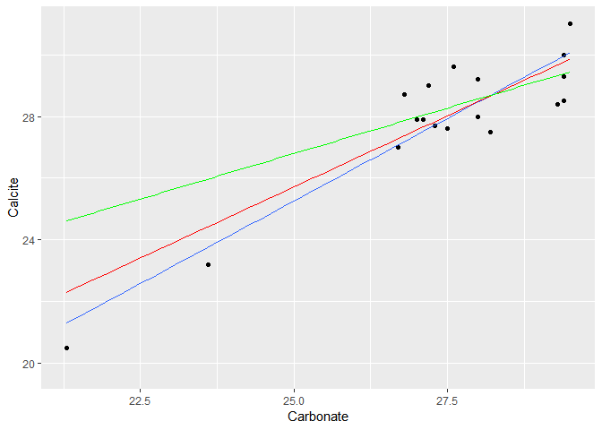

Problem 3:

``` r
tree <- ex1122
```

1.  It appears that transformations benefit this data set. Thoug some of the plots, appear somewhat linear when matched to population, generally it seems as though EDA transformations would be a reasonable next step.

``` r
pairs(tree[,1:4], pch = 19, lower.panel = NULL)
```

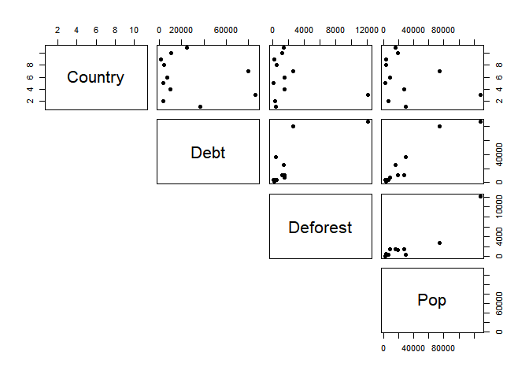

1.  

``` r
tree.lm <- lm(log(Deforest)~ log(Debt) + log(Pop), data= tree)
stargazer(tree.lm, type = "text")

===============================================
                        Dependent variable:    
                    ---------------------------
                           log(Deforest)       
-----------------------------------------------
log(Debt)                     -0.221           
                              (0.516)          
                                               
log(Pop)                      1.072*           
                              (0.529)          
                                               
Constant                      -1.386           
                              (1.853)          
                                               
-----------------------------------------------
Observations                    11             
R2                             0.716           
Adjusted R2                    0.645           
Residual Std. Error       0.797 (df = 8)       
F Statistic            10.086*** (df = 2; 8)   
===============================================
Note:               *p<0.1; **p<0.05; ***p<0.01
```

1.  While deforestation vs. debt has algight residuals it shows a concerning QQ-plot. Though there is not enough deviation to reject the normality of our data, the concavity in the center of the QQ-plot makes me sceptical of its normality.

``` r
tree.resid <- augment(tree.lm)

gf_point(.resid ~ .fitted, data = tree.resid) %>%
  gf_hline(yintercept = 0, col = "blue", lty = 2) %>%
  gf_labs(x = "Fitted values", y = "Residuals",
          title = "Residuals vs. Fitted Values")
```

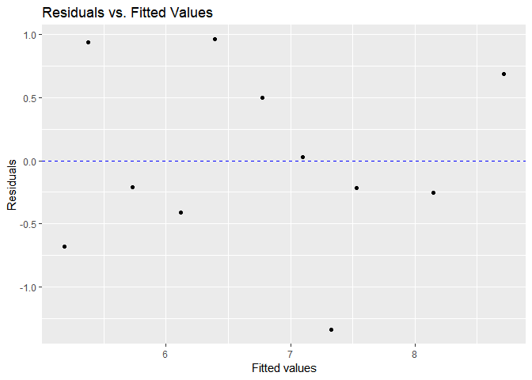

``` r

gf_qq(~ .std.resid, data = tree.resid) %>%
  gf_qqline() %>%
  gf_labs(x = "N(0, 1) quantiles", y = "Standardized residuals")
```

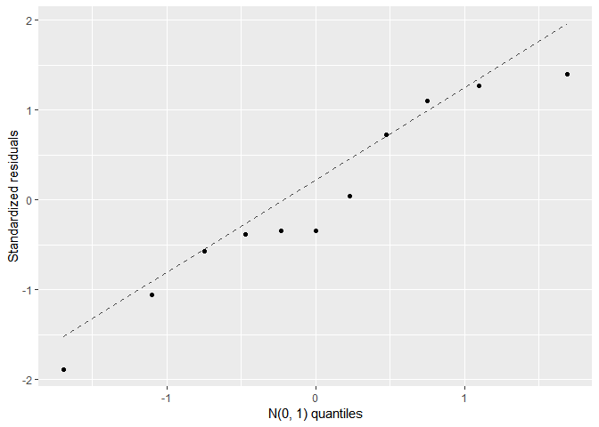

1.  The slope of our last plot shows that the effect of log(Debt) seems to be weak and negative and shows no real concerns about linearity.

``` r
tree.log <- lm(log(Deforest)~ log(Debt) + log(Pop), data= tree)
library(car)
crPlots(tree.log)
```

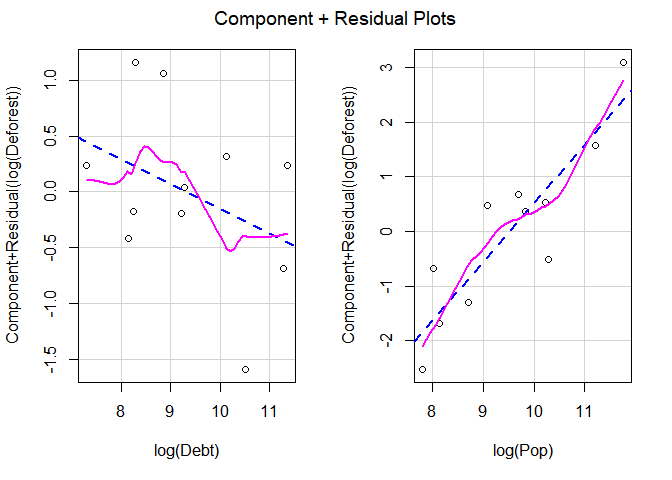

``` r
crPlots(tree.log, smooth = FALSE)
```

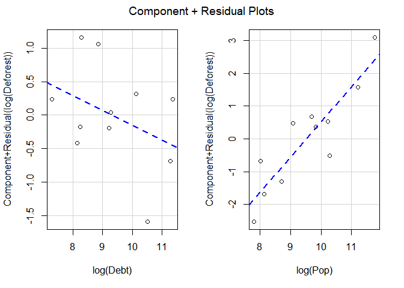

``` r
crPlot(tree.log, variable = "log(Debt)")
```

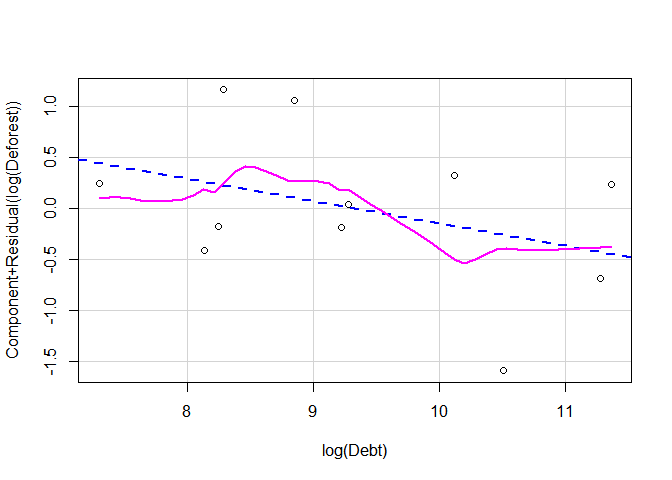

1.  Our Partial residuals plot above shows us that, even accounting for log(population) debt and defoerstation follows a negative trend. This means, there is not sufficient evidence to conclude that as a country's debt increase, so does the deforestation of that country. This disproves the hypothesis that the deeper a Latin America is in debt the greater effort they put into deforestation.

Problem 4)

``` r
water <- read.csv("http://aloy.rbind.io/data/water2.csv")
```

1.  

``` r
water.lm <- lm(BSAAM ~ APMAM + APSAB +APSLAKE+ OPBPC +OPRC+OPSLAKE, data = water)
stargazer(water.lm, type = "text")

===============================================
                        Dependent variable:    
                    ---------------------------
                               BSAAM           
-----------------------------------------------
APMAM                         -12.772          
                             (708.891)         
                                               
APSAB                        -664.412          
                            (1,522.895)        
                                               
APSLAKE                     2,270.676*         
                            (1,341.291)        
                                               
OPBPC                         69.703           
                             (461.689)         
                                               
OPRC                       1,916.450***        
                             (641.357)         
                                               
OPSLAKE                    2,211.584***        
                             (752.691)         
                                               
Constant                   15,944.670***       
                            (4,099.796)        
                                               
-----------------------------------------------
Observations                    43             
R2                             0.925           
Adjusted R2                    0.912           
Residual Std. Error     7,556.878 (df = 36)    
F Statistic           73.825*** (df = 6; 36)   
===============================================
Note:               *p<0.1; **p<0.05; ***p<0.01
```

1.  *R*<sup>2</sup> = 0.925

``` r
summary(water.lm)

Call:
lm(formula = BSAAM ~ APMAM + APSAB + APSLAKE + OPBPC + OPRC + 
    OPSLAKE, data = water)

Residuals:
   Min     1Q Median     3Q    Max 
-12690  -4936  -1424   4173  18542 

Coefficients:
            Estimate Std. Error t value Pr(>|t|)    
(Intercept) 15944.67    4099.80   3.889 0.000416 ***
APMAM         -12.77     708.89  -0.018 0.985725    
APSAB        -664.41    1522.89  -0.436 0.665237    
APSLAKE      2270.68    1341.29   1.693 0.099112 .  
OPBPC          69.70     461.69   0.151 0.880839    
OPRC         1916.45     641.36   2.988 0.005031 ** 
OPSLAKE      2211.58     752.69   2.938 0.005729 ** 
---
Signif. codes:  0 '***' 0.001 '**' 0.01 '*' 0.05 '.' 0.1 ' ' 1

Residual standard error: 7557 on 36 degrees of freedom
Multiple R-squared:  0.9248,    Adjusted R-squared:  0.9123 
F-statistic: 73.82 on 6 and 36 DF,  p-value: < 2.2e-16
```

1.  Linear regression on a constant leaves the intercept value.

``` r
waterInt.lm <- lm(BSAAM ~ 1 , data = water)
summary(waterInt.lm)

Call:
lm(formula = BSAAM ~ 1, data = water)

Residuals:
   Min     1Q Median     3Q    Max 
-35971 -17899  -8579  14449  68589 

Coefficients:
            Estimate Std. Error t value Pr(>|t|)    
(Intercept)    77756       3892   19.98   <2e-16 ***
---
Signif. codes:  0 '***' 0.001 '**' 0.01 '*' 0.05 '.' 0.1 ' ' 1

Residual standard error: 25520 on 42 degrees of freedom
```

1.  The relationship between the response and explanitory variables range from linear to seemingly random across the board. None have particularly stron correlations and transformations are certainly recommeded. However, the relationships between some of the explanitory variables are very strong and linear.

``` r
pairs(water[,1:7], pch = 19, lower.panel = NULL)
```

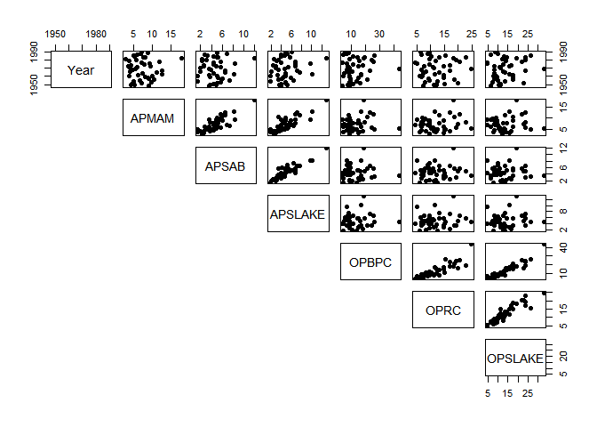

1.  Our largest concerns are tbe is the lack of correlation between the x variables and y variables and the strong pairwise correlation between many of the X variables.

2.  

``` r
APMAM1 <- lm(BSAAM ~ APMAM , data = water)
summary(APMAM1)

Call:
lm(formula = BSAAM ~ APMAM, data = water)

Residuals:
   Min     1Q Median     3Q    Max 
-37043 -16339  -5457  17158  72467 

Coefficients:
            Estimate Std. Error t value Pr(>|t|)    
(Intercept)    63364       9917   6.389 1.21e-07 ***
APMAM           1965       1249   1.573    0.123    
---
Signif. codes:  0 '***' 0.001 '**' 0.01 '*' 0.05 '.' 0.1 ' ' 1

Residual standard error: 25080 on 41 degrees of freedom
Multiple R-squared:  0.05692,   Adjusted R-squared:  0.03391 
F-statistic: 2.474 on 1 and 41 DF,  p-value: 0.1234
APSAB1 <- lm(BSAAM ~ APSAB , data = water)
summary(APSAB1)

Call:
lm(formula = BSAAM ~ APSAB, data = water)

Residuals:
   Min     1Q Median     3Q    Max 
-41314 -16784  -5101  16492  70942 

Coefficients:
            Estimate Std. Error t value Pr(>|t|)    
(Intercept)    67152       9689   6.931 2.06e-08 ***
APSAB           2279       1909   1.194    0.239    
---
Signif. codes:  0 '***' 0.001 '**' 0.01 '*' 0.05 '.' 0.1 ' ' 1

Residual standard error: 25390 on 41 degrees of freedom
Multiple R-squared:  0.0336,    Adjusted R-squared:  0.01003 
F-statistic: 1.425 on 1 and 41 DF,  p-value: 0.2394
APSLAKE1 <- lm(BSAAM ~ APSLAKE , data = water)
summary(APSLAKE1)

Call:
lm(formula = BSAAM ~ APSLAKE, data = water)

Residuals:
   Min     1Q Median     3Q    Max 
-46438 -16907  -5661  19028  69464 

Coefficients:
            Estimate Std. Error t value Pr(>|t|)    
(Intercept)    63864       9249   6.905 2.25e-08 ***
APSLAKE         2818       1709   1.649    0.107    
---
Signif. codes:  0 '***' 0.001 '**' 0.01 '*' 0.05 '.' 0.1 ' ' 1

Residual standard error: 25010 on 41 degrees of freedom
Multiple R-squared:  0.06217,   Adjusted R-squared:  0.0393 
F-statistic: 2.718 on 1 and 41 DF,  p-value: 0.1069
OPBPC1 <- lm(BSAAM ~ OPBPC , data = water)
summary(OPBPC1)

Call:
lm(formula = BSAAM ~ OPBPC, data = water)

Residuals:
   Min     1Q Median     3Q    Max 
-21183  -7298   -819   4731  38430 

Coefficients:
            Estimate Std. Error t value Pr(>|t|)    
(Intercept)  40017.4     3589.1   11.15 5.47e-14 ***
OPBPC         2940.1      240.6   12.22 3.00e-15 ***
---
Signif. codes:  0 '***' 0.001 '**' 0.01 '*' 0.05 '.' 0.1 ' ' 1

Residual standard error: 11990 on 41 degrees of freedom
Multiple R-squared:  0.7845,    Adjusted R-squared:  0.7793 
F-statistic: 149.3 on 1 and 41 DF,  p-value: 2.996e-15
OPRC1 <- lm(BSAAM ~ OPRC , data = water)
summary(OPRC1)

Call:
lm(formula = BSAAM ~ OPRC, data = water)

Residuals:
   Min     1Q Median     3Q    Max 
-24356  -5514   -522   7448  24854 

Coefficients:
            Estimate Std. Error t value Pr(>|t|)    
(Intercept)  21741.4     4044.1   5.376 3.32e-06 ***
OPRC          4667.3      311.3  14.991  < 2e-16 ***
---
Signif. codes:  0 '***' 0.001 '**' 0.01 '*' 0.05 '.' 0.1 ' ' 1

Residual standard error: 10150 on 41 degrees of freedom
Multiple R-squared:  0.8457,    Adjusted R-squared:  0.842 
F-statistic: 224.7 on 1 and 41 DF,  p-value: < 2.2e-16
OPSLAKE1 <- lm(BSAAM ~ OPSLAKE , data = water)
summary(OPSLAKE1)

Call:
lm(formula = BSAAM ~ OPSLAKE, data = water)

Residuals:
     Min       1Q   Median       3Q      Max 
-17603.8  -5338.0    332.1   3410.6  20875.6 

Coefficients:
            Estimate Std. Error t value Pr(>|t|)    
(Intercept)  27014.6     3218.9   8.393 1.93e-10 ***
OPSLAKE       3752.5      215.7  17.394  < 2e-16 ***
---
Signif. codes:  0 '***' 0.001 '**' 0.01 '*' 0.05 '.' 0.1 ' ' 1

Residual standard error: 8922 on 41 degrees of freedom
Multiple R-squared:  0.8807,    Adjusted R-squared:  0.8778 
F-statistic: 302.6 on 1 and 41 DF,  p-value: < 2.2e-16
```

1.  Our VIF makes it clear that we have a problem with multicollinearity, because with a VIF above 5 we should to be concerned about multicollinearity and for those above 10 we know there is a problem with multicollinearity, and 4 out of our 5 variables have VIF values above 5 and 1 of those 4 has a value above 10. problem.

``` r
vif(lm(lm(BSAAM ~ APMAM + APSAB +APSLAKE+ OPBPC +OPRC+OPSLAKE, data = water)))
    APMAM     APSAB   APSLAKE     OPBPC      OPRC   OPSLAKE 
 3.546344  7.183798  6.748004  9.266088  7.648712 16.970457 
```

1.  

``` r
duo.lm  <- lm(BSAAM ~ APMAM + OPRC , data = water)
summary(duo.lm)

Call:
lm(formula = BSAAM ~ APMAM + OPRC, data = water)

Residuals:
     Min       1Q   Median       3Q      Max 
-21893.1  -6742.5   -654.1   6725.7  27061.8 

Coefficients:
            Estimate Std. Error t value Pr(>|t|)    
(Intercept)  16703.9     5033.7   3.318  0.00194 ** 
APMAM          815.0      501.6   1.625  0.11206    
OPRC          4589.7      309.0  14.854  < 2e-16 ***
---
Signif. codes:  0 '***' 0.001 '**' 0.01 '*' 0.05 '.' 0.1 ' ' 1

Residual standard error: 9948 on 40 degrees of freedom
Multiple R-squared:  0.8553,    Adjusted R-squared:  0.848 
F-statistic: 118.2 on 2 and 40 DF,  p-value: < 2.2e-16
```

1.  

``` r
water$A.avg <- apply(water[,c("APMAM", "APSAB", "APSLAKE")], 1, mean) 
water$O.avg <- apply(water[, c("OPBPC", "OPRC", "OPSLAKE")], 1, mean)

tot.lm<- lm(BSAAM ~ water$A.avg + water$O.avg , data = water)
summary(tot.lm)

Call:
lm(formula = BSAAM ~ water$A.avg + water$O.avg, data = water)

Residuals:
     Min       1Q   Median       3Q      Max 
-14495.0  -5805.8   -264.5   5675.1  21028.8 

Coefficients:
            Estimate Std. Error t value Pr(>|t|)    
(Intercept)  20235.0     3991.0   5.070 9.47e-06 ***
water$A.avg   1537.8      539.9   2.848  0.00691 ** 
water$O.avg   3820.8      204.3  18.702  < 2e-16 ***
---
Signif. codes:  0 '***' 0.001 '**' 0.01 '*' 0.05 '.' 0.1 ' ' 1

Residual standard error: 8134 on 40 degrees of freedom
Multiple R-squared:  0.9032,    Adjusted R-squared:  0.8984 
F-statistic: 186.7 on 2 and 40 DF,  p-value: < 2.2e-16
```

1.  The composite variables using the total of the two different areas appears to work the best. They appear to factor in more of the data in a clearer sense than the model using only one record from each area as a representative of the population.
