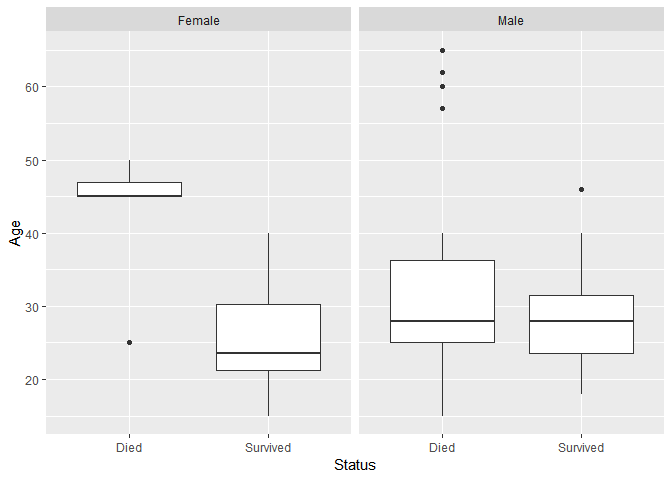
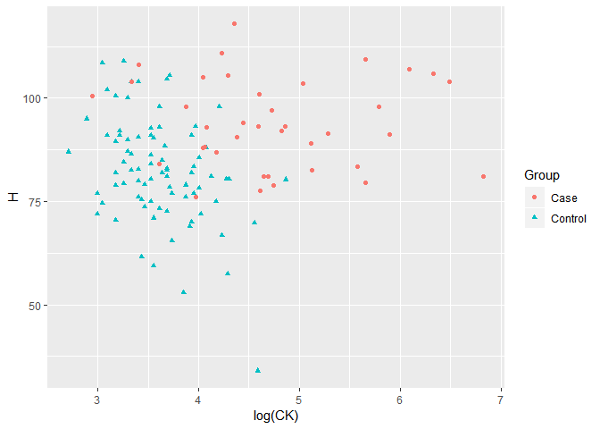

HW \#6
================
Noam Benkler
I worked with: Christian Zaytoun

``` r
knitr::opts_chunk$set(echo = TRUE)
library(dplyr)
```

    ## 
    ## Attaching package: 'dplyr'

    ## The following objects are masked from 'package:stats':
    ## 
    ##     filter, lag

    ## The following objects are masked from 'package:base':
    ## 
    ##     intersect, setdiff, setequal, union

``` r
library(ggplot2)
library(broom)
library(stargazer)
```

    ## 
    ## Please cite as:

    ##  Hlavac, Marek (2018). stargazer: Well-Formatted Regression and Summary Statistics Tables.

    ##  R package version 5.2.2. https://CRAN.R-project.org/package=stargazer

``` r
library(tidyr)
library(car)
```

    ## Loading required package: carData

    ## 
    ## Attaching package: 'car'

    ## The following object is masked from 'package:dplyr':
    ## 
    ##     recode

``` r
library(GGally)
```

    ## 
    ## Attaching package: 'GGally'

    ## The following object is masked from 'package:dplyr':
    ## 
    ##     nasa

``` r
library(MASS)
```

    ## 
    ## Attaching package: 'MASS'

    ## The following object is masked from 'package:dplyr':
    ## 
    ##     select

``` r
library(readxl)
library(car)
library(Sleuth3)
```

    ## Warning: package 'Sleuth3' was built under R version 3.5.2

``` r
library(ggformula)
```

    ## Loading required package: ggstance

    ## 
    ## Attaching package: 'ggstance'

    ## The following objects are masked from 'package:ggplot2':
    ## 
    ##     geom_errorbarh, GeomErrorbarh

    ## 
    ## New to ggformula?  Try the tutorials: 
    ##  learnr::run_tutorial("introduction", package = "ggformula")
    ##  learnr::run_tutorial("refining", package = "ggformula")

Problem 1
=========

``` r
medschool <- read.csv("http://aloy.rbind.io/data/medschool.csv")
```

1.  Fit the logistic regression of acceptance status on MCAT score. Report the fitted logistic regression model (logit(πb) = · · ·).

``` r
acc_mod <- glm(Acceptance ~ MCAT, data = medschool, family = binomial)
preds<- predict(acc_mod)
preds
```

    ##          1          2          3          4          5          6 
    ##  0.6341900  2.3559399 -0.5956313  1.1261186 -0.1037028  0.1422615 
    ##          7          8          9         10         11         12 
    ##  1.1261186  0.8801543 -0.1037028 -0.3496670  0.8801543 -1.0875598 
    ##         13         14         15         16         17         18 
    ## -0.1037028 -0.8415956 -0.8415956  0.6341900 -0.1037028  0.8801543 
    ##         19         20         21         22         23         24 
    ## -0.8415956  3.0938327  1.3720828  0.1422615  1.3720828  0.8801543 
    ##         25         26         27         28         29         30 
    ## -1.0875598 -0.8415956 -0.8415956  0.3882258  0.1422615  1.3720828 
    ##         31         32         33         34         35         36 
    ##  0.8801543 -0.3496670 -0.1037028 -0.3496670  1.3720828  1.1261186 
    ##         37         38         39         40         41         42 
    ##  0.1422615 -2.0714169 -0.3496670  0.6341900 -1.0875598 -0.3496670 
    ##         43         44         45         46         47         48 
    ##  1.1261186  0.8801543 -0.3496670  1.1261186  3.0938327  0.1422615 
    ##         49         50         51         52         53         54 
    ##  0.3882258  0.8801543 -0.8415956 -0.3496670 -0.3496670 -4.2850953 
    ##         55 
    ##  0.8801543

``` r
preds_orig <- predict(acc_mod, type = "response")
preds_orig
```

    ##          1          2          3          4          5          6 
    ## 0.65343893 0.91340520 0.35534382 0.75512188 0.47409752 0.53550551 
    ##          7          8          9         10         11         12 
    ## 0.75512188 0.70685419 0.47409752 0.41346317 0.70685419 0.25207806 
    ##         13         14         15         16         17         18 
    ## 0.47409752 0.30119885 0.30119885 0.65343893 0.47409752 0.70685419 
    ##         19         20         21         22         23         24 
    ## 0.30119885 0.95663763 0.79771646 0.53550551 0.79771646 0.70685419 
    ##         25         26         27         28         29         30 
    ## 0.25207806 0.30119885 0.30119885 0.59585552 0.53550551 0.79771646 
    ##         31         32         33         34         35         36 
    ## 0.70685419 0.41346317 0.47409752 0.41346317 0.79771646 0.75512188 
    ##         37         38         39         40         41         42 
    ## 0.53550551 0.11190615 0.41346317 0.65343893 0.25207806 0.41346317 
    ##         43         44         45         46         47         48 
    ## 0.75512188 0.70685419 0.41346317 0.75512188 0.95663763 0.53550551 
    ##         49         50         51         52         53         54 
    ## 0.59585552 0.70685419 0.30119885 0.41346317 0.41346317 0.01358521 
    ##         55 
    ## 0.70685419

1.  For somebody who scored 30 on the MCAT, find the probability they were accepted.

A 30 on the MCAT will give you a 79.8% chance of being accepted.

1.  For somebody who scored 30 on the MCAT, find the odds of being accepted (to not being accepted).

*e*<sup>1.372</sup> = 3.94 The odds of being accepted to not being accepted are 3.94. Therefore you are 3.94 times more likely to be accepted than denied.

1.  Compare the odds of acceptance for somebody who scored a 35 to somebody who scored a 30 on the MCAT and give a sentence interpreting this number. *e*<sup>1.372</sup> = 3.94 The odds of being accepted with score a 35 are the same as those with a score of 30. In both scores you are 3.94 times more likely to be accepted than denied.

2.  Interpret the coefficient of MCAT in your model (in terms of odds). Fore each adittional point you score on the MCAT you increase your chances of acceptance by 0.246 times.

``` r
coef(acc_mod)
```

    ## (Intercept)        MCAT 
    ##  -8.7124520   0.2459643

1.  Find a 95% confidence interval for the MCAT coefficient and give a sentence interpreting this interval in context. A 1 point increase in MCAT score is assosiated with a multiplicative change in the log(odds) of accaptance of between 0.090 and 0.441 times

``` r
confint(acc_mod, level = .95) 
```

    ## Waiting for profiling to be done...

    ##                    2.5 %     97.5 %
    ## (Intercept) -15.76542012 -3.0445836
    ## MCAT          0.08990626  0.4412673

Problem 2
=========

1.  what are the estimated probabilities of survival for men and women of ages 25 and 50? $logit(M\_{25}) = 1.6 -(0.078)\*25.......M\_{25}=exp\[1.6-(0.078)\*25\]=\\frac{e^{-0.35}}{1+e^{-0.35}}= 0.413$ $logit(M\_{50}) = 1.6 -(0.078)\*50.......M\_{50}=exp\[1.6-(0.078)\*50\]==0.091 $

$logit(W\_{25}) = 3.2 -(0.078)\*25.......W\_{25}=exp\[3.2-(0.078)\*25\]=\\frac{e^{-1.25}}{1+e^{-1.25}}= 0.777$ $logit(W\_{50}) = 3.2 -(0.078)\*50.......W\_{50}=exp\[3.2-(0.078)\*50\]=\\frac{e^{-0.7}}{1+e^{-0.7}}=0.332$ The estimated probability of survival for men at age 25 is 41.3% and at age 50 is 9.1% The estimated probability of survival for women at age 25 is 77.7% and at age 50 is 33.2%

1.  what is the age at which the estimated probability of survival is 50% (i) for women (ii) for men (i)For W=0.5 $age = \\frac{3.2-logit(W)}{0.078}= \\frac{3.2-logit(0.5)}{0.078}=41.025$ The age at which the estimated probability of survival for women is 50% is about 41 years old (ii)For M=0.5 $age = \\frac{1.6-logit(M)}{0.078}= \\frac{1.6-logit(0.5)}{0.078}=20.51$ The age at which the estimated probability of survival for men is 50% is about 21 years old

Problem 3
=========

### Donner Party continued (the data are in case2001). A comment in section 20.6.1 suggests that there may be a weak interaction between sex and age. In this problem, you will explore that suggestion.

1.  Create side-by-side boxplots of age by survival status, faceted by sex using the command: gf\_boxplot(Age~Status|Sex, data=...). Explain why this graph is suggestive of a possible interactive effect. The age ranges for survival status are very different depending on Sex which makes it suggestive of a possible interactive effect.

``` r
donner <- case2001
gf_boxplot(Age~Status|Sex, data=donner)
```



1.  Fit the logistic regression of survival status on age, sex and the interaction of age and sex. Give the estimated effect and standard error for the interaction term. Interpret this coefficient estimate on the odds scale. Age\*Sex: SE: 0.09426, Estimated effect: z=1.7 on N(0,1) p-value= 0.086 Positive survival status is e^(0.1616)= 1.17 times more likely holding both Sex and Age constant.

``` r
surv_mod <- glm(Status ~ Age+Sex, data = donner, family = binomial)
sur_mod.interact<- glm(Status ~ Age*Sex, data = donner, family = binomial)

summary(surv_mod)
```

    ## 
    ## Call:
    ## glm(formula = Status ~ Age + Sex, family = binomial, data = donner)
    ## 
    ## Deviance Residuals: 
    ##     Min       1Q   Median       3Q      Max  
    ## -1.7445  -1.0441  -0.3029   0.8877   2.0472  
    ## 
    ## Coefficients:
    ##             Estimate Std. Error z value Pr(>|z|)  
    ## (Intercept)  3.23041    1.38686   2.329   0.0198 *
    ## Age         -0.07820    0.03728  -2.097   0.0359 *
    ## SexMale     -1.59729    0.75547  -2.114   0.0345 *
    ## ---
    ## Signif. codes:  0 '***' 0.001 '**' 0.01 '*' 0.05 '.' 0.1 ' ' 1
    ## 
    ## (Dispersion parameter for binomial family taken to be 1)
    ## 
    ##     Null deviance: 61.827  on 44  degrees of freedom
    ## Residual deviance: 51.256  on 42  degrees of freedom
    ## AIC: 57.256
    ## 
    ## Number of Fisher Scoring iterations: 4

``` r
summary(sur_mod.interact)
```

    ## 
    ## Call:
    ## glm(formula = Status ~ Age * Sex, family = binomial, data = donner)
    ## 
    ## Deviance Residuals: 
    ##     Min       1Q   Median       3Q      Max  
    ## -2.2279  -0.9388  -0.5550   0.7794   1.6998  
    ## 
    ## Coefficients:
    ##             Estimate Std. Error z value Pr(>|z|)  
    ## (Intercept)  7.24638    3.20517   2.261   0.0238 *
    ## Age         -0.19407    0.08742  -2.220   0.0264 *
    ## SexMale     -6.92805    3.39887  -2.038   0.0415 *
    ## Age:SexMale  0.16160    0.09426   1.714   0.0865 .
    ## ---
    ## Signif. codes:  0 '***' 0.001 '**' 0.01 '*' 0.05 '.' 0.1 ' ' 1
    ## 
    ## (Dispersion parameter for binomial family taken to be 1)
    ## 
    ##     Null deviance: 61.827  on 44  degrees of freedom
    ## Residual deviance: 47.346  on 41  degrees of freedom
    ## AIC: 55.346
    ## 
    ## Number of Fisher Scoring iterations: 5

1.  Conduct a drop-in-deviance (i.e. likelihood ratio) test for the interaction term. Give the p-value for this test and compare it to the p-value for the Wald test. Does your conclusion about the interaction term change substantially? Explain. (Moral: as noted in comment 1 on pages 616-617, you should trust the drop in deviance test more than the Wald test.) There is a difference in the p-values given by the two tests, and when a difference in p-values for the Deviance and Walds test is present, we should consider the deviance test more reliable.

``` r
anova(sur_mod.interact, surv_mod, test= "Chisq")
```

    ## Analysis of Deviance Table
    ## 
    ## Model 1: Status ~ Age * Sex
    ## Model 2: Status ~ Age + Sex
    ##   Resid. Df Resid. Dev Df Deviance Pr(>Chi)  
    ## 1        41     47.346                       
    ## 2        42     51.256 -1  -3.9099    0.048 *
    ## ---
    ## Signif. codes:  0 '***' 0.001 '**' 0.01 '*' 0.05 '.' 0.1 ' ' 1

P-value for deviance: 0.048 p-value for Wald: 0.086

1.  What is the estimated change in the odds of survival for a one year increase in age for females? Compute a 95% confidence interval for this effect and interpret the interval. (Use the model with the interaction term to answer this question.) The estimated change in odds of survival for a one year increase in age for females is e^(-0.194)= 0.823 or 82.3% We are 95% confident that the estimated change in odds of survival for a one year increase in age for females is between 0.694 times and 0.978 times as likely.

``` r
beta_age <- coef(sur_mod.interact)[2]
se_age <- sqrt(vcov(sur_mod.interact)[2,2])
exp(beta_age + c(-1, 1) * qnorm(.975) * se_age)
```

    ## [1] 0.6939154 0.9775136

1.  Compute and interpret the odds ratio for survival for females vs. males who are all 30 years old. Repeat this calculation and interpretation for females vs. males who are 40 years old. $logit(M\_{30}) = 1.6 -(0.078)\*30.......M\_{30}=exp\[1.6-(0.078)\*30\]=\\frac{e^{2.487}}{1+e^{2.487}}= 0.923$ $logit(M\_{40}) = 1.6 -(0.078)\*40.......M\_{40}=exp\[1.6-(0.078)\*40\]==0.184 $

$logit(W\_{30}) = 3.2 -(0.078)\*30.......W\_{30}=exp\[3.2-(0.078)\*30\]=\\frac{e^{0.89}}{1+e^{0.89}}= 0.71$ $logit(W\_{40}) = 3.2 -(0.078)\*40.......W\_{40}=exp\[3.2-(0.078)\*40\]=\\frac{e^{0.11}}{1+e^{0.11}}=0.527$

$\\frac{M\_{30}}{W\_{30}}=\\frac{0.923}{0.71}=1.3$ Men are 1.3 times as likely to survive at age 30 than women $\\frac{M\_{40}}{W\_{40}}=\\frac{0.184}{0.527}=0.349$ Men are 0.349 times as likely to survive at age 40 as women

Problem 4
=========

### Chapter 20, exercise 12 (a), (c), (d), and (e) The data are in ex2012.

``` r
DMD <- ex2012
View(DMD)
```

1.  Scatterplot of H v. log(CK) It does appear that these enzymes might be useful predictors of whether a woman is a carrier.

``` r
gf_point(H ~ log(CK), shape = ~ Group, color = ~ Group, data = DMD)
```



1.  Fit logistic regression of carrier on CK and CK-squared. Does the CK term differ significantly from 0? Next fit logistic regression of carrier on log(CK) and *l**o**g*(*C**K*)<sup>2</sup> does the term differ significantly from 0? Which scale seems more appropriate for CK?

-   1.  the CK term does significantly differ from 0 in the original logged model

-   1.  the log(CK) term does not significantly differ from 0 in the second logged model

-   1.  I believe the original scale seems more appropriate for CK

``` r
ck_mod <- glm(Group ~ CK+I(CK^2), data = DMD, family = binomial)
cklog_mod <- glm(Group ~ log(CK)+I((log(CK))^2), data = DMD, family = binomial)
stargazer(ck_mod, cklog_mod, type = "text")
```

    ## 
    ## ==============================================
    ##                       Dependent variable:     
    ##                   ----------------------------
    ##                              Group            
    ##                        (1)            (2)     
    ## ----------------------------------------------
    ## CK                  -0.058***                 
    ##                      (0.013)                  
    ##                                               
    ## I(CK2)                0.0001                  
    ##                     (0.00003)                 
    ##                                               
    ## log(CK)                              8.516    
    ##                                     (8.358)   
    ##                                               
    ## I((log(CK))2)                       -1.446    
    ##                                     (1.063)   
    ##                                               
    ## Constant             4.177***       -9.735    
    ##                      (0.726)       (16.298)   
    ##                                               
    ## ----------------------------------------------
    ## Observations           120            120     
    ## Log Likelihood       -42.735        -42.508   
    ## Akaike Inf. Crit.     91.470        91.017    
    ## ==============================================
    ## Note:              *p<0.1; **p<0.05; ***p<0.01

1.  fit the logistic regression of carrier on log(CK) and H. Report coefficients and standard errors. Coefficients and Standard errors are reported in the table below in the form $ $

``` r
ckH_mod <- glm(Group ~ log(CK)+H, data = DMD, family = binomial)
stargazer(ckH_mod, type = "text")
```

    ## 
    ## =============================================
    ##                       Dependent variable:    
    ##                   ---------------------------
    ##                              Group           
    ## ---------------------------------------------
    ## log(CK)                    -4.020***         
    ##                             (0.829)          
    ##                                              
    ## H                          -0.137***         
    ##                             (0.037)          
    ##                                              
    ## Constant                   28.913***         
    ##                             (5.800)          
    ##                                              
    ## ---------------------------------------------
    ## Observations                  120            
    ## Log Likelihood              -30.996          
    ## Akaike Inf. Crit.           67.992           
    ## =============================================
    ## Note:             *p<0.1; **p<0.05; ***p<0.01

1.  Carry out a drop-in-deviance test for the hypothesis that neither log(CK) nor H are useful predictors of whether a woman is a carrier The p-values from our drop in deviance test show us that neither log(CK) nor H are useful predictors of whether a woman is a carrier

``` r
ck_mod1 <- glm(Group ~ CK + log(CK) + H, data = DMD, family = binomial)
```

    ## Warning: glm.fit: fitted probabilities numerically 0 or 1 occurred

``` r
anova(ckH_mod, surv_mod, test= "Chisq")
```

    ## Warning in anova.glmlist(c(list(object), dotargs), dispersion =
    ## dispersion, : models with response '"Status"' removed because response
    ## differs from model 1

    ## Analysis of Deviance Table
    ## 
    ## Model: binomial, link: logit
    ## 
    ## Response: Group
    ## 
    ## Terms added sequentially (first to last)
    ## 
    ## 
    ##         Df Deviance Resid. Df Resid. Dev  Pr(>Chi)    
    ## NULL                      119    149.840              
    ## log(CK)  1   62.855       118     86.984 2.225e-15 ***
    ## H        1   24.992       117     61.992 5.756e-07 ***
    ## ---
    ## Signif. codes:  0 '***' 0.001 '**' 0.01 '*' 0.05 '.' 0.1 ' ' 1

1.  Typical values of CK and H are 80 and 85. Suppose that a suspected carrier has values of 300 and 100. What are the odds that she is a carrier relative to the odds that a woman with with typical values (80 to 85) is a carrier?

28.913 − 4.02(*l**o**g**C**K*)−0.136(*H*)=28.913 − 4.02(*l**n*80)−0.136(85)=28.913 − 6.056 = 22.857 $1 $ 28.913 − 4.02(*l**n*300)−0.136(100)=28.913 − 9.329 = 19.384 $1 $ by this model there is no significant difference between the odds a female with 80,85 (CK,H) values and the odds a female with 300,100 (CK,H) values is a carrier.

Problem 5
=========

### Sociologists are interested in the factors that determine whether or not a released prisoner will return to prison (recidivism). A data set for this study included the variables:

#### • Y = backinprison (yes=1, no=0)

#### • alcohol - user (yes=1, no=0)

#### • drugs - user (yes=1, no=0)

#### • married (yes=1, no=0)

#### • felon - felony (yes=1, no=0)

#### • priors - number of prior convictions

#### • education (1-19)

#### • age (years)

#### • timeserved (months)

#### Coefficients:

#### Estimate Std. Error z value Pr(&gt;|z|)

#### (Intercept) 0.511714 0.349697 1.463 0.14338

#### alcohol 0.451906 0.144920 3.118 0.00182 ** \#\#\#\#drugs 0.229176 0.131670 1.741 0.08177 . \#\#\#\#married -0.230532 0.138047 -1.670 0.09493 . \#\#\#\#felon -0.382262 0.145663 -2.624 0.00868 **

#### priors 0.129057 0.024325 5.305 1.12e-07 *** \#\#\#\#education -0.022940 0.025180 -0.911 0.36227 \#\#\#\#age -0.046499 0.007600 -6.119 9.44e-10 ***

#### timeserved 0.019668 0.003528 5.574 2.49e-08 \*\*\* \#\#\#\#Residual Deviance: 1803.122 on 1436 degrees of freedom (a) For a person who uses alcohol and drugs, is not married, not a felon, with 0 prior convictions, 12 years of education, had served 50 months , and is 20 years old, compute the odds of returning to prison. + His odds of returning to prison are *e*<sup>0.971</sup> = 2.64. He is 2.64 times more likely to return to prison

``` r
0.511714+0.451906+0.229176-(0.022940*12)-(0.046499*20)+(0.019668*50)
```

    ## [1] 0.970936

1.  Compute the odds of returning to prison for a 20 year old to a 35 year old, all other variables held constant and give a sentence interpreting this number. 20 year old: *e*<sup>−0.418</sup> = 0.658 35 year old: *e*<sup>−1.116</sup> = 0.328 35y.o./20y.o.= all else held constant a 20 year old is around 2 times as likely to return to prison as a 30 year old

``` r
(0.511714-0.046499*20)
```

    ## [1] -0.418266

``` r
(0.511714-0.046499*35)
```

    ## [1] -1.115751

1.  Compute the 95% confidence interval for the alcohol coefficient and give an interpretation on the odds scale. We are 95% confident that all else held constant, the odds of recidivism for a person who uses alcohol are between 0.167 and 0.735 times as high as those of a person who does not drink alcohol

``` r
0.451+1.96*0.1449
```

    ## [1] 0.735004

``` r
0.451-1.96*0.1449
```

    ## [1] 0.166996

1.  Consider a model that includes only the alcohol, felon, priors, age and time served variables. This new model has deviance 1810.314 on 1439 degrees of freedom. Conduct a test to see which model is preferred. Drop in deviance = 1810.314 - 1803.122 = 7.192 on 1439- 1436 = change of 3 degrees of freedom. Chisq test for the probability that ($^2 $ &gt; 7.192) on 3 df : p-value = 0.066 Chisq dsn on 3 df. right tail test at 7.192. Given a p-value &gt; 0.05 we can conclude that the reduce model an adequate alterantive to the full model.
