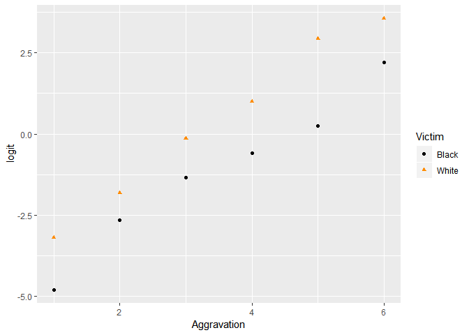
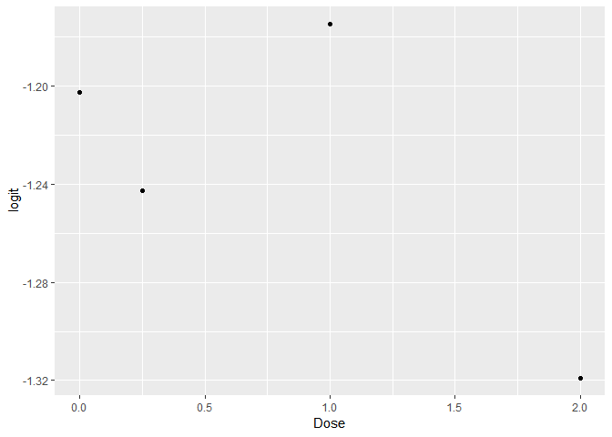
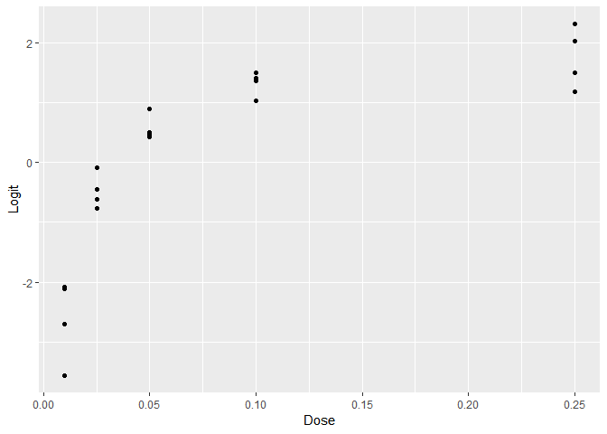
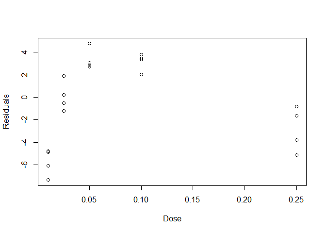
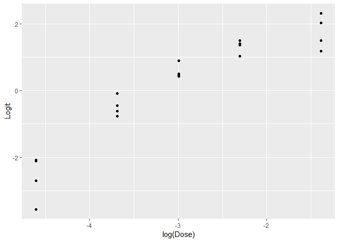
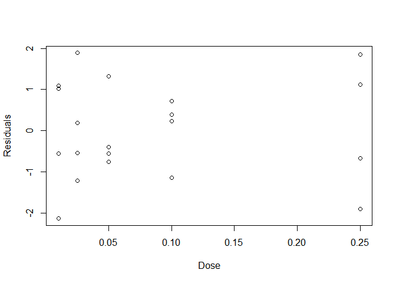

HW \#7
================
Noam Benkler
May 17, 2018

Problem 1: Exercise 21.10 (the data are in case1902)
====================================================

``` r
death <- Sleuth3::case1902
```

a)
--

``` r
death$Total <- death$Death + death$NoDeath
death <- death %>%
mutate(prop = Death/ Total ,
logit = log((Death + .5) / (Total - Death + .5)))
p <- gf_point(logit ~ Aggravation, color = ~ Victim, shape = ~ Victim, data = death) %>% gf_refine(scale_color_manual(values = c("Black", "Darkorange")))
p
```



b)
--

``` r
death_glm <- glm(prop ~ Aggravation * Victim, data = death, family = binomial, weight = Total)
summary(death_glm, type = "text")
```

    ## 
    ## Call:
    ## glm(formula = prop ~ Aggravation * Victim, family = binomial, 
    ##     data = death, weights = Total)
    ## 
    ## Deviance Residuals: 
    ##     Min       1Q   Median       3Q      Max  
    ## -0.6614  -0.2246   0.1658   0.5430   0.9132  
    ## 
    ## Coefficients:
    ##                         Estimate Std. Error z value Pr(>|z|)    
    ## (Intercept)              -6.2319     0.9015  -6.913 4.75e-12 ***
    ## Aggravation               1.4067     0.2466   5.705 1.17e-08 ***
    ## VictimWhite               0.9788     1.2377   0.791    0.429    
    ## Aggravation:VictimWhite   0.2744     0.3762   0.729    0.466    
    ## ---
    ## Signif. codes:  0 '***' 0.001 '**' 0.01 '*' 0.05 '.' 0.1 ' ' 1
    ## 
    ## (Dispersion parameter for binomial family taken to be 1)
    ## 
    ##     Null deviance: 212.2838  on 11  degrees of freedom
    ## Residual deviance:   3.3438  on  8  degrees of freedom
    ## AIC: 33.21
    ## 
    ## Number of Fisher Scoring iterations: 4

c)
--

With p=0.91, there is not sufficient evidence to reject the null hypothesis that the model is adequate.

``` r
1 - pchisq(3.3438, 8)
```

    ## [1] 0.9109686

d)
--

Using the Wald Test: $z =\\frac{\\widehat\\beta}{SE(\\beta)}$ With p=.466, there is not sufficient evidene to reject the null hypothesis that the coefficient of the indicator variable for race is equal to 0.

``` r
z <- 0.2744 / 0.3762
2*(1-pnorm(z))
```

    ## [1] 0.4657575

e) Wald interval
----------------

With 95% confidence, being a white individual is associated with a between -.463 and 1.012 change in log odds of recieving the death penalty.

``` r
beta1 <- coef(death_glm)[4]
se <- sqrt(vcov(death_glm)[4,4])
beta1 + c(-1, 1) * qnorm(.975) * se
```

    ## [1] -0.4630323  1.0118013

Problem 2: Exercise 21.13
=========================

``` r
vitc <- Sleuth3::ex2113
```

a)
--

``` r
vitc$logit <- log(vitc$ProportionWithout/(1-vitc$ProportionWithout))
p1 <- gf_point(logit ~ Dose, data = vitc)
p1
```



b)
--

``` r
vitc_glm <- glm(ProportionWithout ~ Dose, data = vitc, family = binomial, weight = Number)
```

    ## Warning in eval(family$initialize): non-integer #successes in a binomial
    ## glm!

``` r
summary(vitc_glm)
```

    ## 
    ## Call:
    ## glm(formula = ProportionWithout ~ Dose, family = binomial, data = vitc, 
    ##     weights = Number)
    ## 
    ## Deviance Residuals: 
    ##        1         2         3         4  
    ## -0.07226  -0.27374   0.58059  -0.36030  
    ## 
    ## Coefficients:
    ##             Estimate Std. Error z value Pr(>|z|)    
    ## (Intercept) -1.19764    0.06163 -19.434   <2e-16 ***
    ## Dose        -0.03560    0.07110  -0.501    0.617    
    ## ---
    ## Signif. codes:  0 '***' 0.001 '**' 0.01 '*' 0.05 '.' 0.1 ' ' 1
    ## 
    ## (Dispersion parameter for binomial family taken to be 1)
    ## 
    ##     Null deviance: 0.79900  on 3  degrees of freedom
    ## Residual deviance: 0.54706  on 2  degrees of freedom
    ## AIC: 29.803
    ## 
    ## Number of Fisher Scoring iterations: 3

Deviance Goodness-of-Fit Test:We do not have sufficient evidene to reject the null hypothesis that the model is adequate.

``` r
1 - pchisq(.54706, 2)
```

    ## [1] 0.7606895

Wald Test: We do not have significant evidence to reject the null hypothesis that β1 = 0.

``` r
z1 <- -0.03560 / 0.07110
2*(1-pnorm(z))
```

    ## [1] 0.4657575

Drop-in-Deviance Test: We do not have sufficient evidence to reject then null hypothesis that β1 = 0.

``` r
dev_diff <- 0.79900 - 0.54706
df_diff <- 3 - 2
1 - pchisq(dev_diff, df_diff)
```

    ## [1] 0.6157124

c)
--

This model does not seem adequate. While the deviance goodness-of-fit test indicated the model was adequate, the actual coefficients were not statistically significant and therefor cannot adequately report true relationship between odds and dosage.

Problem 3: Read Exercise 21.16 but answer the following questions.
==================================================================

``` r
fish <- Sleuth3::ex2116
```

(a) Make a plot of the empirical log-odds of cancer vs. dose. Comment on what you see.
--------------------------------------------------------------------------------------

There seems to be a logarithmic relationship between the empirical logit and dose.

``` r
fish <- fish %>%
mutate(Proportion = Tumor / Total ,
Logit = log((Tumor + .5) / (Total - Tumor + .5)))
p2 <- gf_point(Logit ~ Dose, data = fish)
p2
```



(b) Fit the logistic regression model for the odds of cancer using dose as the sole predictor. Plot the deviance residuals versus the dose. Is there evidence of nonlinearity?
------------------------------------------------------------------------------------------------------------------------------------------------------------------------------

The plot of the residuals shows curvature that would indicate nonlinearity.

``` r
fish_glm <- glm(Proportion ~ Dose, data = fish, family = binomial, weight = Total)
summary(fish_glm)
```

    ## 
    ## Call:
    ## glm(formula = Proportion ~ Dose, family = binomial, data = fish, 
    ##     weights = Total)
    ## 
    ## Deviance Residuals: 
    ##     Min       1Q   Median       3Q      Max  
    ## -7.3577  -4.0473  -0.1515   2.9109   4.7729  
    ## 
    ## Coefficients:
    ##             Estimate Std. Error z value Pr(>|z|)    
    ## (Intercept) -0.86705    0.07673   -11.3   <2e-16 ***
    ## Dose        14.33377    0.93695    15.3   <2e-16 ***
    ## ---
    ## Signif. codes:  0 '***' 0.001 '**' 0.01 '*' 0.05 '.' 0.1 ' ' 1
    ## 
    ## (Dispersion parameter for binomial family taken to be 1)
    ## 
    ##     Null deviance: 667.20  on 19  degrees of freedom
    ## Residual deviance: 277.05  on 18  degrees of freedom
    ## AIC: 368.44
    ## 
    ## Number of Fisher Scoring iterations: 5

``` r
res <- residuals(fish_glm, type = "deviance")
plot(fish$Dose, res, xlab = "Dose", ylab = "Residuals")
```



(c) Now make a plot of the empirical log-odds of cancer vs. log(dose). Comment on what you see.
-----------------------------------------------------------------------------------------------

While The relationship seems far more linear that the previous plot, there is still apparent curvature.

``` r
p3 <- gf_point(Logit ~ log(Dose), data = fish)
p3
```



(d) Fit the logistic regression model for the odds of cancer using log(dose) as the sole predictor. Plot the Pearson residuals versus the dose. Is there evidence of nonlinearity?
----------------------------------------------------------------------------------------------------------------------------------------------------------------------------------

Still curvature on the residual plot indicating nonlinearity.

``` r
fish_glm1 <- glm(Proportion ~ log(Dose), data = fish, family = binomial, weight = Total)
summary(fish_glm1)
```

    ## 
    ## Call:
    ## glm(formula = Proportion ~ log(Dose), family = binomial, data = fish, 
    ##     weights = Total)
    ## 
    ## Deviance Residuals: 
    ##     Min       1Q   Median       3Q      Max  
    ## -4.0906  -0.9647   0.0115   0.9199   2.7948  
    ## 
    ## Coefficients:
    ##             Estimate Std. Error z value Pr(>|z|)    
    ## (Intercept)  4.16336    0.20846   19.97   <2e-16 ***
    ## log(Dose)    1.29804    0.06434   20.18   <2e-16 ***
    ## ---
    ## Signif. codes:  0 '***' 0.001 '**' 0.01 '*' 0.05 '.' 0.1 ' ' 1
    ## 
    ## (Dispersion parameter for binomial family taken to be 1)
    ## 
    ##     Null deviance: 667.195  on 19  degrees of freedom
    ## Residual deviance:  68.897  on 18  degrees of freedom
    ## AIC: 160.29
    ## 
    ## Number of Fisher Scoring iterations: 4

(e) Fit the logistic regression model for the odds of cancer using log(dose) and (log(dose))2 as predictors. Look at the residuals and argue that there is no longer evidence of nonlinearity.
----------------------------------------------------------------------------------------------------------------------------------------------------------------------------------------------

``` r
fish_glm2 <- glm(Proportion ~ log(Dose) + I((log(Dose))^2), data = fish, family = binomial, weight = Total)
summary(fish_glm2)
```

    ## 
    ## Call:
    ## glm(formula = Proportion ~ log(Dose) + I((log(Dose))^2), family = binomial, 
    ##     data = fish, weights = Total)
    ## 
    ## Deviance Residuals: 
    ##     Min       1Q   Median       3Q      Max  
    ## -2.1349  -0.6860  -0.1067   1.0382   1.8863  
    ## 
    ## Coefficients:
    ##                  Estimate Std. Error z value Pr(>|z|)    
    ## (Intercept)       1.02921    0.49343   2.086  0.03699 *  
    ## log(Dose)        -1.03048    0.35743  -2.883  0.00394 ** 
    ## I((log(Dose))^2) -0.39195    0.06136  -6.388 1.68e-10 ***
    ## ---
    ## Signif. codes:  0 '***' 0.001 '**' 0.01 '*' 0.05 '.' 0.1 ' ' 1
    ## 
    ## (Dispersion parameter for binomial family taken to be 1)
    ## 
    ##     Null deviance: 667.195  on 19  degrees of freedom
    ## Residual deviance:  26.048  on 17  degrees of freedom
    ## AIC: 119.45
    ## 
    ## Number of Fisher Scoring iterations: 4

Peason Residuals vs Dose: This residuals plot looks randomly distributed with no apparent pattern or curvature, meaning there is no longer evidence of nonlinearity.

``` r
res2 <- residuals(fish_glm2)
plot(fish$Dose, res2, xlab = "Dose", ylab = "Residuals")
```



(f) Give the dose at which your model estimates 50% chance of getting a tumor. (Hint: if p = 0.5 then the log odds equals zero. The problem requires you to use the quadratic formula for solving a quadratic equation.)
------------------------------------------------------------------------------------------------------------------------------------------------------------------------------------------------------------------------

Using the same process as problem 2b in Homework 6, we set the probability of a tumor equal to 0 and then solve for the dose using the equation that tells us the probability given an X-value. $ 1.02921 − 1.03048X − 0.39195X^2 = 0$ where $ X = log(Dose) $ The two potential X values are -3.4011619122156 and 0.77205105623908. The log(Dose) = 0.772 value is impossible because this dosage is far above the data given. But when log(Dose) = −3.401, Dose = .0333. This would make sense because this is somewhere between the observed proportions of .38 and .60.

(g) Refit the model in part (e) using the quasibinomial procedure. Give the dispersion parameter estimate. Compare the standard errors from the quasibinomial model to the standard binomial model. Explain why the design of this experiment might make one suspect overdispersion.
------------------------------------------------------------------------------------------------------------------------------------------------------------------------------------------------------------------------------------------------------------------------------------

Dispersion Parameter Estimate = 1.475778. The standard errors using the quasi-binomial procedure are higher than those of the standard binomial model. One section of the design that could indicate overdispersion was how, while some tanks were exposed to the same dosage, their probabilities varied.

``` r
fish_glm3 <- update(fish_glm2, . ~ ., family = quasibinomial)
summary(fish_glm3)
```

    ## 
    ## Call:
    ## glm(formula = Proportion ~ log(Dose) + I((log(Dose))^2), family = quasibinomial, 
    ##     data = fish, weights = Total)
    ## 
    ## Deviance Residuals: 
    ##     Min       1Q   Median       3Q      Max  
    ## -2.1349  -0.6860  -0.1067   1.0382   1.8863  
    ## 
    ## Coefficients:
    ##                  Estimate Std. Error t value Pr(>|t|)    
    ## (Intercept)       1.02921    0.59942   1.717   0.1041    
    ## log(Dose)        -1.03048    0.43421  -2.373   0.0297 *  
    ## I((log(Dose))^2) -0.39195    0.07454  -5.258 6.41e-05 ***
    ## ---
    ## Signif. codes:  0 '***' 0.001 '**' 0.01 '*' 0.05 '.' 0.1 ' ' 1
    ## 
    ## (Dispersion parameter for quasibinomial family taken to be 1.475778)
    ## 
    ##     Null deviance: 667.195  on 19  degrees of freedom
    ## Residual deviance:  26.048  on 17  degrees of freedom
    ## AIC: NA
    ## 
    ## Number of Fisher Scoring iterations: 4
